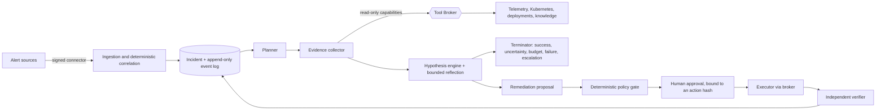

# Autonomous SRE Incident Commander

An agentic incident-response system for cloud-native operations. It ingests alerts, correlates
them into incidents, investigates across metrics, logs, Kubernetes state, deployment history and
operational knowledge, ranks evidence-backed root-cause hypotheses, proposes risk-classified
remediation that a human approves, executes it through a permission-scoped broker, verifies the
outcome independently, and keeps a governed operational memory.

It is built around one idea: **an AI agent may investigate freely, but it may only act through
deterministic, auditable, human-governed boundaries.** The model never holds credentials, never
chooses its own tools or tenant, and never decides whether an action was safe or successful.

> **Status: Phases 0–15 complete; Phase 16 closeout.** Everything below is built and tested
> against deterministic simulators, local HTTP servers, PostgreSQL and a disposable Kubernetes
> (kind) cluster. It has **not** run against production telemetry, live vendor accounts or a live
> LLM, and it is **not** production-ready without the prerequisites in the
> [production readiness review](docs/PRODUCTION_READINESS_REVIEW.md).

## Try it

```bash
python -m venv .venv && .venv/Scripts/python -m pip install -e ".[dev]"   # Python 3.11+
python scripts/demo.py        # Docker required; ~2-5 minutes
```

The demo starts a disposable PostgreSQL, migrates it, runs five contrasting investigations
through the real kernel as the unprivileged application role, reads back what each run persisted,
and runs the 18-scenario evaluation gate. It prints `DEMO PASSED` only if every outcome matches its
scenario's expectation ([demo guide](docs/demo/DEMO.md)).

## How it works



* **Correlation is deterministic** (service, environment, category, time window, stable
  tie-break); no model decides what an incident is.
* **Investigation is a bounded LangGraph loop** with budgets on iterations, tool calls, wall
  clock, tokens and cost, durable checkpoints, leases and resume without repeating side effects.
* **The Tool Broker is the only egress.** Capabilities come from a registry with risk tiers
  (RO/R1/R2; R3 is not expressible); investigation holds read-only credentials; every call is
  audited and carries broker-assigned provenance (`verified_fact` for query results, `retrieved`
  for knowledge).
* **Untrusted text stays data.** Logs, runbooks, tickets and titles reach the model only inside
  fenced untrusted blocks; hostile instructions are flagged and cannot change tools, tenants,
  risk tiers or approvals.
* **Remediation is separated into proposal, policy, approval, execution and verification**, each
  its own node. R2 always needs a human; production R1 needs a human; approvals bind to an action
  version; the verifier never sees the executor's success claim.
* **Tenancy is enforced by the database**: row-level security, composite tenant foreign keys, and
  an application role with no `DELETE`, no DDL and no `BYPASSRLS`.

Architecture detail: [architecture overview](docs/architecture/ARCHITECTURE_OVERVIEW.md) ·
[agent topology](docs/architecture/agent-topology.md) ·
[remediation safety policy](docs/architecture/remediation-safety-policy.md) ·
[31 ADRs](docs/adr/README.md).

## Evidence

Every figure is from a recorded local run and states its source. None is a production measurement.

| What | Result | Source |
|---|---|---|
| Test suite | 2,422 passed, 0 failed, 0 skipped (unit, contract, API, database, adapter, state-transition, simulation, replay, evaluation, E2E, load, resilience, security, prompt-injection, deployment) | [PHASE15_RESULTS.md](docs/testing/PHASE15_RESULTS.md) |
| Requirements | 131 SRS requirements: 112 satisfied, 16 partially satisfied, 2 intentionally deferred, 1 external | [traceability](docs/architecture/requirements-traceability.md#final-status-phase-16) |
| Evaluation | 18/18 golden scenarios pass in simulator and strict-replay modes; 0 unsafe actions; 0 false successes — **simulated, deterministic model, not reasoning quality** | [evaluation](docs/evaluation/EVALUATION_ARCHITECTURE.md) |
| Security gate | 11/11 strict checks incl. gitleaks (history + tree), pip/npm audit, Trivy HIGH/CRITICAL on both images | [SECURITY_HARDENING.md](docs/testing/SECURITY_HARDENING.md) |
| Chaos on kind | 6/6 declared experiments pass (pod kills, Postgres restart, database-access loss, unreachable collector, migration-pod overlap max = 1) | [RESILIENCE_AND_CHAOS.md](docs/testing/RESILIENCE_AND_CHAOS.md) |
| Load (LOCAL BENCHMARK, 2-CPU API) | 600 s soak: 12,000/12,000 OK, no resource growth; 96-client burst: 93.5 % OK, 6.5 % classified 503, 0 timeouts; ingestion ≈ 12 alerts/s (below the assumed 50/s) | [LOAD_AND_PERFORMANCE.md](docs/testing/LOAD_AND_PERFORMANCE.md) |
| Defects found by that testing | 17 new defects, all fixed with regression tests — including two connection-pool deadlocks found only under load — plus 10 carried-forward items closed | [PHASE15_RESULTS.md §5](docs/testing/PHASE15_RESULTS.md#5-defects-found-in-phase-15-all-fixed-each-with-a-regression-test) |

## What it does not do (yet)

No live LLM (the model port is exercised by a deterministic provider), no postmortem generator,
no automated compensation after a failed verification, no inbound chat approvals, no trace-store
adapter, no deployed worker process, per-process rate limiting, retention deletion only for the
idempotency cache, and nothing verified on a remote CI runner or real cluster. The full list, with
what would close each item: [production gap register](docs/PRODUCTION_GAP_REGISTER.md).

## Technology

Python 3.11+ · FastAPI · LangGraph · SQLAlchemy 2 / Alembic · PostgreSQL 16 + pgvector ·
Next.js + TypeScript · OpenTelemetry · Prometheus rules · Grafana dashboards · Loki ·
Docker · Kubernetes (Kustomize) · Terraform · GitHub Actions · pytest. Each major choice — and
each rejected alternative (Temporal, a vector database, LiteLLM, Redis, Kafka/NATS, LangSmith) —
has an ADR.

## Repository layout

```
src/asic/        api · ingestion · orchestration (graph, nodes, kernel) · tools (registry, broker)
                 remediation · integrations · knowledge · memory · evaluation · observability
                 retention · db (models, RLS session) · domain · llm · simulators (test infrastructure)
tests/           one directory per area, plus resilience/, security/, e2e/, packaging/
migrations/      Alembic history (0001-0019), including RLS policies and role grants
deploy/          Kustomize: base, migration Job, retention CronJob, local kind overlays
infra/terraform/ namespace, Pod Security Admission and service accounts
configs/         Prometheus rules and tests, Grafana dashboards, OpenTelemetry Collector
scripts/         deploy orchestrator, kind smoke + chaos, load harness, demo, security gate, validators
docs/            specification, PRD/SRS, architecture, ADRs, security, testing evidence, runbooks
```

## Documentation map

| If you want… | Read |
|---|---|
| The whole story in order | [docs/README.md](docs/README.md) |
| To evaluate readiness | [Production readiness review](docs/PRODUCTION_READINESS_REVIEW.md) · [gap register](docs/PRODUCTION_GAP_REGISTER.md) |
| To run or operate it | [Operator guide](docs/operations/OPERATOR_GUIDE.md) · [troubleshooting](docs/operations/TROUBLESHOOTING.md) · [runbooks](docs/runbooks/README.md) · [deployment](docs/deployment/PHASE14_DEPLOYMENT.md) |
| The security model | [Security architecture](docs/security/SECURITY_ARCHITECTURE.md) · [threat model](docs/security/THREAT_MODEL.md) |
| The testing evidence | [docs/testing](docs/testing/README.md) |
| The project as a portfolio piece | [Portfolio evidence](docs/portfolio/PORTFOLIO_EVIDENCE.md) · [interview guide](docs/portfolio/INTERVIEW_GUIDE.md) |

## Development

```bash
python scripts/verify_spec_transcription.py   # specification transcription unchanged
python scripts/check_repo_hygiene.py          # no secrets or generated junk
python scripts/validate_docs.py               # links, Mermaid, traceability, scope
ruff check . && ruff format --check . && mypy --strict src

# Database-backed tests need PostgreSQL 16 + pgvector migrated to head:
export ASIC_MIGRATION_DATABASE_URL=postgresql+psycopg2://<owner>:<password>@localhost:55432/asic
python -m alembic upgrade head
export ASIC_TEST_DATABASE_URL=$ASIC_MIGRATION_DATABASE_URL
python -m pytest
```

Frontend: `npm ci && npm run lint && npm run build` in `frontend/`. Security gate:
`python scripts/security_gate.py --strict` (release adds `--require-container-scan` with both image
references). Pre-commit procedure: [repository security checklist](docs/security/REPOSITORY_SECURITY_CHECKLIST.md).

## Specification

The authoritative specification is the Word document in [`docs/spec/`](docs/spec/); its Markdown
transcription is verified in both directions by `scripts/verify_spec_transcription.py`.

## License

Not yet selected.
