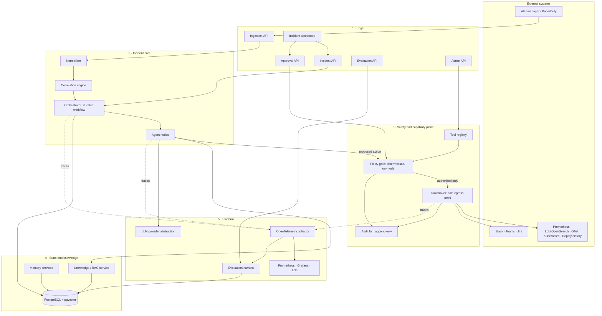
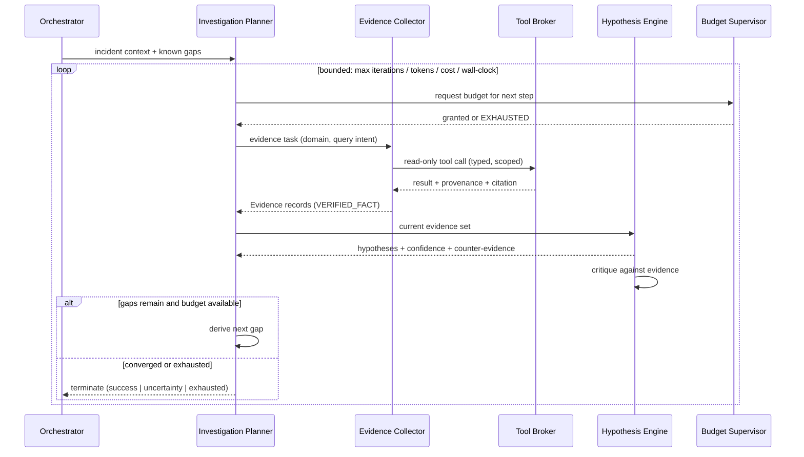

# Architecture Overview

- **Status:** Authored — Architecture Package (V3 §23 E). **Proposed; not implemented.**
- **Master specification references:** Sections 4–13, 23(E)
- **Authoritative source of requirements:** [`../spec/MASTER_PROJECT_PROMPT_V3.md`](../spec/MASTER_PROJECT_PROMPT_V3.md)

This is the single entry point for understanding the system. Each area below names the
document that owns its detail; where this document and a detail document disagree, **the
detail document wins** and this one is the defect.

| Area | Authoritative document |
|---|---|
| Node inventory and consolidation rationale | [`agent-topology.md`](./agent-topology.md) |
| Tool descriptors, capabilities, permissions | [`tool-registry.md`](./tool-registry.md) |
| Risk tiers, approval, execution safety | [`remediation-safety-policy.md`](./remediation-safety-policy.md) |
| Memory tiers, RAG pipeline, provenance | [`memory-and-rag.md`](./memory-and-rag.md) |
| Trace model and correlation identifiers | [`observability.md`](./observability.md) |
| State machine, retries, recovery | [`failure-and-recovery.md`](./failure-and-recovery.md) |
| Entities, invariants, API boundaries | [`data-model-and-api.md`](./data-model-and-api.md) |
| Signal ingestion, correlation and lifecycle handoff | [`telemetry-ingestion.md`](./telemetry-ingestion.md) |
| Threats, invariants, untrusted input | [`../security/THREAT_MODEL.md`](../security/THREAT_MODEL.md) |
| Golden scenarios, judges, regression | [`../evaluation/EVALUATION_ARCHITECTURE.md`](../evaluation/EVALUATION_ARCHITECTURE.md) |
| C4 context/container/component views | [`c4-diagrams.md`](./c4-diagrams.md) |
| Technology decisions | [`../adr/README.md`](../adr/README.md) |

---

## 1. Design principles

These are the load-bearing principles. Every subsequent decision in this package is
traceable to one of them, and a proposal that violates one is rejected regardless of its
other merits.

### PR-1 — Authority never flows from the model

The model proposes; deterministic code authorizes. Every side effect passes through a
non-model policy gate and a permission-scoped tool broker. A compromised, manipulated or
simply mistaken model can waste budget, but it cannot widen its own scope. *(§6, §7, §15)*

### PR-2 — Provenance is a type, not a convention

Every piece of content in the system carries a provenance label, and authority is a
function of that label. "Verified fact", "hypothesis" and "model claim" are distinct
persisted types with different downstream permissions, not adjectives in prose. *(§8)*

### PR-3 — Every run terminates

Iterations, tool calls, wall-clock time, tokens and cost are all bounded. Termination in
uncertainty is a legitimate, first-class success path. *(§5)*

### PR-4 — Read and write are separated by construction

Investigation credentials are physically incapable of mutation. Remediation is a different
code path, a different credential set and a different node. This is not enforced by prompt
instruction. *(§6)*

### PR-5 — The trace is the product's memory of itself

One trace schema serves debugging, replay, and evaluation. Production incidents become
evaluation cases without transformation, which is what makes the improvement loop of §10
mechanically possible. *(§9, §10, §11)*

### PR-6 — Nodes exist only where they genuinely differ

A node is justified only by a meaningful difference in responsibility, tools, permissions,
failure modes or evaluation criteria. Five telemetry analysers that differ only by adapter
are one node with five strategies, not five nodes. *(§4)*

### PR-7 — Simulators are test infrastructure, never a production path

Deterministic simulators back every adapter for local development, replay and evaluation.
They are wired only in test configurations and are unreachable from a production build.
*(§14, §20)*

---

## 2. System shape

The system is five layers with one deliberate chokepoint. The chokepoint — the **Tool
Broker** — is the architectural expression of PR-1: it is the *only* component that can
reach an external system, and it is the only place authorization is enforced.

### 2.1 Why the chokepoint matters

Everything an attacker or a confused model would want to do — query a system, change a
system, message a human — requires the Tool Broker. Because there is exactly one such
component:

- Authorization has exactly one enforcement point rather than one per adapter.
- Audit has exactly one emission point, so "unaudited action" is not reachable.
- Rate limiting, timeouts, retries and idempotency are implemented once.
- The security test surface is small enough to test adversarially and exhaustively.

The alternative — nodes calling adapters directly — spreads authorization across every
node and makes "the model has no unrestricted access" a claim rather than a property.

---

## 3. Layer responsibilities

### Layer 1 — Edge

Five separately authorised API surfaces (see
[`data-model-and-api.md`](./data-model-and-api.md) §API). They are separated because they
have genuinely different threat profiles: ingestion is machine-authenticated and
internet-reachable; approval carries the highest privilege in the system; administration
changes the safety configuration itself.

### Layer 2 — Incident core

- **Normaliser** — vendor payloads into canonical `Alert`, with tenant/service/environment
  resolved. Rejects unparseable input to a dead-letter store.
- **Correlation engine** — deterministic-first grouping (temporal proximity, dependency
  topology, shared labels, deploy coincidence) with optional model-assisted ranking. Runs
  before an incident exists, on a streaming latency budget.
- **Orchestrator** — owns the durable incident workflow: checkpointing, resume, interrupts
  for human approval, budget enforcement, termination. See
  [`failure-and-recovery.md`](./failure-and-recovery.md).
- **Agent nodes** — twelve graph nodes plus two derived services, reduced from the nineteen
  candidate responsibilities in §4 with recorded justification. Only eight invoke a model;
  the rest are deterministic by design. See [`agent-topology.md`](./agent-topology.md).

### Layer 3 — Safety and capability plane

- **Tool registry** — the catalogue of what may be done at all, with capability, schemas,
  permission scope, risk tier, timeout, retry/idempotency semantics and audit requirements.
- **Policy gate** — deterministic authorization. Accepts only a typed, schema-validated
  action proposal. Emits allow / deny / require-approval with the deciding rule recorded.
- **Tool broker** — resolves credentials, enforces scope, applies timeout and retry,
  guarantees idempotency by action key, and emits the audit record. The only egress.
- **Audit log** — append-only, tenant-scoped, covering authorization decisions, executions
  and approvals.

### Layer 4 — State and knowledge

PostgreSQL is the system of record for incident state, events, evidence, actions, approvals
and evaluation records; pgvector holds knowledge embeddings. The **five memory tiers** of
§8 are distinct stores with distinct lifetimes and write governance — see
[`memory-and-rag.md`](./memory-and-rag.md).

### Layer 5 — Platform

OpenTelemetry is the substrate for both operations and evaluation (PR-5). The evaluation
harness consumes the same trace schema production emits. The LLM provider abstraction keeps
model choice a configuration decision rather than a code dependency.

---

## 4. The investigation loop

This is the system's core control flow, and where §5's bounded reflection lives.

Three properties are worth naming because they are frequently absent in agent systems:

1. **The budget supervisor is consulted before the step, not after.** A step that cannot be
   afforded is never started, so budget exhaustion produces a clean partial result rather
   than a truncated one.
2. **The planner reasons about *gaps*, not about *tools*.** Tool selection is a consequence
   of a declared information gap, which is what makes tool-call efficiency measurable and
   redundant collection detectable (FR-INV-08).
3. **Critique happens against the evidence set**, not against the hypothesis text. This is
   what makes counter-evidence a real output rather than a rhetorical gesture.

---

## 5. Request and event flows

| Flow | Path | Latency class | Durability |
|---|---|---|---|
| Alert ingestion | Alertmanager → Ingestion API → Normaliser → dead-letter or Correlation | Seconds, streaming | At-least-once, idempotent by fingerprint |
| Incident open | Correlation → Orchestrator → checkpoint → notification | Seconds | Durable from first checkpoint |
| Investigation step | Planner → Collector → Broker → adapter → Evidence persisted | Seconds to a minute | Checkpointed per step |
| Action proposal | Planner → typed proposal → Policy gate → allow/deny/approval | Sub-second (deterministic) | Decision persisted before any effect |
| Human approval | Gate → Approval request → (UI or Slack) → Approval API → resume | Minutes to hours | Durable interrupt; survives restart |
| Execution | Broker → idempotent adapter call → audit → verification trigger | Seconds to minutes | Idempotency key; outbox for side effects |
| Verification | Verifier → Broker (read-only) → compare to pre-set criteria | Seconds to minutes | Checkpointed |
| Postmortem and memory | Batch, post-resolution → draft → human gate → memory write | Minutes, offline | Versioned, governed |
| Evaluation | Harness → replay fixtures → orchestrator (test config) → scored run | Minutes, offline | Recorded as evaluation run |

---

## 6. Deployment shape

Detail in [`cicd-and-infrastructure.md`](./cicd-and-infrastructure.md).

Three deployable services plus the frontend, chosen to keep the safety boundary inside a
process boundary rather than spread across a network:

| Deployable | Contains | Scaling driver |
|---|---|---|
| **API service** | Edge APIs, normaliser, correlation | Alert ingestion rate |
| **Orchestrator worker** | Workflow engine, agent nodes, policy gate, tool broker | Concurrent incidents |
| **Batch worker** | Knowledge ingestion, postmortem, memory curation, evaluation runs | Offline volume |
| **Frontend** | Next.js incident dashboard | Operator count |

The policy gate and tool broker deploy *inside* the orchestrator worker deliberately: a
network hop between the authorizer and the executor would create a window in which an
authorized action could be tampered with, and would make the audit record's ordering
guarantees weaker.

---

## 7. What this architecture deliberately does not do

Recorded so these are visible as decisions rather than oversights:

- **No telemetry storage.** We query existing backends. Storing metrics would make us a
  competitor to Prometheus and add an enormous data-scale problem irrelevant to the thesis.
- **No message broker in v1.** Postgres-backed queues and the workflow engine's own
  durability cover the required semantics at the expected scale. Revisited in
  [`../adr/README.md`](../adr/README.md) candidate ADR-0007 with an explicit trigger.
- **No autonomous high-risk remediation, ever.** Not a v1 limitation — a permanent product
  property required by §6.
- **No cloud-provider control-plane adapters in v1.** Assumption AS-03, pending review.

---

## 8. Open architectural risks

Ranked and mitigated in
[`PROJECT_INITIATION_AND_ARCHITECTURE_PACKAGE.md`](./PROJECT_INITIATION_AND_ARCHITECTURE_PACKAGE.md)
section P. The three that most shape this design:

1. **Evaluation label cost.** Golden scenarios need expert-labelled expected evidence and
   RCA. This is the most likely schedule risk in the project, and it is why evaluation
   scaffolding moves earlier in the roadmap.
2. **Correlation quality without production alert data.** Deterministic-first correlation
   partly mitigates this, but a synthetic alert corpus is a weaker signal than real traffic.
3. **Judge calibration.** LLM-as-judge is itself a model-based measurement; without
   calibration against human labels it can produce confident, systematically wrong scores.
