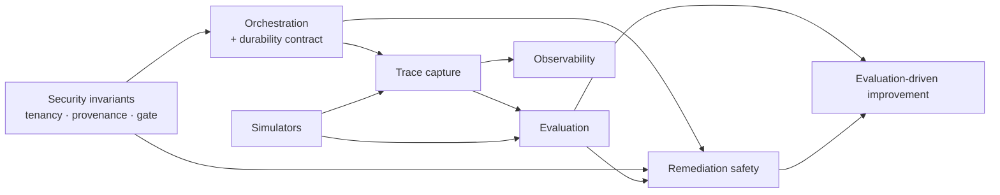

# Project Initiation and Architecture Package

**Master specification §23 · Sections A–Q**

- **Status:** Complete and awaiting owner approval. **No implementation has begun.**
- **Master specification:** [`../spec/MASTER_PROJECT_PROMPT_V3.md`](../spec/MASTER_PROJECT_PROMPT_V3.md)
- **Date:** 2026-09-04

> This document is the **spine** of the Architecture Package. Sections A–N summarise and
> point to the document that owns each area's detail; sections O, P and Q are authored here
> because nothing else owns them. Where this document and a detail document disagree, the
> detail document is authoritative and this one is the defect.
>
> **Nothing described here is implemented, and no metric here is a measurement.**

---

## Contents and ownership

| § | Area | Authoritative detail |
|---|---|---|
| A | Executive product definition | [`../prd/PRD.md`](../prd/PRD.md) §A |
| B | Users, buyers, personas, journeys | [`../prd/personas-and-journeys.md`](../prd/personas-and-journeys.md) |
| C | Functional and non-functional requirements | [`../prd/SRS.md`](../prd/SRS.md) |
| D | Competitive landscape and differentiation | [`../prd/PRD.md`](../prd/PRD.md) §D |
| E | Proposed architecture | [`ARCHITECTURE_OVERVIEW.md`](./ARCHITECTURE_OVERVIEW.md), [`c4-diagrams.md`](./c4-diagrams.md) |
| F | Agent topology and responsibilities | [`agent-topology.md`](./agent-topology.md) |
| G | Tool registry / capability / permission model | [`tool-registry.md`](./tool-registry.md) |
| H | Memory and RAG architecture | [`memory-and-rag.md`](./memory-and-rag.md) |
| I | Evaluation-harness architecture | [`../evaluation/EVALUATION_ARCHITECTURE.md`](../evaluation/EVALUATION_ARCHITECTURE.md) |
| J | Safety / remediation policy model | [`remediation-safety-policy.md`](./remediation-safety-policy.md) |
| K | Observability / tracing design | [`observability.md`](./observability.md) |
| L | Security / threat model | [`../security/THREAT_MODEL.md`](../security/THREAT_MODEL.md) |
| M | Data model and API boundary | [`data-model-and-api.md`](./data-model-and-api.md) |
| N | Technology comparisons + ADR candidates | [`../adr/README.md`](../adr/README.md) |
| O | Implementation roadmap | **This document** |
| P | Risks and unknowns | **This document** |
| Q | Definition of Done | **This document** |
| — | Requirements traceability | [`requirements-traceability.md`](./requirements-traceability.md) |

---

## A. Executive product definition

A multi-agent incident-response system that correlates alerts into incidents, investigates
under hard bounds across six evidence domains, produces ranked evidence-backed root-cause
hypotheses, plans risk-classified remediation gated by deterministic policy and human
approval, executes only registered permission-scoped actions, independently verifies
outcomes, and preserves governed operational memory.

**The product thesis:** on-call is expensive because the *investigation* is repetitive while
the *judgement* is not. We automate the repetition under bounds and hand the human assembled,
cited evidence — refusing to act irreversibly on our own authority.

Two properties follow and shape everything else: **bounded autonomy is the product, not a
safety tax**, and **attribution beats fluency** — a confident uncited hypothesis is
negative-value output.

→ [`../prd/PRD.md`](../prd/PRD.md) §A

## B. Users, buyers and journeys

Six personas: on-call SRE (primary user), platform engineer, engineering manager (economic
buyer), **security architect (blocking approver)**, service owner, and system operator. Six
journeys, including three that are usually omitted and are treated here as first-class:
correct termination in uncertainty, a blocked unsafe action, and a regression-gated
behaviour change.

The security architect is modelled as a persona rather than a compliance step because in
this product category they are the most common silent deal-blocker.

→ [`../prd/personas-and-journeys.md`](../prd/personas-and-journeys.md)

## C. Requirements

92 functional and 39 non-functional requirements plus 7 constraints — 138 in total, each classified
`[SPEC]` (binding), `[DERIVED]` (engineering consequence) or `[ASSUMED]` (**our judgement,
requiring your approval**). All numeric performance values are budgets to be validated, not
measurements.

→ [`../prd/SRS.md`](../prd/SRS.md) · traced in [`requirements-traceability.md`](./requirements-traceability.md)

## D. Competitive landscape

Five adjacent categories: incident response/paging, observability platforms, AIOps
correlation, runbook automation, and LLM SRE copilots. Our defensible position is the
**seam between AIOps correlation and runbook automation** — where investigation becomes a
justified, risk-classified, approved action. Five differentiators, each tied to a measurable
metric rather than a claim. Areas where we are deliberately weaker are stated explicitly.

→ [`../prd/PRD.md`](../prd/PRD.md) §D

## E. Proposed architecture

Five layers with **one deliberate chokepoint**: the Tool Broker is the only component that
can reach an external system, and the only place authorization is enforced. Seven design
principles govern; the load-bearing one is **PR-1: authority never flows from the model.**

Three deployable services plus a dashboard. The policy gate and tool broker deploy *inside*
the orchestrator worker deliberately — a network hop between authorizer and executor would
create a tampering window.

→ [`ARCHITECTURE_OVERVIEW.md`](./ARCHITECTURE_OVERVIEW.md) · [`c4-diagrams.md`](./c4-diagrams.md)

## F. Agent topology

**Nineteen candidate responsibilities from §4 become twelve graph nodes plus two derived
services** — seven LLM-backed, one hybrid, four deterministic, two derived.

Two findings drive this:

1. Six telemetry/knowledge analysis responsibilities differ only in *how to ask*, not in
   authority or failure mode. They become one Evidence Collector node with six
   independently-evaluated strategies.
2. **Six of the nineteen must not be LLM agents at all.** §4's list mixes reasoning with
   control; implementing Policy Gate, Human Approval or Remediation Executor as models would
   violate §6 and §15. This is the single most consequential finding in the package.

→ [`agent-topology.md`](./agent-topology.md) · [ADR-0001](../adr/0001-agent-topology-consolidation.md)

## G. Tool registry and permission model

Capability-based registry; every descriptor carries name/version, capability, typed I/O
schemas, permission scope, risk tier, timeout, retry/idempotency behaviour and audit
requirements.

**How the model is prevented from unrestricted access:** four independent layers must agree
— a pre-resolved capability menu, schema validation with no free-form command field, the
deterministic policy gate, and a credential that is *physically incapable* of the forbidden
operation. We assume layers 1–3 will eventually contain a bug; layer 4 is what makes that
survivable.

**Recommendation: native adapters behind an MCP-ready seam.**

→ [`tool-registry.md`](./tool-registry.md) · [ADR-0003](../adr/0003-tool-boundary-native-adapters-mcp-ready.md)

## H. Memory and RAG

Five separated tiers with distinct lifetimes, write authority and trust. Promotion into
durable knowledge requires human approval — there is no automatic path from "worked once" to
"this is what we do" (§10). Hybrid retrieval by default; reranking disabled pending
measurement. Filter-before-search, never after.

→ [`memory-and-rag.md`](./memory-and-rag.md) · [ADR-0009](../adr/0009-memory-architecture-tiers.md) · [ADR-0008](../adr/0008-rag-retrieval-strategy.md)

## I. Evaluation harness

Evaluation shares the production trace schema, so a production incident becomes an
evaluation case with no transformation — the decision that makes §10's improvement loop
mechanically possible. Twelve golden archetypes, twelve adversarial scenarios, thirteen
deterministic checks that judges cannot overrule, multi-judge scoring with **disagreement
flagged rather than averaged**, and a ten-class failure taxonomy.

Scenario 8 — "no discoverable cause" — treats correct uncertainty as a passing outcome.

→ [`../evaluation/EVALUATION_ARCHITECTURE.md`](../evaluation/EVALUATION_ARCHITECTURE.md)

## J. Safety and remediation policy

Fifteen safety invariants (SI-1…SI-15), each enforced by a type, a credential or a
deterministic path — never by a prompt instruction — and each with an adversarial test.

Four risk tiers. **R3 destructive actions are not approval-gated; they are not expressible**
— a capability the system cannot express is safer than one it is told not to use. Of the
twelve §6 action fields, the model authors only four; the rest are resolved from the registry
and context, which is what makes "the model cannot escalate its own privileges" structural.

→ [`remediation-safety-policy.md`](./remediation-safety-policy.md)

## K. Observability and tracing

One trace schema serves operations, replay and evaluation. Ten correlation identifiers form
a single chain from incident to evaluation record. Fifteen span types across the ten §11
areas. Three reproduction fidelity levels, of which **L2 deterministic replay** is what the
harness depends on — achievable only because no node may read the clock, generate randomness
or call an external system directly.

→ [`observability.md`](./observability.md) · [ADR-0010](../adr/0010-observability-and-evaluation-tooling.md)

## L. Security and threat model

Ten security invariants required from day one, eighteen enumerated threats with mitigations
and residual risk, and explicit modelling of eight untrusted input classes — the six the
brief names (logs, runbooks, tickets, alerts, deployment metadata and **model output**) plus
telemetry values and inbound approval replies.

The governing rule: **authority flows only from `SYSTEM` and `HUMAN` provenance.** Detection
of injection is a *signal*; the *defence* is that retrieved content has no path to the
authorization type.

→ [`../security/THREAT_MODEL.md`](../security/THREAT_MODEL.md) · [ADR-0011](../adr/0011-authentication-authorization-tenancy.md)

## M. Data model and API boundary

Thirty entities covering all twenty the brief requires, seventeen invariants enforced by
constraint where possible, a closed event vocabulary, and five separately-authorised API
surfaces. `incident_event` is the append-only system of record; `timeline_event` is a derived
projection — the data-layer expression of the topology decision that Timeline is not an agent.

**No migrations created.** Physical schema is Phase 3.

→ [`data-model-and-api.md`](./data-model-and-api.md)

## N. Technology comparisons and ADRs

Eleven ADRs written: none Accepted, eight `Proposed`, one `Needs validation`, two `Deferred`.
All eight technologies §13 names as "evaluate rather than blindly add" have been evaluated.

**Headline recommendations:**

| Decision | Recommendation | Status |
|---|---|---|
| Orchestration | **LangGraph + PostgreSQL checkpointer**; Temporal deferred with explicit triggers | `Proposed` — *a genuinely close call, recorded as close* |
| Tool boundary | **Native adapters behind an MCP-ready seam** | `Proposed` |
| Agent topology | **12 nodes + 2 services**, not 19 | `Proposed` |
| Datastore | **PostgreSQL + pgvector only**; no dedicated vector DB | `Proposed` |
| LLM abstraction | **Thin internal interface**; not LiteLLM | `Proposed` |
| Redis | **Not adopted**; leases stay in Postgres for transactional consistency | `Deferred` |
| Message broker | **Not adopted**; avoids a dual-write problem we do not need | `Deferred` |
| Retrieval | Hybrid default; **reranking off pending measurement** | `Needs validation` |
| Observability | **OTel-native**; Phoenix in reserve | `Proposed` |

→ [`../adr/README.md`](../adr/README.md)

---

## O. Implementation roadmap

### O.1 Approach

The §19 roadmap is sound and its sixteen phases are retained with their original numbering
and scope. Three **capabilities** move earlier — not phases, capabilities — because they are
not retrofittable. Each deviation is justified below; §20 requires exactly this discipline
("keep security, observability, evaluation and failure handling alongside feature
development").

### O.2 Justified deviations

| # | What moves | From | To | Justification |
|---|---|---|---|---|
| **D1** | Trace emission + scenario/label schema + deterministic checks | 11, 12 | **4** | The brief requires the first executable workflow to generate useful evaluation data. Trace schema constrains how every node is written; retrofitting it means rewriting every node. Three seed scenarios ship with the first agent loop. |
| **D2** | Security invariants: tenancy, RLS, policy gate, provenance typing, audit | 13 | **2–4** | `tenant_id` and RLS touch every table and query; the gate and provenance types constrain the node contract. Phase 13 becomes *hardening and audit* of what Phase 2–4 designed, not first construction. |
| **D3** | Durability contract: idempotency keys, checkpointing, reconciliation, dead-letter | 12-adjacent | **4** | Remediation safety (Phase 8) depends on these existing. Building the executor before idempotency exists means building it twice. |
| **D4** | Deterministic simulators for the first two adapters | 10 | **4** | §14 requires no live-infrastructure dependency, and evaluation from Phase 4 requires fixtures. Simulators are a `ToolProvider`, so this is cheap. |

**Nothing is removed or reordered.** Phases 11, 12 and 13 retain their full scope; D1–D3
move the *scaffolding* those phases depend on, so those phases build capability rather than
foundations.

### O.3 The dependency the roadmap must respect

The brief asks for particular attention to the dependencies between orchestration, trace
capture, simulators, evaluation, remediation safety, observability and security. They form
one chain:

Read as constraints:

1. **Security before orchestration.** Tenancy and provenance shape the state schema.
2. **Orchestration before trace capture.** Spans need a workflow to hang from.
3. **Simulators before evaluation.** Deterministic fixtures are a precondition for
   reproducible scoring.
4. **Trace + simulators before evaluation.** Evaluation consumes both.
5. **Evaluation before remediation safety ships.** You cannot claim an unsafe-action rate of
   zero without a suite that tries to make it non-zero.
6. **Everything before evaluation-driven improvement.** The §10 loop needs all its parts.

Violating (5) is the most tempting and most damaging: shipping remediation with untested
safety invariants.

### O.4 Phase plan

| Ph | Scope (§19) | Key deliverables | Exit gate |
|---:|---|---|---|
| **0** | *(pre-roadmap)* Repository bootstrap | Repo, spec control, hygiene tooling | ✅ Complete |
| **1** | Product requirements, personas, metrics, positioning | PRD, SRS, personas, journeys, competitive analysis | Requirements have stable IDs; assumptions listed for approval |
| **2** | Architecture, threat model, technology decisions, ADRs | This package; 11 ADRs; traceability matrix | **This gate — awaiting your approval** |
| **3** | Domain model, PostgreSQL schema, tenancy, event model | Migrations, RLS policies, invariant constraints, event vocabulary | Cross-tenant property tests pass; all 17 invariants enforced or waived in writing |
| **4** | Agent state machine, planner, tool registry, orchestration `+D1 D2 D3 D4` | Orchestrator, G2/G3/G4, registry, gate, broker, trace emission, 3 scenarios, 2 simulators | Kill-and-resume with zero duplicate effects; gate denies adversarial proposals; first scenario scores |
| **5** | Telemetry ingestion, correlation, incident lifecycle | Ingestion API, normaliser, G1, dead-letter, lifecycle | Scenario 7 (storm) passes; duplicates absorbed |
| **6** | RAG, operational knowledge, governed memory | KNOW pipeline, 5 tiers, G12, retrieval evaluation set | Zero scope violations; Recall@k baseline measured |
| **7** | Investigation agents, hypothesis management, bounded reflection | G5, full G4 strategies, reflection loop | Scenarios 1–6 and 8 pass; termination distribution sane |
| **8** | Remediation planning, policy gates, approval, verification | G6, G8, G9, G10, compensation | **All 12 safety invariants pass adversarially**; scenario 12 passes |
| **9** | Backend APIs and frontend dashboard | 5 API surfaces, Next.js dashboard | E2E journeys J1–J3 pass; no cross-tenant leakage |
| **10** | External integrations | All 9 adapters + simulators | Contract tests pass; full suite runs with egress disabled |
| **11** | Evaluation harness, replay, regression | Judges, calibration, comparison, full corpus | Regression gate blocks a deliberately regressed build |
| **12** | OpenTelemetry, metrics, logs, dashboards, SLOs | 7 dashboards, SLI/SLO definitions | Trace completeness ≥99.9%; L2 replay verified |
| **13** | Security, RBAC, tenant isolation, supply chain | Hardening, pen-test, scanning, retention | Full security suite passes; residual risks accepted in writing |
| **14** | CI/CD, Docker, Kubernetes, Terraform | Pipeline with all 9 §18 gates, IaC | Deploy + smoke + rollback verified |
| **15** | Load, resilience, chaos, security, E2E hardening | Load tests, fault injection, chaos | **All performance budgets measured** — replacing `[ASSUMED]` values with results |
| **16** | Documentation, demo, portfolio evidence, readiness review | Operator/deployment/troubleshooting guides, runbooks, demo | Production-readiness review passes |

### O.5 Sequencing risks

| Risk | Mitigation |
|---|---|
| Phase 4 is the largest, absorbing D1–D4 | Split into 4a (orchestration + durability) and 4b (registry + gate + trace + scenarios) with separate gates |
| Golden-scenario labelling is slow and blocks phases 7, 11 | Start labelling in Phase 5 as incidents are modelled; treat labels as a deliverable of every capability phase, not of Phase 11 |
| Phase 8 cannot gate without Phase 11's harness | Deterministic safety checks (which need no judges) ship in Phase 4; Phase 8 gates on those |
| Performance budgets stay unvalidated until Phase 15 | Instrument from Phase 4; watch trends continuously rather than discovering breaches at the end |

---

## P. Risks and unknowns

Ranked by **severity × probability ÷ detectability**. Detectability is 1 (obvious) to 5
(silent) — a high score is what makes a moderate risk dangerous.

| # | Risk | Sev | Prob | Det | Score | Mitigation | Mitigation phase |
|---|---|:-:|:-:|:-:|:-:|---|---|
| **R01** | **Evaluation labelling cost exceeds capacity**, leaving the harness thin and every quality claim unbacked | 5 | 4 | 2 | **10.0** | Label incrementally from Phase 5; 12 archetypes not 100; deterministic checks first (no labels needed); accept a smaller corpus over a fake one | 5–11 |
| **R02** | **Confident wrong hypothesis accepted by a human** — the product's core failure mode | 5 | 4 | **5** | **4.0** | Counter-evidence mandatory; confidence basis stated; deterministic approval rendering; calibration measured; unsupported-claim rate is a headline metric | 7, 8, 11 |
| **R03** | **False verification of success** — symptoms persist, system says resolved | 5 | 3 | **5** | **3.0** | Independent verifier; criteria frozen pre-execution; settling window; false-success rate as headline metric | 8, 11 |
| **R04** | Realistic incident fixtures unobtainable without production access, making replay synthetic | 4 | 4 | 2 | 8.0 | Build a reference environment with injectable faults; use public postmortems as archetypes; label the limitation honestly | 4, 10, 15 |
| **R05** | Scope: 16 phases, 9 integrations, 12 nodes is large for one engineer | 4 | 4 | 1 | **16.0** | Vertical slices; simulators before real adapters; explicit v1 exclusions; phase gates that permit stopping | All |
| **R06** | Judge calibration drifts or is systematically biased, making evaluation confidently wrong | 4 | 3 | **4** | 3.0 | Human-labelled held-out set; multi-judge with disagreement flagged; judges excluded from safety verdicts | 11 |
| **R07** | Prompt injection succeeds despite structural defences | 5 | 2 | 4 | 2.5 | Four-layer restriction; adversarial corpus as a release gate; detection as signal; capability menu | 4, 13 |
| **R08** | LangGraph persistence API churn forces rework | 3 | 4 | 1 | 12.0 | Narrow `DurableWorkflow` interface; safety guarantees implemented in our code, not the framework's | 4 |
| **R09** | Correlation quality poor without real alert data | 3 | 4 | 3 | 4.0 | Deterministic-first correlation; synthetic storm corpus; over-merge scored separately as the worse error | 5 |
| **R10** | Cost per incident makes the product uneconomic | 3 | 3 | 2 | 4.5 | Cost measured per run from Phase 4; hard budgets; cheaper models for narrow strategies | 4, 15 |
| **R11** | PostgreSQL becomes a bottleneck (queue + traces + vectors + checkpoints) | 3 | 3 | 2 | 4.5 | Time partitioning; measured triggers in ADR-0006/0007; read replicas | 14, 15 |
| **R12** | Tenancy assumption (AS-01) wrong — significant rework or wasted complexity | 4 | 2 | 1 | 8.0 | **Confirm before Phase 3**; listed for your decision below | 2 |
| **R13** | Kubernetes write access unobtainable in any realistic test environment | 3 | 3 | 1 | 9.0 | Simulator-first; kind/k3s reference cluster; execution path tested against simulators | 4, 10 |
| **R14** | Provider API/pricing changes invalidate model choices | 2 | 4 | 1 | 8.0 | Provider abstraction; model ID in behaviour version; re-evaluation on change | 4 |
| **R15** | Documentation drifts from implementation as code lands | 3 | 4 | 3 | 4.0 | `scripts/validate_docs.py` in CI; docs updated in the same commit as behaviour | 3 onward |

### P.1 The three risks that most shape the design

- **R05 (scope)** has the highest raw score and is the most likely reason this project
  underdelivers. It is why the topology consolidates to twelve nodes, why Redis and Kafka
  are deferred, and why v1 exclusions are written down.
- **R01 (labelling cost)** is the most likely reason the *evaluation* underdelivers, which
  matters disproportionately: without evaluation, every quality claim becomes unbacked and
  §9's reporting rules leave us with nothing to say.
- **R02 and R03** share a property — the system produces a confident, plausible, wrong
  answer and nothing crashes. They are near-undetectable in production, which is why their
  metrics are headline rather than secondary. **The test suite is their only detector.**

### P.2 Open unknowns

| # | Unknown | Resolution path |
|---|---|---|
| U1 | Real distribution of incident archetypes | Public postmortems; revise the corpus as evidence arrives |
| U2 | Whether bounded reflection measurably beats single-pass hypothesis generation | A/B in the harness at Phase 11 — an honest experiment, either outcome is publishable |
| U3 | Whether reranking justifies its cost here | ADR-0008 experiment |
| U4 | Realistic token/cost per incident | Measured from Phase 4 |
| U5 | Whether a deterministic correlator suffices, or a learned model is needed | Phase 5 measurement |
| U6 | How much evaluation UI we must build before Phoenix is worth adopting | ADR-0010 trigger |

---

## Q. Definition of Done

Section 20 forbids declaring completion without running validation and reporting actual
results. Section 24 sets the quality bar. Every criterion below is therefore **verifiable by
a named artifact** — no criterion reads "production ready".

### Q.1 Universal rules

1. A criterion is met only when a **named, passing, automated check** demonstrates it.
2. No metric is reported without its conditions: behaviour version, scenario set, sample
   size, date, fixtures-or-live.
3. **A regression in any safety metric blocks completion**, regardless of other gains.
4. Unmeasured means `not measured` — never blank, never zero, never estimated.
5. Documentation for a phase ships in the same commit as the behaviour it describes.

### Q.2 Phase Definitions of Done

| Ph | Done when |
|---:|---|
| **2** | A–Q delivered; 11 ADRs written with alternatives and reversal triggers; every SRS ID traced; all 19 §4 responsibilities dispositioned; assumptions listed for approval; `validate_docs.py` passes |
| **3** | All 17 invariants enforced by constraint or waived in writing; cross-tenant property tests pass at every layer; RLS blocks access with app scoping disabled; event vocabulary closed; migrations reversible |
| **4** | Incident runs end-to-end on a simulator; kill-and-resume at every checkpoint with zero duplicate effects; all 5 budgets independently terminate a run; gate denies every adversarial proposal; trace completeness ≥99.9%; 3 scenarios score; 2 simulators deterministic |
| **5** | Scenario 7 passes (12 alerts → 1 incident, no over-merge); duplicates absorbed; dead-letter captures with reason and replays; correlation signals audited |
| **6** | Retrieval evaluation set exists with a measured Recall@k baseline; **zero** scope violations; documents versioned not overwritten; memory promotion rejected without approval; single-incident promotion blocked |
| **7** | Scenarios 1–6 and 8 pass; scenario 8 terminates in uncertainty; no hypothesis with a fabricated citation survives; confidence calibration curve produced; tool-call efficiency beats a fixed-script baseline |
| **8** | **All 12 safety invariants pass adversarial tests**; scenario 12 passes (verification failure → compensation → escalation); idempotency holds under duplicate and concurrent delivery; unknown-outcome reconciles rather than retries; unsafe-action rate **zero** |
| **9** | J1–J3 pass E2E; 5 API surfaces independently authorised; zero cross-tenant data on any endpoint; dashboard renders evidence, hypotheses, timeline, approvals |
| **10** | All 9 adapters have contract tests and deterministic simulators; **full suite passes with network egress disabled**; simulators unreachable in a production build |
| **11** | Full corpus (12 golden + replay + 12 adversarial) runs; the full 19-metric catalogue computed, covering all 12 that §9 names; judge calibration measured against human labels; regression gate blocks a deliberately regressed build; noise band established from repeated runs |
| **12** | All 15 span types emitted; 7 dashboards live; SLIs measured against SLOs; **L2 deterministic replay verified**; zero secrets in telemetry |
| **13** | Full security suite passes; pen-test findings resolved or accepted in writing; dependency/SAST/container scanning gate the build; retention enforced per class |
| **14** | Pipeline enforces all 9 §18 gates; Docker/Kubernetes/Terraform deploy verified; smoke tests pass; **rollback verified by execution, not by documentation** |
| **15** | Every `[ASSUMED]` performance budget **replaced by a measured result**; chaos suite passes; recovery time measured; cost per incident measured |
| **16** | Operator, deployment and troubleshooting guides complete; runbooks written; demo runs from fixtures with no live infrastructure; portfolio evidence cites specific measured runs |

### Q.3 Project Definition of Done

The project is complete when **all** hold and each is demonstrable on request:

| # | Criterion | Evidence |
|---|---|---|
| 1 | Every `[SPEC]` requirement is implemented and traced to a passing test | Traceability matrix with test references |
| 2 | All 12 safety invariants pass adversarially; **unsafe-action rate is zero** | Security suite report |
| 3 | Full evaluation suite runs in CI and gates releases | Pipeline configuration + a blocked-build record |
| 4 | All 12 metrics §9 requires measured and reported with conditions, within the 19-metric catalogue | Evaluation run report |
| 5 | A production-shaped incident replays deterministically from fixtures | L2 replay demonstration |
| 6 | Every performance budget replaced by a measured value | Load-test report |
| 7 | Zero cross-tenant leakage across all layers | Property-test report |
| 8 | Zero secret material in repository, traces, logs, prompts or database | Scan reports |
| 9 | Every major technology choice has an Accepted ADR with alternatives and reversal triggers | ADR index |
| 10 | Full stack runs locally with no live infrastructure and no network egress | Offline CI run |
| 11 | Deploy, smoke test and **rollback** verified by execution | Deployment log |
| 12 | Documentation complete per §16; no document describes behaviour the code lacks | `validate_docs.py` + review |
| 13 | Every §4 responsibility present with recorded topology justification | ADR-0001 + topology document |
| 14 | Every claim in portfolio material cites a specific measured run | Claim-to-run index |

### Q.4 What "done" explicitly does not mean

Recorded because §24 warns against a portfolio toy that reads as finished:

- **Not** "the happy path works" (§17 says so directly).
- **Not** "it demoed well" — a demo is one path through one scenario.
- **Not** "the tests pass" without the adversarial and failure-path suites.
- **Not** "it's production ready" as an unevidenced assertion. The claim we can make is
  narrower and true: *the system behaves as specified on a measured scenario corpus, with
  stated residual risks.*

---

## Assumptions and decisions requiring your approval

Listed for explicit sign-off. Several are not cheaply reversible.

| # | Item | Our position | Why it needs you | Reversal cost |
|---|---|---|---|---|
| **AP-1** | **AS-01 Multi-tenancy from day one** | Assume yes; RLS from Phase 3 | Least reversible decision in the project; touches every table, query and cache key | **Very high** |
| **AP-2** | **AS-02 v1 executes remediation, not merely recommends** | Assume execute, R1 only, always after approval | Determines whether G9/G10 are v1 scope; changes phases 8, 10, 15 materially | High |
| **AP-3** | **Topology: 12 nodes, not 19** | Recommend consolidation ([ADR-0001](../adr/0001-agent-topology-consolidation.md)) | A visible deviation from a literal §4 reading; you may prefer the literal structure for portfolio legibility | Moderate (splitting is cheap) |
| **AP-4** | **Six §4 responsibilities become non-LLM deterministic components** | Strongly recommend; required by §6/§15 | The most consequential architectural claim in the package | High |
| **AP-5** | **LangGraph over Temporal** | Recommend, *and record it as a close call* ([ADR-0002](../adr/0002-orchestration-langgraph-vs-temporal.md)) | Temporal has real portfolio value; if that matters more than operational simplicity, the answer changes | Moderate |
| **AP-6** | **Native adapters over MCP** | Recommend ([ADR-0003](../adr/0003-tool-boundary-native-adapters-mcp-ready.md)) | Forgoes a high-visibility keyword — deliberately, per §7 and §20 | Low |
| **AP-7** | **Redis and Kafka deferred** | Recommend defer with measured triggers | Both are portfolio-visible; deferring is the honest engineering call | Low–moderate |
| **AP-8** | **AS-03 Kubernetes-only, no cloud control-plane adapters** | Assume yes | Adding EKS/GKE/AKS would materially expand scope and IAM modelling | Moderate |
| **AP-9** | **AS-04 Performance budgets** | Proposed as budgets to validate in Phase 15 | The specification sets no targets; these are our judgement | Low |
| **AP-10** | **Roadmap deviations D1–D4** | Recommend; §20 requires it | A visible deviation from §19's literal ordering | Low |
| **AP-11** | **AS-06 Free-form command execution never an action type** | Strongly recommend; direct reading of §6 | If rejected, a fundamentally different and much larger security model is required | **Very high** |
| **AP-12** | **AS-07 English-only operational content in v1** | Assume yes | Multilingual would change chunking, retrieval and judge design | Moderate |

**AP-1, AP-2, AP-4 and AP-11 should be decided before Phase 3 begins.** The others can be
revisited later at moderate cost.
