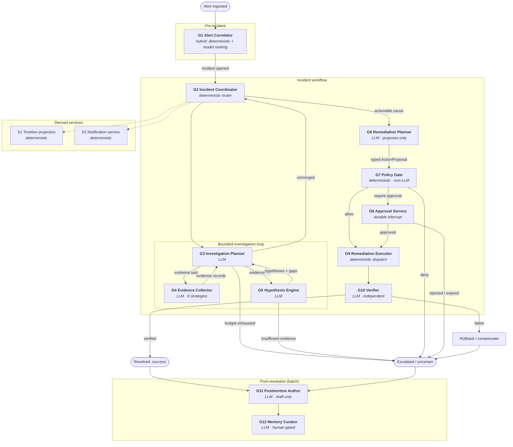

# Agent Topology and State Machine

- **Status:** Authored — Architecture Package (V3 §23 F). Formalised as [ADR-0001](../adr/0001-agent-topology-consolidation.md).
  **Partially implemented:** G2, G3, G4 and G5 exist in the Phase 4 orchestration kernel
  ([`orchestration-kernel.md`](./orchestration-kernel.md)); G1 is Phase 5, G6-G10 Phase 8,
  G11-G12 later. G4 is implemented without a model call for now, which the kernel document
  records and justifies.
- **Master specification references:** Sections 4, 5, 12, 16, 23(F)
- **Authoritative source:** [`../spec/MASTER_PROJECT_PROMPT_V3.md`](../spec/MASTER_PROJECT_PROMPT_V3.md)

Master specification section 4 lists nineteen candidate agents/nodes and, in the same
breath, forbids creating agents merely to inflate the portfolio: *"Use specialized
agents/nodes only where responsibility, tools, permissions, failure modes or evaluation
criteria are meaningfully different."*

This document applies that test to all nineteen, one at a time, and records the result.

---

## 1. The test

Section 4 gives five discriminators. We treat a candidate as deserving its own node if it
differs on **at least two**, and we require that at least one of the two be *permissions*
or *failure modes* — because those are the two that create genuine blast-radius separation
rather than merely tidy code.

| Discriminator | What counts as "meaningfully different" |
|---|---|
| **Responsibility** | A different question is being answered, not the same question against different data |
| **Tools** | A different *capability class*, not merely a different endpoint of the same class |
| **Permissions** | A different permission scope or risk tier — the blast radius genuinely differs |
| **Failure modes** | Failure requires a different recovery path, not merely a different error message |
| **Evaluation criteria** | Correctness is measured by a different metric, needing its own labels |

A single discriminator is not enough. "Reads a different API" is a *strategy*, not a node.

### 1.1 The alternative we are rejecting, and why

The naive reading — nineteen nodes, one per bullet — fails on its own terms. It produces
five telemetry-analysis nodes that share a permission scope, a failure mode, a recovery
path and an evaluation metric, differing only in which adapter they call. That is five
copies of one node with a parameter, and it carries real costs: five prompt surfaces to
maintain and evaluate, five sets of golden labels, five places for a permission bug to
hide, and an agent graph whose size implies a sophistication the design does not have.

It also fails the security test. Section 4's list mixes *reasoning* responsibilities with
*control* responsibilities — "Risk/Policy Gate" and "Human Approval" sit in the same list
as "Log Analysis". Implementing a policy gate as an LLM agent because it appears in a list
of agents would put the authorization decision inside the model, directly violating section
6 and section 15. **Six of the nineteen candidates must not be LLM agents at all.** That is
the single most consequential finding in this document.

---

## 2. Result

**Nineteen candidate responsibilities become twelve graph nodes plus two derived services.**

| | Count | Which |
|---|---|---|
| LLM-backed reasoning nodes | 7 | Investigation Planner, Evidence Collector, Hypothesis Engine, Remediation Planner, Verifier, Postmortem Author, Memory Curator |
| Hybrid (deterministic core, model-assisted ranking) | 1 | Alert Correlator |
| Deterministic nodes (no LLM, by design) | 4 | Incident Coordinator, Policy Gate, Approval Service, Remediation Executor |
| Derived services (not graph nodes) | 2 | Timeline Projection, Notification Service |
| **Total components** | **14** | |

Six telemetry and knowledge domains collapse into one Evidence Collector node carrying six
independently-evaluated **analyser strategies**. The strategies keep what actually differs
between the domains — the query language, the parsing, the prompt, the golden labels —
while the node keeps what does not: the permission tier, the failure and recovery path, the
budget accounting and the provenance handling.

---

## 3. Decision table — all nineteen candidates

`R` responsibility · `T` tools · `P` permissions · `F` failure modes · `E` evaluation criteria.
A tick means *meaningfully* different from the node it is being compared against.

| # | §4 candidate | R | T | P | F | E | Decision | Rationale |
|---:|---|:-:|:-:|:-:|:-:|:-:|---|---|
| 1 | Incident Coordinator | ✅ | — | ✅ | ✅ | — | **Keep — as deterministic node G2** | Owns workflow state and routing. Making it an LLM would put incident control flow inside a model with no benefit: routing is a function of state, and a wrong route is a durability bug, not a reasoning error. |
| 2 | Investigation Planner | ✅ | ✅ | — | ✅ | ✅ | **Keep — G3** | The core reasoning loop of §5. Distinct evaluation metric (tool-call efficiency, gap closure) and a distinct failure mode (non-convergence) requiring budget-based termination. |
| 3 | Alert Correlation | ✅ | ✅ | ✅ | ✅ | ✅ | **Keep — G1, hybrid** | Runs *before* an incident exists, on a streaming latency budget, against a different data shape, with its own metric (correlation precision/recall). Deterministic core with model-assisted ranking (AS-05). |
| 4 | Metrics Analysis | ✅ | — | — | — | ✅ | **Merge → G4 strategy** | Same read-only tier, same failure and recovery path, same provenance handling as the other four. Differs in query language and interpretation only. |
| 5 | Log Analysis | ✅ | — | — | — | ✅ | **Merge → G4 strategy** | As above. High token volume is a budget parameter, not a separate node. |
| 6 | Distributed Trace Analysis | ✅ | — | — | — | ✅ | **Merge → G4 strategy** | As above. |
| 7 | Deployment/Change Analysis | ✅ | — | — | — | ✅ | **Merge → G4 strategy** | As above. Highest single-signal RCA value, which is a prompt and ranking concern, not a topology concern. |
| 8 | Kubernetes/Infrastructure Analysis | ✅ | — | — | — | ✅ | **Merge → G4 strategy** | Read-only K8s queries share the read tier. *Kubernetes **writes** are a different matter entirely and live in G9 under a different credential.* |
| 9 | Operational Knowledge/RAG | ✅ | ✅ | — | — | ✅ | **Merge → G4 strategy** | Retrieval is a *capability the investigation uses*, not an actor with its own goals. Modelling it as a peer agent implies it decides something; it does not. Its distinct quality metrics are preserved as strategy-level evaluation. |
| 10 | Root-Cause Hypothesis | ✅ | — | — | ✅ | ✅ | **Keep — G5** | Reasons *over* evidence rather than gathering it; calls no tools; owns RCA accuracy and unsupported-claim rate; fails by over-confidence, which needs a calibration response, not a retry. |
| 11 | Remediation Planner | ✅ | ✅ | ✅ | ✅ | ✅ | **Keep — G6** | Differs on all five. Produces typed action proposals; separation from execution is mandated by §6. |
| 12 | Risk/Policy Gate | ✅ | ✅ | ✅ | ✅ | ✅ | **Keep — G7, deterministic and non-LLM** | The security chokepoint. **Must not be a model.** A probabilistic authorizer is not an authorizer. Separation of duties from G6 is a security invariant: the proposer must not be the approver. |
| 13 | Human Approval | ✅ | — | ✅ | ✅ | — | **Keep — G8, workflow state, not an agent** | Nothing here reasons. It is a durable interrupt plus an authenticated decision record. Implementing it as an agent would add a model to a path whose entire purpose is that a *human* decides. |
| 14 | Remediation Executor | ✅ | ✅ | ✅ | ✅ | ✅ | **Keep — G9, deterministic dispatch** | The only write path. Different credentials, idempotency obligations, and compensation logic. Selects from a registered catalogue; performs no free-form generation (FR-REM-06). |
| 15 | Verification | ✅ | — | — | ✅ | ✅ | **Keep — G10** | Must be *independent* of the executor to be worth anything. Merging it into G9 would let the component that acted also grade itself — the exact failure it exists to prevent. |
| 16 | Timeline | — | — | — | — | — | **Not a node — derived projection S1** | Every node already emits incident events. A timeline agent would re-derive, with a model, information the event log already holds deterministically — adding hallucination risk to a solved problem. |
| 17 | Notification/Collaboration | ✅ | ✅ | ✅ | ✅ | — | **Not a reasoning node — service S2** | Templating and delivery. Deterministic. Its egress still goes through the Tool Broker, so scope and audit are unchanged. |
| 18 | Postmortem | ✅ | — | — | ✅ | ✅ | **Keep — G11, batch** | Runs after resolution, offline, on a different latency budget, with its own quality metric (citation validity). |
| 19 | Incident Learning/Memory | ✅ | ✅ | ✅ | ✅ | ✅ | **Keep — G12, batch, human-gated** | The only component that writes durable operational knowledge. §10 forbids silent behaviour change from a single incident, which makes this a governed, versioned, approval-gated write path. |

### 3.1 Consolidations, stated plainly

| Merged away | Into | The honest reason |
|---|---|---|
| 4, 5, 6, 7, 8, 9 (six analysis nodes) | **G4 Evidence Collector**, six strategies | They differ in *how to ask*, not in *what authority they have or how they fail*. One node, six strategies, six evaluation label sets. |
| 16 Timeline | **S1**, deterministic projection over `incident_event` | Determinism beats generation for something already recorded. |
| 17 Notification | **S2**, deterministic service | No judgement required. |

### 3.2 Reclassifications from "agent" to "deterministic component"

This is where the design departs most sharply from a literal reading of §4, and it does so
in the direction §6 and §15 demand.

| Candidate | Literal reading | Our decision | Consequence if we had followed the literal reading |
|---|---|---|---|
| 12 Risk/Policy Gate | An LLM agent that judges risk | Deterministic rule evaluator | Authorization becomes probabilistic and promptable; §6 and §15 are unsatisfiable |
| 13 Human Approval | An LLM agent managing approvals | Durable workflow state + authenticated API | A model mediating a human's authority record |
| 14 Remediation Executor | An LLM agent that executes | Deterministic catalogue dispatch | Model-generated commands reaching production — explicitly forbidden by §6 |
| 1 Incident Coordinator | An LLM supervisor | Deterministic state router | Non-deterministic control flow; unreplayable incidents |
| 16 Timeline | An LLM timeline builder | SQL projection | Hallucinated timeline entries in a compliance artifact |
| 17 Notification | An LLM communicator | Template + adapter | Model-authored text sent to customers under the org's name |

---

## 4. Topology

### 4.1 The two structural guarantees

1. **G6 cannot reach G9.** The only path from a proposal to an execution passes through
   G7, and G7 is deterministic. The proposer is never the approver.
2. **Every terminal state is reachable and every path reaches one.** There is no arrow that
   loops without a budget check, and no node whose failure has no exit (§5, FR-INC-03).

---

## 5. Node specifications

Every node below is specified against the twelve attributes required by §4 and by the
project brief. `RO` = read-only capability tier; risk tiers are defined in
[`remediation-safety-policy.md`](./remediation-safety-policy.md).

### G1 — Alert Correlator *(hybrid)*

| Attribute | Specification |
|---|---|
| **Responsibility** | Group incoming alerts into coherent incidents, or attach to an open incident |
| **Inputs** | Canonical `Alert`; open incidents in window; service dependency graph; recent deployments |
| **Outputs** | Correlation decision + signals used + confidence; `Incident` created or joined |
| **Tools** | `topology.read`, `deploy.read` (both `RO`) |
| **Permission scope** | Read-only; tenant-scoped |
| **Failure modes** | Over-grouping (distinct incidents merged); under-grouping (storm); topology unavailable; model unavailable |
| **Confidence** | Deterministic signal score; model ranking contributes only within a bounded band and can never create a group on its own |
| **Timeout** | 5 s deterministic; 10 s including optional model assist |
| **Retry** | 2 retries, exponential backoff, on transient topology errors only. On model failure: degrade to deterministic-only, do not retry |
| **Audit events** | `alert.received`, `alert.normalised`, `correlation.decided`, `incident.opened`, `incident.joined` |
| **Deterministic exit** | Always emits exactly one of: joined, opened, suppressed-as-duplicate, dead-lettered |
| **Evaluation** | Correlation precision/recall against labelled alert-storm fixtures; over-merge rate is scored separately because it is the more damaging error |

### G2 — Incident Coordinator *(deterministic)*

| Attribute | Specification |
|---|---|
| **Responsibility** | Own incident state; route between phases; enforce global budget; emit lifecycle events |
| **Inputs** | Incident state; node results; budget ledger |
| **Outputs** | Next phase transition; terminal state; lifecycle events |
| **Tools** | None |
| **Permission scope** | Internal state only; no egress |
| **Failure modes** | Checkpoint write failure; lease loss; illegal transition attempt |
| **Confidence** | Not applicable — deterministic by design |
| **Timeout** | Per-incident wall-clock budget (default 6 h, configurable) |
| **Retry** | Checkpoint writes retried 3× then dead-letter; illegal transitions are rejected, never retried |
| **Audit events** | `incident.state_changed`, `incident.budget_exhausted`, `incident.terminated` |
| **Deterministic exit** | Exactly one of: `resolved_success`, `resolved_uncertain`, `timeout`, `failed`, `escalated` |
| **Evaluation** | State-machine conformance tests; no illegal transition reachable; replay determinism |

### G3 — Investigation Planner *(LLM)*

| Attribute | Specification |
|---|---|
| **Responsibility** | Identify the largest open information gap and select the next evidence task to close it |
| **Inputs** | Incident context; evidence set so far; hypotheses and their gaps; remaining budget; available capabilities from the registry |
| **Outputs** | Next evidence task (domain + query intent + expected gap closure), or a termination signal |
| **Tools** | None directly — it *requests* evidence tasks; G4 executes them |
| **Permission scope** | None. This is deliberate: the planner reasons about what to ask, and cannot itself ask |
| **Failure modes** | Non-convergence; redundant task selection; schema-invalid output; model outage |
| **Confidence** | Expected information gain per candidate task; reported with the gap it targets |
| **Timeout** | 60 s per planning step |
| **Retry** | 1 retry on schema-invalid output with a repair prompt; then terminate as `uncertain`. Model outage: pause and resume per [`failure-and-recovery.md`](./failure-and-recovery.md) |
| **Audit events** | `plan.step_selected`, `plan.gap_declared`, `plan.terminated` |
| **Deterministic exit** | Terminates on: gaps closed, budget exhausted, no task with positive expected gain, or hard iteration cap |
| **Evaluation** | Tool-call efficiency (evidence value per call); gap-closure rate; redundant-call rate; termination-reason distribution |

### G4 — Evidence Collector *(LLM, six strategies)*

| Attribute | Specification |
|---|---|
| **Responsibility** | Execute one evidence task against one domain and return normalised, cited evidence |
| **Strategies** | `metrics`, `logs`, `traces`, `deployments`, `kubernetes_state`, `knowledge` |
| **Inputs** | Evidence task; incident scope (tenant, service, environment, time window) |
| **Outputs** | `Evidence` records with provenance `VERIFIED_FACT`, citation, and the query issued |
| **Tools** | `metrics.query`, `logs.query`, `traces.query`, `deploy.read`, `k8s.read`, `knowledge.search` — all `RO` |
| **Permission scope** | Read-only tier, scoped to the incident's tenant/service/environment. Credentials are physically read-only (PR-4) |
| **Failure modes** | Adapter timeout; empty result; oversized result; malformed data; **injected content in retrieved text**; partial backend outage |
| **Confidence** | Per-evidence quality score: completeness of the window queried, sample size, and whether the query fully covered the declared gap |
| **Timeout** | 30 s per tool call; 120 s per evidence task including analysis |
| **Retry** | 2 retries with backoff on transient adapter errors. **No retry** on empty result — empty is a valid, informative answer and retrying it wastes budget |
| **Audit events** | `evidence.task_started`, `tool.invoked`, `tool.result`, `evidence.recorded`, `content.injection_flagged` |
| **Deterministic exit** | Always returns evidence records, an explicit empty result, or a typed failure. Never returns prose without records |
| **Evaluation** | Per strategy: evidence precision/recall vs golden labels; citation validity; query appropriateness; injection-detection rate on adversarial fixtures |

> **Why one node.** All six share the read-only tier, the retry policy, the provenance
> labelling, the budget accounting and the recovery path. They differ in query language and
> interpretation — which is exactly what a strategy encapsulates. Each strategy keeps its
> own prompt, parser and golden-label set, so per-domain evaluation is fully preserved.

### G5 — Hypothesis Engine *(LLM)*

| Attribute | Specification |
|---|---|
| **Responsibility** | Form, rank, and critique root-cause hypotheses strictly against the evidence set |
| **Inputs** | Evidence records; incident context; similar historical incidents (advisory only) |
| **Outputs** | Ranked `Hypothesis` records with supporting evidence IDs, counter-evidence IDs, confidence and basis; declared remaining gaps |
| **Tools** | None — reasons over already-gathered evidence |
| **Permission scope** | None |
| **Failure modes** | Over-confidence; unsupported claims; anchoring on history over current evidence; schema-invalid output |
| **Confidence** | Derived from evidence count, evidence quality, and presence of contradiction. Reported with its basis (FR-RCA-03) |
| **Timeout** | 90 s per hypothesis cycle |
| **Retry** | 1 repair retry on schema violation; hypotheses citing non-existent evidence IDs are **rejected deterministically**, not retried |
| **Audit events** | `hypothesis.formed`, `hypothesis.critiqued`, `hypothesis.rejected_unsupported` |
| **Deterministic exit** | Emits ranked hypotheses, or an explicit "insufficient evidence" verdict |
| **Evaluation** | RCA accuracy (top-1 and top-3) vs labels; unsupported-claim rate; counter-evidence quality; confidence calibration curve |

> **Citation integrity is enforced in code, not asked for in a prompt.** Every evidence ID a
> hypothesis cites is checked against the persisted evidence set; a hypothesis referencing
> an ID that does not exist is dropped before ranking. This converts hallucinated citation
> from a scoring problem into an impossible state (FR-RCA-02).

### G6 — Remediation Planner *(LLM)*

| Attribute | Specification |
|---|---|
| **Responsibility** | Convert an accepted hypothesis into one or more typed, parameterised action proposals |
| **Inputs** | Accepted hypothesis + evidence; registry of *available* actions; verified past outcomes for similar causes |
| **Outputs** | `ActionProposal` records carrying all twelve fields required by §6 |
| **Tools** | `registry.read` only |
| **Permission scope** | None beyond registry read. **It cannot execute, and cannot request a capability absent from the registry** |
| **Failure modes** | Proposing an unregistered action; wrong parameters; wrong scope; missing rollback; over-broad blast radius |
| **Confidence** | Expected-effect confidence, with the evidence supporting it |
| **Timeout** | 60 s |
| **Retry** | 1 repair retry on schema violation. A proposal naming an unregistered action is **rejected, never repaired** — repairing it would teach the loop to negotiate for capability |
| **Audit events** | `remediation.proposed`, `remediation.rejected_unregistered` |
| **Deterministic exit** | Emits validated proposals, or "no safe action available" — which is a legitimate and common outcome |
| **Evaluation** | Remediation correctness vs labels; unsafe-proposal rate; rollback-completeness rate; scope-precision |

### G7 — Policy Gate *(deterministic, non-LLM)*

| Attribute | Specification |
|---|---|
| **Responsibility** | The sole authorization decision for any non-read-only action |
| **Inputs** | `ActionProposal` (typed, schema-validated); tool registry descriptor; tenant policy; actor identity; current environment |
| **Outputs** | `allow` \| `deny` \| `require_approval`, plus the deciding rule ID |
| **Tools** | None |
| **Permission scope** | Reads policy and registry. **Consumes no free text, no model output, no retrieved content** |
| **Failure modes** | Policy store unavailable; ambiguous rule match; registry/proposal version skew |
| **Confidence** | Not applicable — deterministic. A gate with a confidence score is not a gate |
| **Timeout** | 1 s |
| **Retry** | Policy store read retried 3×; on continued failure the gate **fails closed** (deny) |
| **Audit events** | `policy.evaluated`, `policy.denied`, `policy.approval_required` — every decision, without exception |
| **Deterministic exit** | Exactly one of the three verdicts. There is no fall-through and no default-allow |
| **Evaluation** | Adversarial suite: no input — including prompt-injected proposals — produces `allow` for an action outside the actor's scope. Target: zero, verified by construction and by test |

### G8 — Approval Service *(durable workflow state)*

| Attribute | Specification |
|---|---|
| **Responsibility** | Hold the workflow durably while a human decides; record the decision immutably |
| **Inputs** | Approval request bound to a specific action version hash; approver identity from RBAC |
| **Outputs** | `approved` \| `rejected` \| `expired`, with actor, justification and timestamp |
| **Tools** | None directly; notification egress via S2 |
| **Permission scope** | Verifies the approver holds the required role **for that risk tier, tenant and environment**. Chat identity alone grants nothing (FR-CLB-03) |
| **Failure modes** | Approver unavailable; approval expiry; **stale approval** (state changed after approval); attempted self-approval |
| **Confidence** | Not applicable |
| **Timeout** | Per risk tier: 30 min low-risk, 2 h high-risk, then expiry |
| **Retry** | Notification delivery retried; the approval decision itself is never retried or inferred |
| **Audit events** | `approval.requested`, `approval.granted`, `approval.rejected`, `approval.expired`, `approval.invalidated_stale` |
| **Deterministic exit** | Exactly one of the three outcomes. Expiry is a real outcome, not a hang |
| **Evaluation** | Restart-resume tests; approval binding tests (mutated parameters must invalidate); self-approval rejection |

### G9 — Remediation Executor *(deterministic dispatch)*

| Attribute | Specification |
|---|---|
| **Responsibility** | Execute an authorized action exactly once, or fail cleanly |
| **Inputs** | Authorized action + idempotency key + preconditions |
| **Outputs** | Execution record: outcome, observed effect, timing, compensation state |
| **Tools** | Write-tier tools, resolved per action from the registry |
| **Permission scope** | Narrowest scope satisfying the action, resolved at execution time. Credentials distinct from all read paths |
| **Failure modes** | Precondition drift; partial application; adapter timeout with unknown outcome; compensation failure |
| **Confidence** | Not applicable — reports observed outcome, never a judgement of success |
| **Timeout** | Per action descriptor; default 300 s |
| **Retry** | Retry **only** where the descriptor declares the operation idempotent. Unknown-outcome timeouts are **never blindly retried** — they reconcile by querying actual state first |
| **Audit events** | `execution.started`, `execution.completed`, `execution.failed`, `compensation.started`, `compensation.completed` |
| **Deterministic exit** | Exactly one of: `succeeded`, `failed_clean` (no effect), `failed_partial` (compensation required), `unknown` (reconciliation required) |
| **Evaluation** | Idempotency tests under duplicate delivery; fault-injection for partial failure; zero double-application |

### G10 — Verifier *(LLM, independent)*

| Attribute | Specification |
|---|---|
| **Responsibility** | Independently determine whether the incident's symptoms actually resolved |
| **Inputs** | Verification criteria **fixed at proposal time**; post-action telemetry; pre-action baseline |
| **Outputs** | `verified` \| `not_verified` \| `inconclusive`, with the evidence supporting the verdict |
| **Tools** | Read-only telemetry tools — the same tier as G4, deliberately not the executor's |
| **Permission scope** | Read-only |
| **Failure modes** | Premature verification (before effect propagates); confusing correlation with causation; telemetry lag; **accepting the executor's success claim** |
| **Confidence** | Based on the margin by which criteria were met and the observation window covered |
| **Timeout** | 180 s including a settling delay per action descriptor |
| **Retry** | Re-observation up to the settling window; `inconclusive` if the window closes without a decision |
| **Audit events** | `verification.started`, `verification.result`, `verification.inconclusive` |
| **Deterministic exit** | Exactly one of the three verdicts |
| **Evaluation** | Verification accuracy vs labels; **false-success rate is the headline metric** — declaring success when symptoms persist is the most damaging error this system can make |

> **Independence is structural.** G10 receives the criteria and the telemetry, and does not
> receive the executor's report of what it did. It cannot be persuaded by a claim it never
> sees (FR-VRF-02).

### G11 — Postmortem Author *(LLM, batch)*

| Attribute | Specification |
|---|---|
| **Responsibility** | Draft a cited postmortem from the incident record |
| **Inputs** | Incident events, evidence, hypotheses, actions, approvals, timeline projection |
| **Outputs** | Postmortem **draft**, every claim citing an event or evidence ID, marked as requiring human review |
| **Tools** | None; optional Jira write via S2/broker after human acceptance |
| **Permission scope** | Read incident record; no write to knowledge base |
| **Failure modes** | Narrative drift beyond evidence; uncited claims; premature publication |
| **Confidence** | Per-section citation coverage |
| **Timeout** | 300 s (batch) |
| **Retry** | 2 retries; uncited claims are stripped deterministically before output |
| **Audit events** | `postmortem.drafted`, `postmortem.claim_stripped_uncited` |
| **Deterministic exit** | Emits a draft or a typed failure. **Never publishes autonomously** |
| **Evaluation** | Citation validity rate; factual consistency vs incident record (judge + deterministic ID check); human-edit distance |

### G12 — Memory Curator *(LLM, batch, human-gated)*

| Attribute | Specification |
|---|---|
| **Responsibility** | Propose promotions from a resolved incident into durable operational memory |
| **Inputs** | Resolved incident; verified remediation outcome; existing knowledge entries |
| **Outputs** | Proposed memory writes — **queued for human approval, never applied directly** |
| **Tools** | `knowledge.read`; writes only via an approved, versioned change |
| **Permission scope** | Cannot write knowledge without an approval record |
| **Failure modes** | Over-generalising from one incident; contradicting existing knowledge; poisoning memory with an unverified outcome |
| **Confidence** | Support count across incidents; **a single incident is never sufficient** for automatic promotion (§10) |
| **Timeout** | 300 s (batch) |
| **Retry** | 2 retries |
| **Audit events** | `memory.promotion_proposed`, `memory.promotion_approved`, `memory.promotion_rejected`, `memory.version_created` |
| **Deterministic exit** | Emits proposals or none |
| **Evaluation** | Promotion precision vs expert review; contradiction-detection rate; measured effect of promoted knowledge on later replay runs |

### S1 — Timeline projection · S2 — Notification service *(deterministic)*

| | S1 Timeline | S2 Notification |
|---|---|---|
| **Responsibility** | Deterministic projection of `incident_event` into an ordered, human-readable timeline | Render templates and deliver to Slack/Teams/PagerDuty/Jira |
| **Inputs** | `incident_event` rows | Lifecycle events; approval requests |
| **Outputs** | Ordered timeline entries, each traceable to a source event | Delivery receipts |
| **Tools** | None | `slack.post`, `teams.post`, `pagerduty.update`, `jira.write` — via broker |
| **Failure modes** | Out-of-order or missing events | Delivery failure; duplicate delivery; rate limiting |
| **Retry** | Not applicable — recomputed on read | At-least-once with de-duplication key; delivery failure **never fails the incident** |
| **Audit events** | None (derived) | `notification.sent`, `notification.failed` |
| **Evaluation** | Projection determinism: identical events yield identical timeline | Delivery success rate; zero duplicate user-visible messages |

---

## 6. Cross-cutting node contract

Every node, without exception, satisfies:

| Requirement | Mechanism |
|---|---|
| Typed I/O schemas | Pydantic models validated at both boundaries; schema violation is a typed failure, never a silent coercion |
| Budget accounting | Every node reports tokens, cost, wall-clock and tool calls to the budget supervisor **before** and after execution |
| Provenance | Every output carries a provenance label; nodes cannot self-assign `VERIFIED_FACT` — only the tool broker can |
| Audit | Every node emits its declared audit events; a node that completes without them is a defect caught by contract tests |
| Determinism under replay | Given identical inputs and fixtures, node routing is identical; model non-determinism is captured in the trace, not re-rolled |
| Cancellation | Every node checks for cancellation at await points; an incident can be interrupted (§11) |

---

## 7. Reconciling the count with §4

The specification's nineteen bullets are *responsibilities*, and all nineteen are present in
this design. What changed is their **implementation form**:

| §4 responsibility | Present as |
|---|---|
| 1, 2, 3, 10, 11, 15, 18, 19 | Their own nodes (G2, G3, G1, G5, G6, G10, G11, G12) |
| 4, 5, 6, 7, 8, 9 | Six strategies within G4, each independently evaluated |
| 12, 13, 14 | Deterministic components G7, G8, G9 — **not models** |
| 16, 17 | Derived services S1, S2 |

**No responsibility from §4 has been dropped.** This is checked mechanically by
`scripts/validate_docs.py`, which fails if any of the nineteen names lacks a disposition in
the decision table above.

---

## 8. When to revisit this topology

Recorded so the decision has an expiry condition rather than becoming folklore:

| Trigger | Likely change |
|---|---|
| One G4 strategy's evaluation diverges persistently from the others, or needs a different permission scope | Split that strategy into its own node |
| Correlation quality plateaus and needs a learned model with its own training and eval lifecycle | Promote G1 to a fully separate service |
| Hypothesis generation needs parallel independent branches with cross-critique | Split G5 into generator and critic nodes |
| Postmortem or memory work grows a distinct human review workflow | Promote G11/G12 into their own service |

Splitting later is cheap because the strategies already carry separate prompts, schemas and
evaluation labels. Merging later is expensive. **This is why the design starts consolidated
and splits on evidence** — the opposite of starting with nineteen nodes and hoping.
