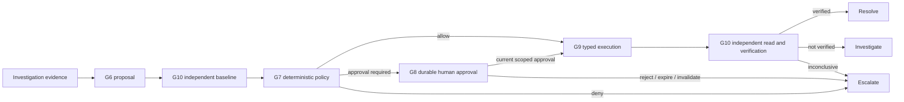

# Bounded remediation

- **Status:** Implemented in Phase 8 with deterministic simulators; no production adapter or live model provider is wired.
- **Decision:** [ADR-0023](../adr/0023-bounded-remediation-as-a-separate-graph.md)
- **Specification:** Sections 6, 7, 12, 15 and 17

Phase 8 adds a separate `G6`–`G10` graph for one proposed action. A human must first reopen
an escalated incident into `investigating`; remediation never begins as an automatic tail of
an investigation run.

Before G6, the kernel freezes an append-only target binding the incident, investigation
run, hypothesis, selected service, environment and resolved permission scope. The model
chooses one tool from the planner's pre-resolved menu and authors the reason, evidence
references and expected effect; it may only select a server-defined verification profile.
Registry descriptors and
incident scope supply risk, permissions, preconditions, rollback, timeout and scope. The
policy gate alone chooses `allow`, `require_approval` or `deny`.

R1 actions are autonomous only outside production with unambiguous, current evidence and no
overlapping remediation. Production R1 requires approval. R2 always requires approval and
is denied when ambiguous or concurrent. R3 has no registered descriptor and cannot be used
as a resolver ceiling.

An approval is a durable row bound to the action-version hash. Dispatch rechecks the policy
verdict, action hash, immutable target/scope binding, current action status, tool descriptor, typed parameters, approval
expiry, approver identity, active role, tenant, environment and risk ceiling. Revocation or
expiry before dispatch removes authority. The broker re-resolves the current write-tool
definition and grant immediately before dispatch; a planning menu is never execution
authority. The broker commits an append-only effect claim in
an independent transaction before invoking a write adapter. If the process dies after the
adapter receives the operation but before a receipt commits, recovery sees the claim and
will not dispatch the effect again.

Every declared precondition is mapped to a read capability and evaluated against an exact
resource identity and explicit fields. Missing, stale, deduplicated or malformed evidence
fails closed. Unknown write outcomes are reconciled through a fresh read and an explicit
effect comparison. G10 captures a real independent baseline before policy can admit the
write. A successful transport response is not verification: after execution G10 waits for
the descriptor settling period, obtains fresh timestamped metrics through the read broker,
and applies the frozen tool-specific profile to the baseline and observation. Empty,
unrelated, stale or malformed evidence is inconclusive and escalates.

The kernel writes a checkpoint after every node. Checkpoints keep the budget ledger and
ephemeral phase; immutable target, action, policy, approval and verification references are
rebuilt from their durable tables. Resume retains the exact selected hypothesis/service and
action and does not reconstruct either from mutable alerts or call the planner again.
Approval waits and settling waits suspend the workflow, release its lease and later resume
under the original run identity, trace and wall-clock budget.

The catalogue currently contains four simulator-backed Kubernetes actions: deployment
rollback, HPA adjustment, node cordon and node uncordon. No real Kubernetes credential or
external integration exists. Automated compensation, repeated remediation attempts,
production latency claims and remediation-quality measurements remain deferred.
