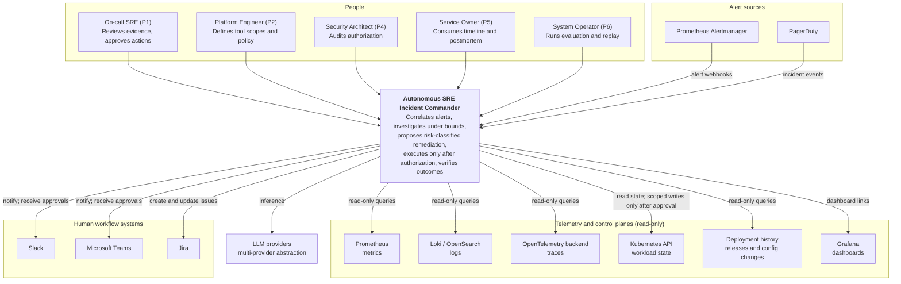
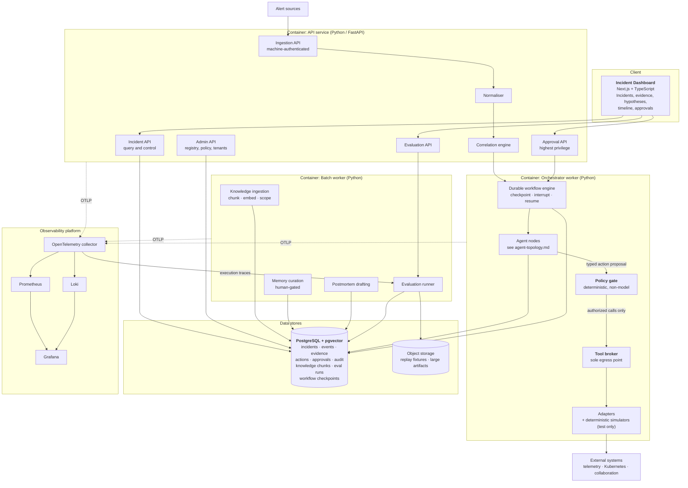
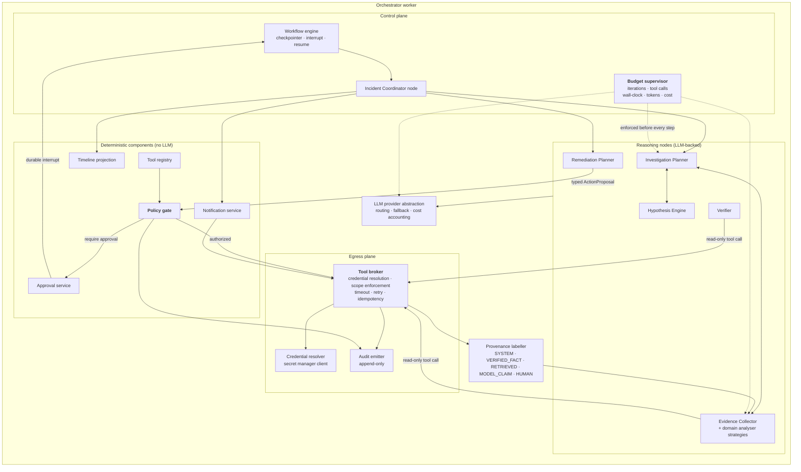
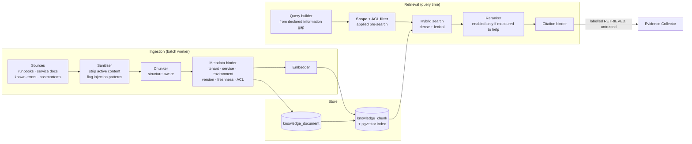

# C4 Diagrams

- **Status:** Authored — Architecture Package (V3 §23 E, §16). **Proposed; not implemented.**
- **Master specification references:** Sections 4, 11, 13, 14, 16
- **Context for these views:** [`ARCHITECTURE_OVERVIEW.md`](./ARCHITECTURE_OVERVIEW.md)

Diagrams use Mermaid `flowchart` rather than the C4 plugin syntax, because Mermaid's native
`C4Context` support is still marked experimental and renders inconsistently across GitHub,
IDEs and static site generators. The C4 *levels* are preserved; only the notation is
portable. Structural validity is checked by `scripts/validate_docs.py`.

---

## Level 1 — System context

Who uses the system, and which external systems it depends on.

**Boundary note.** Kubernetes is the only external system the product ever writes to in
v1, and only through registered, parameter-validated actions after policy authorization.
Every other telemetry integration is read-only by credential, not by convention (PR-4).

---

## Level 2 — Containers

Deployable and runtime units, and the stores they own.

### Container responsibilities and scaling

| Container | Owns | Scales with | Stateless? |
|---|---|---|---|
| API service | Edge authorization, normalisation, correlation | Alert rate | Yes |
| Orchestrator worker | Incident workflows, agent execution, **all authorization and egress** | Concurrent incidents | No — holds workflow leases; state in PostgreSQL |
| Batch worker | Offline knowledge, postmortem, memory, evaluation | Offline job volume | Yes |
| Dashboard | Presentation only; no direct store access | Operator count | Yes |

---

## Level 3 — Components: Orchestrator worker

The security-critical container, expanded. This is where PR-1 ("authority never flows from
the model") is physically enforced.

### The three properties this view is drawn to make checkable

1. **No reasoning node touches an adapter.** Every arrow leaving the reasoning box
   terminates at the Tool Broker or the Policy Gate. If a future change draws an arrow from
   a reasoning node to an adapter, it is a security regression and should fail review.
2. **The Policy Gate has no LLM edge.** It consumes a typed proposal and the registry, and
   nothing else. Retrieved content and model prose cannot reach it (PR-1, FR-POL-02).
3. **Provenance is applied at the egress boundary**, where the origin of data is actually
   known — not later, by a model asked to self-label.

---

## Level 3 — Components: Knowledge and RAG

Detail and rationale in [`memory-and-rag.md`](./memory-and-rag.md).

**Filter-before-search, not after.** Access control and tenant/service scoping are applied
as query predicates, so out-of-scope content is never embedded into a candidate set and
cannot leak through ranking. Post-filtering would allow a scoring path to be influenced by
content the requester may not see (FR-KNW-03, NFR-SEC-03).

---

## Level 4 — Code

Deliberately not produced. Master specification section 20 requires architecture before
implementation, and a code-level view before any code exists would be speculation. Code
structure will be documented once packages exist, in Phase 3 onward.
