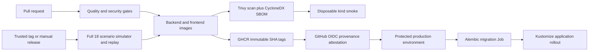

# CI/CD and Infrastructure Architecture

- **Status:** Implemented in Phase 14; local deployment validation only
- **Master specification:** §§11–20 and §24
- **Decision:** [ADR-0031](../adr/0031-production-delivery-boundary.md)
- **Operator procedure:** [Phase 14 deployment guide](../deployment/PHASE14_DEPLOYMENT.md)

## 1. Problem and business value

Phase 13 proved application security but did not create a deployable artifact. Phase 14 makes the
same reviewed code reproducibly buildable, scanable and deployable without converting development
conveniences into production defaults. The value is release evidence and a repeatable hand-off, not
a claim of production availability, scale or cost.

## 2. Responsibility boundary and data flow

There are two production images: API and Next.js frontend. The API image is also the one-shot
migration image, so migration code and application schema expectation cannot drift. The current
orchestration command is a simulator-backed demonstration rather than a production queue consumer;
shipping invented orchestrator/batch workers would create a false runtime boundary.

Production PostgreSQL with pgvector is externally managed. Kubernetes owns application workloads.
Terraform owns the namespace and three tokenless service accounts only. The local overlay alone
runs disposable PostgreSQL.

## 3. Images and release identity

Both Dockerfiles use digest-pinned multi-stage bases and UID/GID 10001. The Python runtime installs
only `runtime.lock` with hashes; the Next.js runtime uses standalone output. Build contexts exclude
Git data, environment files, tests, caches, Terraform state, credentials and scanner output. Root
filesystems are read-only in Kubernetes, with bounded `emptyDir` mounts for `/tmp` and Next cache.

The API uses one Uvicorn process per pod. Its rate limiter is process-local: two replicas do not
provide a cluster-wide quota. A platform ingress rate limit is required for a global budget; adding
workers would multiply the local allowance and database pools. Resource defaults are not sizing
evidence. The Python final stage removes package installers; the Next.js final stage is distroless.

CI uses local `phase14-*` tags only before publication. Trusted releases publish commit-SHA tags to
GHCR, record registry digests, and attest those digests with GitHub's OIDC-backed artifact
attestation. `latest` is never built or deployed. Base digest updates and pinned Actions are reviewed
dependency changes.

Trivy 0.67.2 is the single container scanner. HIGH and CRITICAL findings block regardless of fix
availability; an exception requires a time-bounded reviewed policy change, not a silent ignore.
Missing tools, invalid JSON, absent image identity and empty scan targets fail closed. Advisory DB
unavailability fails the release; an intentionally stale DB is not accepted. CycloneDX SBOMs are
generated from final images, checked for known packages, and retained as workflow artifacts rather
than committed.

## 4. Kubernetes architecture

Kustomize is sufficient because environments change values and resource counts, not chart shape.
The base contains API/frontend Deployments and Services, TLS Ingress contract, meaningful two-replica
PDBs, initial requests/limits, rolling-update policy, topology spread, probes, and default-deny
NetworkPolicies. Production overlays must patch the fail-closed TEST-NET database address, hostname,
ingress class, TLS secret and immutable image digests.

Each workload has an explicit service account with token automount disabled. No Kubernetes RBAC role
is granted. External Kubernetes connector credentials are tenant connector secrets and are not pod
identity. Pods are non-root, RuntimeDefault seccomp, capability-free and cannot escalate.

`/livez` tests the process only. `/readyz` gates DB/schema availability. Initial resource values are
deployment defaults, not measured capacity. PDBs and soft topology spreading improve placement but
are not HA or zero-downtime claims.

The migration Job uses a separate database secret and service account, runs once with no retry, and
must complete before application rollout. Runtime pods receive the least-privilege application URL,
never migration credentials. Failed migrations stop deployment. Application rollback never performs
an automatic Alembic downgrade; schema rollback is an explicit operator/data-safety decision.

Non-secret values use ConfigMap data. Database/auth material is referenced from Kubernetes Secrets
that a platform secret manager must provision; committed production secret values do not exist.
Production OIDC values are deliberately absent from the base, so an unconfigured pod fails closed.
Recommended IdP access-token lifetime is an operator expectation; P13-SEC-05 remains open because the
application does not impose a maximum lifetime.

Default-deny ingress/egress allows DNS, frontend-to-API, database, OTLP, ingress and an egress-gateway
contract. Kubernetes NetworkPolicy cannot express arbitrary vendor DNS safely. Slack/Jira/PagerDuty
traffic requires a production DNS-aware firewall/egress gateway, in addition to application SSRF
checks. The renderer accepts reviewed destination CIDRs for direct HTTPS (including JWKS); operators
must maintain those ranges or use a transparent platform gateway. Application support for arbitrary
HTTP proxy configuration is not assumed. The base does not allow `0.0.0.0/0`.

## 5. Terraform boundary

The project has no selected cloud. Terraform therefore does not fabricate EKS/GKE/AKS, databases or
secret managers. The pinned Kubernetes provider manages namespace and service-account prerequisites;
Kustomize owns workload resources, avoiding dual ownership. Typed variables require an explicit
context and safe namespace. Outputs contain names only.

Local state is for the disposable smoke cluster. Real environments must configure an encrypted,
versioned remote backend with locking and restricted access before apply. No secret value is a
Terraform variable or output, so credentials are not copied into state. Managed database backups,
PITR, registry retention and state recovery are platform prerequisites; their disaster tests belong
to Phase 15.

## 6. CI and release gates

`quality.yml` runs Python formatting/lint/type/test/schema/docs/lock gates against a digest-pinned
PostgreSQL 16 + pgvector service, frontend install/typecheck/build/audit, image builds, required image
scans, non-vacuous SBOM checks, Kustomize/Terraform validation and a disposable kind deployment smoke.
Actions and tool/container versions are immutable pins; permissions begin at `contents: read`; jobs
have timeouts and concurrency controls.

`release.yml` is tag/manual only and depends on the reusable quality workflow. It runs the complete 18-scenario simulator and strict replay,
builds and scans the artifacts, runs the actual strict security gate with container scanning
required, uploads evidence, pushes SHA-tagged images with short-lived `GITHUB_TOKEN`, then generates
OIDC provenance attestations and verifies them against both published digests. It first deploys the
same scanned images to disposable kind, without rebuilding. Its protected environment is an approval
boundary, not a fake remote deployment.

`deploy.yml` is manual and serialized. It accepts only image digests, uses the protected production
environment, verifies release attestations, validates non-secret platform inputs, runs migration
first and waits, then rolls out workloads. The generic kubeconfig secret
is the cloud-neutral contract; a selected platform should replace it with short-lived federated
cluster identity. PRs never receive registry or deployment write authority.

## 7. Failure modes, observability and rollback

Scanner absence/output corruption, security/evaluation failure, migration failure, readiness
failure, Terraform validation failure or rollout timeout returns non-zero and prevents dependent
jobs. Logs are structured stdout/stderr; metrics and OTLP are configured for platform collectors.
The base deploys no duplicate observability stack.

Rollout failure stops deployment. A compatible prior-image rollback is an explicit operator action;
the local smoke exercises Deployment rollback. Database migration is not reversed automatically.
Current migrations are applied before replacement pods; no zero-downtime expand/contract guarantee
is claimed, so operators must assess old/new schema overlap before production rollout.

## 8. Validation, scale and cost

The deployment smoke consumes already-built production images, creates kind Kubernetes 1.34, applies
Terraform prerequisites, starts disposable pgvector, completes migration, rolls out both services,
checks live/readiness/metrics/frontend behavior and inspects runtime UID/token policy. It installs
checksum-pinned Cilium for a representative frontend-to-database denial probe with positive API
connectivity controls. Helm is used only to install this local test CNI, not to package the product.
Enforcement must still be checked on the production CNI. Remote production, TLS termination, HA, SLOs, scaling, DR and cloud
cost are **not executed or claimed**.

Phase 15 may measure sizing, broaden network/load/chaos/penetration campaigns, rollout
resilience and recovery. Interview-relevant concepts here are build-once promotion, immutable
identity, provenance, least privilege, migration ordering, fail-closed gates and IaC ownership.
