# CI/CD and Infrastructure Architecture

- **Status:** Implemented in Phase 14; local deployment validation only
- **Master specification:** §§11–20 and §24
- **Decision:** [ADR-0031](../adr/0031-production-delivery-boundary.md)
- **Operator procedure:** [Phase 14 deployment guide](../deployment/PHASE14_DEPLOYMENT.md)

## 1. Problem and business value

Phase 13 proved application security but did not create a deployable artifact. Phase 14 makes the
same reviewed code reproducibly buildable, scanable and deployable without converting development
conveniences into production defaults. The value is release evidence and a repeatable hand-off, not
a claim of production availability, scale or cost.

## 2. Responsibility boundary and data flow

```mermaid
flowchart LR
    PR[Pull request] --> Q[Quality and security gates]
    Q --> IMG[Backend and frontend images]
    IMG --> SCAN[Trivy scan plus CycloneDX SBOM]
    SCAN --> KIND[Disposable kind smoke]
    TAG[Trusted main or v-tag release] --> BUILD[build-validate: contents read only]
    BUILD --> ARCH[Checksummed image archives]
    ARCH --> PUB[publish-attest: packages and id-token write, no checkout]
    PUB --> GHCR[GHCR digest bound to scanned image ID]
    GHCR --> ATT[GitHub OIDC provenance attestation]
    ATT --> VER[Deploy: verify repo, signer, ref, revision, digest]
    VER --> CRED[Only then: kubeconfig in one step]
    CRED --> MIG[Alembic migration Job, terminal-state watch]
    MIG --> APP[Kustomize application rollout]
    APP --> SMOKE[Automatic post-rollout smoke]
```

There are two production images: API and Next.js frontend. The API image is also the one-shot
migration image, so migration code and application schema expectation cannot drift. The current
orchestration command is a simulator-backed demonstration rather than a production queue consumer;
shipping invented orchestrator/batch workers would create a false runtime boundary.

Production PostgreSQL with pgvector is externally managed. Kubernetes owns application workloads.
Terraform owns the namespace and three tokenless service accounts only. The local overlay alone
runs disposable PostgreSQL.

## 3. Images and release identity

Both Dockerfiles use digest-pinned multi-stage bases and UID/GID 10001. The Python runtime installs
only `runtime.lock` with hashes; the Next.js runtime uses standalone output. Build contexts exclude
Git data, environment files, tests, caches, Terraform state, credentials and scanner output. Root
filesystems are read-only in Kubernetes, with bounded `emptyDir` mounts for `/tmp` and Next cache.

The API uses one Uvicorn process per pod. Its rate limiter is process-local: two replicas do not
provide a cluster-wide quota. A platform ingress rate limit is required for a global budget; adding
workers would multiply the local allowance and database pools. Resource defaults are not sizing
evidence. The Python final stage removes package installers; the Next.js final stage is distroless.

CI uses local `phase14-*` tags only before publication. Trusted releases publish commit-SHA tags to
GHCR, record registry digests, and attest those digests with GitHub's OIDC-backed artifact
attestation. `latest` is never built or deployed. Base digest updates and pinned Actions are reviewed
dependency changes.

Trivy 0.67.2 is the single container scanner. HIGH and CRITICAL findings block regardless of fix
availability; an exception requires a time-bounded reviewed policy change, not a silent ignore.
Missing tools, invalid JSON, absent image identity and empty scan targets fail closed. Advisory DB
unavailability fails the release; an intentionally stale DB is not accepted. CycloneDX SBOMs are
generated from final images, checked for known packages, and retained as workflow artifacts rather
than committed.

## 4. Kubernetes architecture

Kustomize is sufficient because environments change values and resource counts, not chart shape.
The base contains API/frontend Deployments and Services, TLS Ingress contract, meaningful two-replica
PDBs, initial requests/limits, rolling-update policy, topology spread, probes, and default-deny
NetworkPolicies. Production overlays must patch the fail-closed TEST-NET database address, hostname,
ingress class, TLS secret and immutable image digests.

Each workload has an explicit service account with token automount disabled. No Kubernetes RBAC role
is granted. External Kubernetes connector credentials are tenant connector secrets and are not pod
identity. Pods are non-root, RuntimeDefault seccomp, capability-free and cannot escalate.

`/livez` tests the process only. `/readyz` gates DB/schema availability. The frontend has its own
`/livez` (self-only, no API call) and `/readyz` (one API readiness probe bounded by an explicit
1.5 s deadline, 503 when the API is down or hung). An API outage therefore removes frontend pods
from Service endpoints instead of restarting them; page renders are also bounded (10 s).

Terraform labels the namespace with Pod Security Admission `restricted` for `enforce`, `audit` and
`warn`, pinned to policy version `v1.34` (the validated kind version). Caller labels cannot override
it; raising the version is a deliberate change after validating a newer cluster. Initial resource values are
deployment defaults, not measured capacity. PDBs and soft topology spreading improve placement but
are not HA or zero-downtime claims.

The migration Job uses a separate database secret and service account, runs once with no retry, and
must complete before application rollout. Runtime pods receive the least-privilege application URL,
never migration credentials. Failed migrations stop deployment. Application rollback never performs
an automatic Alembic downgrade; schema rollback is an explicit operator/data-safety decision.

Non-secret values use ConfigMap data. Database/auth material is referenced from Kubernetes Secrets
that a platform secret manager must provision; committed production secret values do not exist.
Production OIDC values are deliberately absent from the base, so an unconfigured pod fails closed.
Recommended IdP access-token lifetime is an operator expectation; P13-SEC-05 remains open because the
application does not impose a maximum lifetime.

Default-deny ingress/egress allows DNS, frontend-to-API, database, OTLP, ingress and an egress-gateway
contract. Kubernetes NetworkPolicy cannot express arbitrary vendor DNS safely. Slack/Jira/PagerDuty
traffic requires a production DNS-aware firewall/egress gateway, in addition to application SSRF
checks. The renderer accepts reviewed destination CIDRs for direct HTTPS (including JWKS); operators
must maintain those ranges or use a transparent platform gateway. Application support for arbitrary
HTTP proxy configuration is not assumed. The base does not allow `0.0.0.0/0`, and the renderer
rejects any CIDR set whose collapsed union is all IPv4 or all IPv6 space (for example
`0.0.0.0/1` + `128.0.0.0/1`). This is address arithmetic, not DNS-aware vendor egress control.

## 5. Terraform boundary

The project has no selected cloud. Terraform therefore does not fabricate EKS/GKE/AKS, databases or
secret managers. The pinned Kubernetes provider manages namespace and service-account prerequisites;
Kustomize owns workload resources, avoiding dual ownership. Typed variables require an explicit
context and safe namespace. Outputs contain names only.

Local state is for the disposable smoke cluster. Real environments must configure an encrypted,
versioned remote backend with locking and restricted access before apply. No secret value is a
Terraform variable or output, so credentials are not copied into state. Managed database backups,
PITR, registry retention and state recovery are platform prerequisites; their disaster tests belong
to Phase 15.

## 6. CI and release gates

`quality.yml` runs Python formatting/lint/type/test/schema/docs/lock gates against a digest-pinned
PostgreSQL 16 + pgvector service, frontend install/typecheck/build/audit, image builds, required image
scans, non-vacuous SBOM checks, Kustomize/Terraform validation and a disposable kind deployment smoke.
Actions and tool/container versions are immutable pins; permissions begin at `contents: read`; jobs
have timeouts and concurrency controls.

`release.yml` accepts `main` or `v*` tags whose commit is reachable from protected `main`, and
depends on the reusable quality workflow. It is split by authority:

- `build-validate` (`contents: read`, checkout without persisted credentials) runs the complete
  18-scenario simulator and strict replay, builds both images **once**, runs the strict security gate
  with container scanning required, generates and validates SBOMs against the image IDs, deploys the
  same images to disposable kind, then `docker save`s them and records each archive's SHA-256 and
  image ID as job outputs.
- `publish-attest` (only `packages`, `id-token` and `attestations: write`, protected environment) has
  no checkout and runs no repository code or build. It downloads the archives, checks them against
  the recorded checksums, loads them, checks the image IDs, pushes the SHA tags, binds each registry
  digest to the scanned image ID, attests the registry digests and verifies the attestations (source
  ref and revision included). The binding supports both registry shapes the Docker image stores
  produce: a single manifest (classic store) must have config digest == scanned image ID; an OCI
  index or manifest list (containerd store, where the local image ID is the index digest) must have
  index digest == scanned image ID, or its single `linux/amd64` runtime manifest's config == scanned
  image ID. Buildx attestation manifests (`unknown/unknown`) are never selected; a missing or
  ambiguous runtime manifest, unknown media type or mismatch fails closed. The logic is inline in
  the workflow (no checkout) and its exact shell is exercised by tests against fixtures.

`deploy.yml` is manual, main-only and serialized with `cancel-in-progress: false`. It takes two image
digests and the release commit. With no cluster credential present, it validates inputs, verifies
each attestation (`gh attestation verify --format json` plus a deterministic policy check of
repository, `release.yml` signer, `main`/`v*` source ref, source revision and subject digest), then
installs dependencies and renders. Only the single deployment step receives `KUBE_CONFIG_DATA`; it
writes a `0600` kubeconfig, removes it on exit and in an `always()` cleanup, and runs
`scripts/deploy_release.py`. That orchestrator is the one sequencing implementation, also used by the
kind smoke. The generic kubeconfig secret is the cloud-neutral contract; a selected platform should
replace it with short-lived federated cluster identity. PRs never receive registry or deployment
write authority.

## 7. Failure modes, observability and rollback

Scanner absence/output corruption, security/evaluation failure, migration failure, readiness
failure, Terraform validation failure or rollout timeout returns non-zero and prevents dependent
jobs. Logs are structured stdout/stderr; metrics and OTLP are configured for platform collectors.
The base deploys no duplicate observability stack.

Before creating the migration Job the orchestrator frees its fixed name: a terminal
(`Complete`/`Failed`) Job from an earlier release is recorded and deleted, and its absence confirmed
within 180 s; an active one fails the deployment closed and is left untouched. Only then is the new
Job (whose pod template is immutable) dry-run validated and created; results are accepted only from
the created UID. This makes same-release redeploys, new digests and fix-forward after a failed
migration repeatable.

The migration watcher polls Job conditions and returns as soon as `Failed`/`FailureTarget` or
`Complete` appears, so a failed migration stops in seconds, not after the 10-minute deadline. It
prints bounded, credential-redacted diagnostics (conditions, pod termination reasons, a 40-line log
tail). After rollout the orchestrator runs an automatic smoke through `kubectl port-forward` (no
NetworkPolicy exception, no public DNS/TLS): Service endpoints ready, API `/livez` and `/readyz` 200,
unauthenticated `/api/v1/incidents` 401, frontend `/livez` and `/readyz` 200. Checks for each service
are retried as a unit within a bounded 60 s convergence allowance (rollout completion does not mean
old pods and endpoints have settled); anything still failing at the deadline fails the workflow. A
created migration Job that disappears mid-wait fails the deployment immediately.

Rollout or smoke failure stops deployment. A compatible prior-image rollback is an explicit operator action;
the local smoke exercises Deployment rollback. Database migration is not reversed automatically.
Current migrations are applied before replacement pods; no zero-downtime expand/contract guarantee
is claimed, so operators must assess old/new schema overlap before production rollout.

## 8. Validation, scale and cost

The deployment smoke consumes already-built production images, creates kind Kubernetes 1.34,
applies Terraform prerequisites (then requires a no-drift re-plan), checks the PSA labels and that a
privileged/root/host-namespace pod is rejected at admission, checks that the renderer refuses a
full-space CIDR union, and starts disposable pgvector. Through the shared orchestrator it then runs a
bad-credential migration (it must fail fast, and the application must never be applied), repeats that
run with the guard mutated away in an outside-repo copy (the application must then appear, which
proves the check is not vacuous), and runs the real migration, rollout and automatic smoke. It checks
runtime UID/token policy and network policy (frontend-to-API, API-to-DB and DNS allowed; frontend-to-DB,
internet egress and another namespace to the API denied, all on checksum-pinned Cilium). It scales
the API to zero to show the frontend stays live and is not restarted, and that the smoke then fails.
It also covers failed-rollout recovery and Terraform destroy. Helm is used only to install this local test CNI, not to package the product.
Enforcement must still be checked on the production CNI. Remote production, TLS termination, HA, SLOs, scaling, DR and cloud
cost are **not executed or claimed**.

Phase 15 may measure sizing, broaden network/load/chaos/penetration campaigns, rollout
resilience and recovery. Interview-relevant concepts here are build-once promotion, immutable
identity, provenance, least privilege, migration ordering, fail-closed gates and IaC ownership.
