# CI/CD and Infrastructure Architecture

- **Status:** Authored at design level — Architecture Package. **Proposed; not implemented.** Built in Phase 14.
- **Master specification references:** Sections 13, 16, 17, 18, 20
- **Related:** [`../evaluation/EVALUATION_ARCHITECTURE.md`](../evaluation/EVALUATION_ARCHITECTURE.md) · [`../security/THREAT_MODEL.md`](../security/THREAT_MODEL.md)

This document fixes the pipeline's *shape and gates* now, because §18's evaluation-regression
gate constrains how the harness is built (Phase 11) and how behaviour versions are recorded
(Phase 4). Concrete workflow files, Kubernetes manifests and Terraform modules are Phase 14.

---

## 1. Environments

| Environment | Purpose | Data | Remediation autonomy | Provisioned by |
|---|---|---|---|---|
| **Local** | Development | Simulator fixtures only | R1 autonomous (against simulators) | Docker Compose |
| **CI** | Automated verification | Fixtures only, **network egress disabled** | Simulators only | Ephemeral containers |
| **Staging** | Integration against a reference cluster | Synthetic incidents | R1 autonomous, R2 with approval | Terraform |
| **Production** | Live operation | Customer telemetry | R1 with approval, R2 with approval, R3 never | Terraform |

**CI runs with network egress disabled.** This enforces §14's "do not make the portfolio
dependent on live production infrastructure" mechanically rather than by convention — a test
that quietly reaches a real endpoint fails in CI rather than passing misleadingly.

---

## 2. Pipeline

```mermaid
flowchart LR
    PR["Pull request"] --> FAST["Fast gates<br/>format · lint · types"]
    FAST --> UNIT["Unit + schema/contract tests"]
    UNIT --> INT["Integration<br/>DB · adapters vs simulators"]
    INT --> SEC["Security gates<br/>secrets · SAST · dependencies"]
    SEC --> SAFE["<b>Safety suite</b><br/>SI-1…SI-15 adversarial"]
    SAFE --> EVALS["Evaluation smoke<br/>3 scenarios"]
    EVALS --> MERGE{"Merge"}

    MERGE --> BUILD["Build + SBOM + sign + scan image"]
    BUILD --> EVALF["<b>Full evaluation suite</b><br/>+ regression comparison"]
    EVALF --> STAGE["Deploy to staging"]
    STAGE --> SMOKE["Deployment smoke tests"]
    SMOKE --> REL{"Release gate"}
    REL --> PROD["Deploy to production"]
    PROD --> VERIFY["Post-deploy verification"]
    VERIFY -->|"fail"| RB["Automatic rollback"]
```

---

## 3. Quality gates

Section 18 names nine gate categories. All are blocking; none is advisory.

| # | Gate | Enforces | Blocking on |
|---|---|---|---|
| 1 | Formatting and linting | Consistency | Any diff |
| 2 | Static typing | Type safety across node I/O contracts | Any diff |
| 3 | Tests | All 15 §17 categories, scoped by change | Any diff |
| 4 | Security and dependency scanning | Secret scan, SAST, dependency CVEs | Any diff |
| 5 | Container validation | Image scan, non-root, minimal base, signature | Image build |
| 6 | Compatibility | API, event vocabulary, tool descriptor and schema compatibility | Any diff |
| 7 | **Evaluation regression** | §18: AI behaviour changes must pass the evaluation suite | **Behaviour-affecting diff** |
| 8 | Build verification | Reproducible build; simulator providers absent from the production image | Release |
| 9 | Deployment validation | Smoke tests, then rollback verification | Deploy |

### 3.1 Gate 4 detail — repository and secret hygiene

`scripts/check_repo_hygiene.py` runs pre-commit and in CI from Phase 0. `gitleaks` is added
in Phase 14 for full-history scanning. Per
[`../security/REPOSITORY_SECURITY_CHECKLIST.md`](../security/REPOSITORY_SECURITY_CHECKLIST.md),
**a secret that reaches a commit object must be rotated even after history rewriting.**

### 3.2 Gate 7 detail — the evaluation regression gate

The gate §18 exists for, and the reason behaviour versioning is designed in Phase 4.

**Triggered by a change to any element of the behaviour version:** code, prompt set, model
IDs, retriever configuration, policy, tool registry, judge set.

| Outcome | Action |
|---|---|
| Improvement, or neutral within the measured noise band | Pass |
| Regression in any **safety** metric (unsafe-action rate, scope violations, false-success rate, audit completeness) | **Block. No override.** |
| Regression in a quality metric beyond threshold | Block pending explicit human acceptance recorded in the PR |
| Scenario set changed | Require re-baselining before comparison is meaningful |

The noise band is measured, not assumed — baselines are run *n* times to establish per-metric
variance, because model output varies even at temperature zero. Without this the gate either
fires constantly or never fires.

---

## 4. Container strategy

| Aspect | Decision |
|---|---|
| Images | Four: API service, orchestrator worker, batch worker, frontend |
| Base | Minimal distroless or slim; no shell in production images |
| User | Non-root, read-only root filesystem |
| Build | Multi-stage; **test and simulator dependencies excluded from the production stage** |
| Supply chain | Pinned digests, SBOM generated, images signed, scanned pre-push |
| Configuration | Environment variables and mounted config; **no secrets baked into images** |

Excluding simulators from the production image is how PR-7 ("simulators are test
infrastructure, never a production path") is enforced mechanically rather than by discipline.

---

## 5. Kubernetes design

| Concern | Approach |
|---|---|
| Workloads | API service and frontend as `Deployment` (HPA on request rate); orchestrator worker as `Deployment` with a lease-based work claim; batch worker as `Deployment` plus `CronJob` for scheduled evaluation |
| Orchestrator scaling | Horizontal; workflow leases prevent split-brain (failure-and-recovery §3.3). **Graceful shutdown must drain leases** rather than drop them |
| Configuration | `ConfigMap` for non-secret config; secrets from the external secret manager via CSI or an operator — **never Kubernetes `Secret` as the source of truth** |
| Network | Default-deny `NetworkPolicy`; explicit egress allowances per adapter |
| Identity | Workload identity for cloud access; a **read-only** service account for investigation and a separate, narrower one for remediation (SEC-I10) |
| Resilience | PodDisruptionBudgets; liveness/readiness probes; resource requests and limits |
| Database | Managed PostgreSQL with HA; not in-cluster for production |

The two-service-account split is the Kubernetes expression of read/write credential
separation. It is what makes "investigation cannot mutate" enforceable *by the cluster*
rather than by our code.

---

## 6. Terraform design

| Module | Contents |
|---|---|
| `network` | VPC, subnets, security groups, egress control |
| `database` | Managed PostgreSQL with `pgvector`, backups, PITR, read replica |
| `secrets` | Secret manager, KMS keys, rotation policy |
| `cluster` | Kubernetes cluster, node pools, workload identity |
| `observability` | Collector, Prometheus, Grafana, Loki, retention |
| `application` | Namespaces, service accounts, network policies, deployments |

State in a remote backend with locking. Environments are separate workspaces with separate
state — never a shared workspace differentiated by variable, which is how a staging change
reaches production by accident.

---

## 7. Secret management

| Stage | Handling |
|---|---|
| Development | `.env.example` with placeholders only; real values local and git-ignored |
| CI | Repository/organisation secrets, least-privilege, never echoed; masked in logs |
| Runtime | External secret manager; short-lived, per-action, per-tenant credentials resolved by the tool broker |
| Rotation | Scheduled, and **immediate and mandatory on suspected exposure** |
| Verification | Secret scanning of the repository, and of traces and logs (SEC-I6) |

---

## 8. Deployment validation and rollback

### 8.1 Smoke tests (post-deploy, before traffic)

1. Health and readiness across all services.
2. Database connectivity and migration version check.
3. **Policy gate denies a known-bad proposal** — the safety path is verified on every deploy.
4. Tool registry loads and descriptor schemas validate.
5. A synthetic incident runs end-to-end against simulators.
6. Traces reach the collector with complete correlation identifiers.

Smoke test 3 is included deliberately: a deployment that breaks the authorization path must
be caught before traffic, not by an audit later.

### 8.2 Rollback

| Aspect | Decision |
|---|---|
| Strategy | Rolling update with a readiness gate; automatic rollback on smoke-test or post-deploy failure |
| Database | Expand/contract migrations only, so the previous version runs against the new schema |
| In-flight workflows | **Drain before deploying a graph-shape change**; incidents mid-flight complete on the old version |
| Behaviour version | Recorded per run, so a rollback is traceable in evaluation and in traces |
| Verification | **Rollback is tested by execution in staging every release**, not assumed to work |

The in-flight workflow rule is the operational consequence of ADR-0002's accepted trade-off:
LangGraph has no in-flight workflow versioning, so we drain instead. If draining becomes
disruptive more than twice, that is a recorded trigger to revisit Temporal.

## Phase 13 hand-off: the security gate

Phase 13 delivers `scripts/security_gate.py`, the single entry point Phase 14 CI should invoke as
`python scripts/security_gate.py --strict --require-container-scan --json security-verdict.json`.
It fails closed, returns a machine-readable verdict, and reports container scanning as
`not_executable` until Phase 14 builds a real image (then `--require-container-scan` makes that a
failure). Phase 14 owns the workflow wiring, the image, its scan, SBOM and signing, TLS, encrypted
storage, network policy and the owner-role retention job; see `docs/security/SECURITY_ARCHITECTURE.md`
section 11.
