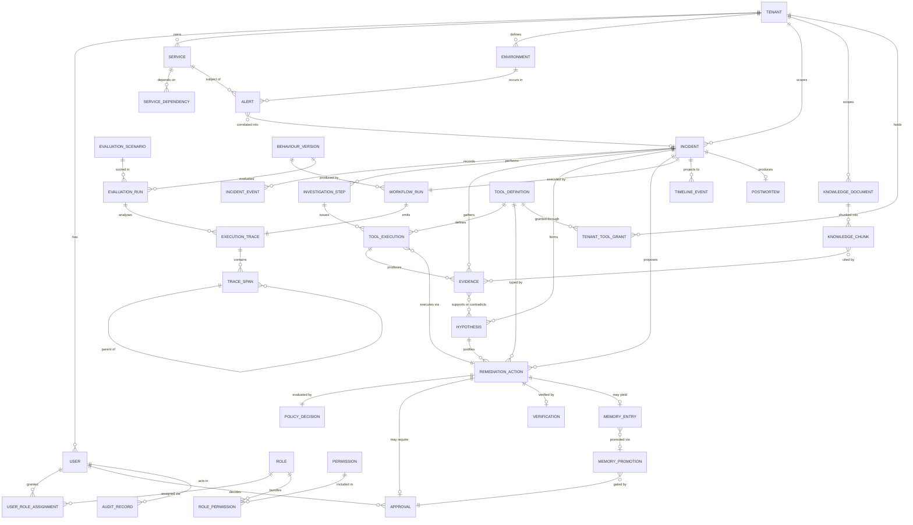

# Data Model and API Boundary

Phase 5 adds delivery receipts, source-state projections and durable investigation requests;
see [telemetry ingestion](./telemetry-ingestion.md) for the implemented contract. The HTTP
surface below is implemented as the authenticated, read-focused Phase 9 API described in
[`phase9-api-dashboard.md`](./phase9-api-dashboard.md); deferred operations are called out
in §7.

- **Status:** Persistence is implemented through Phase 9 and the §7 authenticated API is
  implemented at its documented read-focused boundary. Production external adapters and
  evaluation execution remain deferred.
- **Master specification references:** Sections 8, 12, 13, 15, 16, 23(M)
- **Related:** [`../security/THREAT_MODEL.md`](../security/THREAT_MODEL.md) · [`memory-and-rag.md`](./memory-and-rag.md)

> **Phase 3 delivered the schema.** 36 tables, 38 native enum types, 30 of them
> tenant-scoped and protected by row-level security. Where the model below and the code
> disagree, the code is authoritative and this document is the defect.
>
> Two names changed during implementation, and the reconciliation is recorded rather than
> applied silently:
>
> | Architecture package | Implemented as | Why |
> |---|---|---|
> | `tool_descriptor` | **`tool_definition`** | The Phase 3 brief names the entity "Tool Definition"; one name across brief, schema and code is worth more than fidelity to the earlier draft. |
> | `verified_outcome` | **`memory_entry`** (with `kind`) | The brief names the entity "Memory". One table with a `memory_kind` discriminator covers both T4 operational facts and T5 verified outcomes, which share every column that matters. |
>
> Six tables were added beyond the package's 30, each earning its place: `role`,
> `permission`, `role_permission` and `user_role_assignment` (the brief requires
> "Role / Permission", and authority is per tenant *and* environment);
> `tenant_tool_grant` (the capability menu is resolved per tenant, so it cannot live on the
> global catalogue); and `trace_span` (the brief's section F requires parent/child
> relationships in the trace, which a run-level row alone cannot express).

---

## 1. Modelling principles

| # | Principle | Consequence |
|---|---|---|
| DM-1 | **`tenant_id` on every tenant-scoped table** | Row-level security is possible; isolation is enforceable at the database (SEC-I2) |
| DM-2 | **The incident event log is the system of record** | Incident status is derivable; the timeline is a projection, not a written artifact |
| DM-3 | **Append-only where history matters** | Events, evidence, audit, approvals are never updated in place |
| DM-4 | **Provenance is a column, not a convention** | Every content-bearing row carries its provenance label |
| DM-5 | **Versioned entities are superseded, never overwritten** | Knowledge and memory keep history; retrieval targets a version |
| DM-6 | **Foreign keys express the audit chain** | Evidence → tool execution → action → approval → verification is navigable in SQL |
| DM-7 | **Derived data is materialised, never hand-written** | Timeline and incident status are computed; divergence is impossible by construction |

---

## 2. Conceptual entity-relationship model



---

## 3. Entity catalogue

Every entity required by the brief, plus those the design makes necessary. `AO` = append-only.

### 3.1 Identity and topology

| Entity | Purpose | Key attributes | Invariants |
|---|---|---|---|
| **`tenant`** | Isolation boundary | id, name, status, retention_policy, budget_limits | Root of all scoping |
| **`user`** | Human principal | id, tenant_id, external_idp_subject, roles, status | Roles are per tenant **and** environment |
| **`service`** | A deployable customer service | id, tenant_id, name, owner_team, criticality, namespaces | Unique per tenant; drives permission scope resolution |
| **`environment`** | Deployment context | id, tenant_id, name, is_production, approval_policy | `is_production` drives the autonomy matrix |
| **`service_dependency`** | Topology edge | from_service, to_service, kind, confidence | Feeds deterministic correlation |

### 3.2 Incident core

| Entity | Purpose | Key attributes | Invariants |
|---|---|---|---|
| **`alert`** | Normalised alert | id, tenant_id, source, fingerprint, service_id, environment_id, severity, started_at, labels, annotations(`RETRIEVED`), incident_id? | Idempotent on (source, fingerprint, started_at); annotations never trusted |
| **`incident`** | The workflow subject | id, tenant_id, title, severity, status, opened_at, terminal_state, terminated_at, services[], environment_id | `status` **derived** from events (DM-2); exactly one terminal state |
| **`incident_event`** `AO` | System of record | id, incident_id, seq, occurred_at, event_type, actor, payload, correlation_id | Append-only; `seq` gapless per incident |
| **`workflow_run`** | Orchestration execution | id, incident_id, behaviour_version_id, started_at, checkpoint_ref, status, resumed_count | Survives restart; stable ID across resumes |
| **`timeline_event`** | **Derived** projection | incident_id, seq, occurred_at, category, summary, source_event_id, source_evidence_id | **Materialised from `incident_event` only.** Never hand-written (DM-7) |

> **Reconciling `incident_event` and `timeline_event`.** The brief lists both. They are not
> duplicates: `incident_event` is the append-only system of record written by nodes;
> `timeline_event` is a presentation projection computed from it, with every row carrying
> the source event it derives from. This is the data-layer expression of the topology
> decision that Timeline is a projection, not an agent
> ([`agent-topology.md`](./agent-topology.md) §3).

### 3.3 Investigation

| Entity | Purpose | Key attributes | Invariants |
|---|---|---|---|
| **`investigation_step`** `AO` | One planner-selected step | id, incident_id, seq, gap_declared, strategy, rationale, budget_before/after, outcome | Records the decision, not just the result |
| **`tool_execution`** `AO` | One broker invocation | id, tenant_id, incident_id, step_id?, action_id?, tool_name, tool_version, capability, risk_tier, arguments_redacted, idempotency_key, started_at, outcome, duration_ms | **Every egress produces exactly one row**; unique on idempotency_key per tenant |
| **`evidence`** `AO` | One evidence record | id, incident_id, tool_execution_id, domain, provenance, content, citation, gathered_at, quality_score, scope | `provenance ∈ {VERIFIED_FACT, RETRIEVED}`; must reference a `tool_execution` |
| **`hypothesis`** | A ranked candidate cause | id, incident_id, rank, root_cause_class, statement, confidence, confidence_basis, status, superseded_by | Every cited evidence ID must exist (FR-RCA-02); enforced by FK |
| **`hypothesis_evidence`** | Support / contradiction | hypothesis_id, evidence_id, relation(`supports`\|`contradicts`), weight | Junction; makes counter-evidence first-class |

### 3.4 Safety path

| Entity | Purpose | Key attributes | Invariants |
|---|---|---|---|
| **`tool_definition`** | Registry entry | name, version, capability, input/output schema, permission_scope, risk_tier, timeout, retry, idempotency, rollback_ref, audit_requirements, approval_policy | Versioned, Git-reviewed; **no runtime mutation by any agent path** |
| **`remediation_action`** | A proposal, then its execution | id, incident_id, hypothesis_id, tool_name, tool_version, arguments, action_version_hash, risk_tier, permission_scope, preconditions, rollback_ref, expected_effect, verification_criteria, timeout, status | All twelve §6 fields present or the row is invalid; `verification_criteria` **immutable after proposal** |
| **`policy_decision`** `AO` | The gate's verdict | id, action_id, verdict, rule_id, policy_version, evaluated_at, actor | **Exactly one per action, always** — including allow |
| **`approval`** `AO` | A human decision | id, action_id, action_version_hash, required_role, approver_user_id, decision, justification, requested_at, decided_at, expires_at | `approver ≠ proposer`; hash must match at execution (SI-6) |
| **`verification`** `AO` | Independent verdict | id, action_id, criteria_hash, verdict, observed, baseline, window, margin, verified_at | `criteria_hash` must equal the action's frozen criteria (FR-VRF-03) |
| **`audit_record`** `AO` | Immutable audit | id, tenant_id, occurred_at, actor, incident_id, action_id, tool_execution_id, event_type, policy_rule_id, approval_id, outcome, payload_redacted | Never contains secrets; retained 7 years; append-only |

### 3.5 Knowledge and memory

| Entity | Purpose | Key attributes | Invariants |
|---|---|---|---|
| **`knowledge_document`** | Source document | id, tenant_id, source_uri, doc_type, version, superseded_by, acl_labels, trust_class, source_updated_at, ingested_at, content_hash | Versioned, never overwritten (DM-5) |
| **`knowledge_chunk`** | Retrievable unit | id, document_id, tenant_id, seq, text, embedding, embedding_model_id, chunk_strategy, service_ids, environments, acl_labels | Embedding model recorded per chunk; scope columns are query predicates |
| **`memory_entry`** | Durable memory (T4/T5, discriminated by `kind`) | id, tenant_id, root_cause_class, context_signature, action_ref, observed_effect, verification_verdict, support_count, first_seen, last_seen | `support_count = 1` is **never** auto-promoted (§10) |
| **`memory_promotion`** | Governed write | id, proposed_by, target(`T4`\|`T5`), payload, approval_id, status, created_version | Requires an `approval` row (SI-12) |
| **`postmortem`** | Draft artifact | id, incident_id, content, citations[], status(`draft`\|`reviewed`\|`published`), authored_by, reviewed_by | Cannot reach `published` without a human reviewer |

### 3.6 Evaluation and versioning

| Entity | Purpose | Key attributes | Invariants |
|---|---|---|---|
| **`behaviour_version`** | The versioned tuple | id, code_version, prompt_set_version, model_ids, retriever_config_version, policy_version, registry_version, judge_set_version, created_at | Immutable; referenced by every run (FR-EVL-09) |
| **`evaluation_scenario`** | A test case | id, version, class, title, fixtures_ref, input_ref, expected labels, review_state | Versioned; changing it invalidates cross-version comparison |
| **`evaluation_run`** | One scored execution | id, scenario_id, scenario_version, behaviour_version_id, started_at, metrics{}, verdict, judge_versions[], repetition_index | Immutable once complete |
| **`execution_trace`** | The run's trace | id, workflow_run_id?, evaluation_run_id?, trace_id, spans_ref, seeds, clock_start, fixture_refs | **Same schema for production and evaluation** (PR-5) |

---

## 4. Key invariants

Enforced by constraint where possible, by contract test otherwise.

| # | Invariant | Mechanism |
|---|---|---|
| INV-1 | Every tenant-scoped row carries `tenant_id`; no cross-tenant reference | NOT NULL + RLS + composite FKs including tenant |
| INV-2 | Incident status equals the projection of its events | Derived column / view; no direct writes to status |
| INV-3 | `timeline_event` rows all reference a source event or evidence | NOT NULL FK |
| INV-4 | Every `evidence` row references a `tool_execution` | NOT NULL FK — evidence cannot be conjured |
| INV-5 | Every hypothesis citation references an existing evidence row | FK on the junction table |
| INV-6 | Exactly one `policy_decision` per `remediation_action` | Unique constraint |
| INV-7 | No `tool_execution` with `risk_tier ≠ RO` without an allow decision | FK + check; enforced at broker |
| INV-8 | No execution of an approval-required action without a matching `approval` | Check constraint on status transition |
| INV-9 | `approval.action_version_hash` equals the action's hash at execution | Recomputed at broker; mismatch fails closed |
| INV-10 | `approver_user_id ≠ proposer` | Check constraint |
| INV-11 | `verification.criteria_hash` equals the action's frozen criteria | Check constraint |
| INV-12 | `idempotency_key` unique per tenant | Unique index |
| INV-13 | Audit rows are never updated or deleted within retention | Append-only permissions; no UPDATE/DELETE grant |
| INV-14 | Knowledge documents are superseded, never overwritten | `superseded_by` + insert-only |
| INV-15 | `memory_promotion` requires an approval | NOT NULL FK |
| INV-16 | Every `workflow_run` references a `behaviour_version` | NOT NULL FK |
| INV-17 | Alerts are idempotent on (source, fingerprint, started_at) | Unique index |

---

## 5. Event model

`incident_event.event_type` is a closed vocabulary. Adding a type is a schema change,
because open-ended event types make the projection in DM-7 unimplementable.

| Category | Types |
|---|---|
| Lifecycle | `incident.opened`, `incident.joined`, `incident.severity_changed`, `incident.terminated` |
| Correlation | `alert.received`, `alert.normalised`, `alert.dead_lettered`, `correlation.decided` |
| Investigation | `plan.gap_declared`, `plan.step_selected`, `evidence.recorded`, `plan.terminated` |
| Reasoning | `hypothesis.formed`, `hypothesis.critiqued`, `hypothesis.rejected_unsupported` |
| Safety | `remediation.proposed`, `remediation.rejected_unregistered`, `policy.evaluated`, `approval.requested`, `approval.granted`, `approval.rejected`, `approval.expired`, `approval.invalidated_stale` |
| Execution | `execution.started`, `execution.completed`, `execution.failed`, `compensation.started`, `compensation.completed` |
| Verification | `verification.started`, `verification.result` |
| Post | `postmortem.drafted`, `memory.promotion_proposed`, `memory.promotion_approved` |
| Ops | `workflow.checkpointed`, `workflow.resumed`, `budget.exhausted`, `content.injection_flagged` |

Ordering is by `(incident_id, seq)`, assigned by the orchestrator, gapless, so a missing
event is detectable rather than merely absent.

---

## 6. Tenancy, partitioning and retention

| Concern | Approach | Rationale |
|---|---|---|
| Isolation | Shared schema, `tenant_id` + RLS | Operationally simple at expected scale; the database is the backstop, not the app |
| Escalation path | Schema-per-tenant, then database-per-tenant | Recorded as an ADR trigger if a regulated tenant requires physical separation |
| Partitioning | Time-partition `incident_event`, `tool_execution`, `audit_record`, `execution_trace` | These grow without bound; retention is then a partition drop |
| Retention | Per data class, per [`../security/THREAT_MODEL.md`](../security/THREAT_MODEL.md) §8 | Compliance and cost |
| Deletion | Tenant deletion cascades everywhere except `audit_record`, which is retained per legal policy with tenant data redacted | Right-to-erasure vs audit obligation |

---

## 7. API boundary

Five surfaces with **independent authorization**, separated because their threat profiles
genuinely differ — not for tidiness (FR-API-01).

| Surface | Audience | Auth | Threat profile | Rate limit |
|---|---|---|---|---|
| **Ingestion** | Machines (Alertmanager, PagerDuty) | mTLS / signed webhook, per-source keys | Internet-reachable; forgery and flooding | Per tenant + per source |
| **Incident query/control** | Humans, dashboard | OAuth2/JWT, RBAC | Data disclosure; cross-tenant reads | Per user |
| **Approval** | Humans, chat | OAuth2/JWT + resolved chat identity | **Highest privilege**; spoofing, replay | Strict per user |
| **Evaluation/replay** | Operators, CI | OAuth2/JWT, `system_operator` | Baseline tampering; resource abuse | Per principal |
| **Administration** | Platform admins | OAuth2/JWT + **step-up auth** | **Changes the safety configuration itself** | Strict; all actions audited |

### 7.1 Resource boundaries

Implemented Phase 9 shape. Collection responses are cursor-paginated with hard caps;
protected mutations resolve current resource/environment authority before durable
idempotency replay.

```
INGESTION
  POST /ingest/alerts                     idempotent by fingerprint
  POST /ingest/webhooks/{source}          signature-verified

INCIDENT QUERY / CONTROL
  GET  /incidents                         tenant-scoped, filterable
  GET  /incidents/{id}
  GET  /incidents/{id}/timeline           derived projection
  GET  /incidents/{id}/evidence
  GET  /incidents/{id}/hypotheses
  GET  /incidents/{id}/actions
  GET  /incidents/{id}/trace
  POST /incidents/{id}/escalate
  POST /incidents/{id}/annotate
  POST /incidents/{id}/cancel             interruptibility (§11)

APPROVAL
  GET  /approvals/pending
  GET  /approvals/{id}                    full scope, blast radius, rollback
  POST /approvals/{id}/decide             {decision, justification, action_version_hash}

EVALUATION / REPLAY
  GET  /evaluation/scenarios
  POST /evaluation/runs                   {scenario_set, behaviour_version}
  GET  /evaluation/runs/{id}
  GET  /evaluation/runs/{id}/comparison   vs baseline
  POST /replay/incidents/{id}             replay a real incident

ADMINISTRATION
  GET/POST /admin/tools                   registry (Git-backed, reviewed)
  GET/POST /admin/policies
  GET/POST /admin/tenants
  GET/POST /admin/services
  GET/POST /admin/knowledge-sources
  GET      /admin/audit                   security_auditor only
```

Incident annotation and administration GET routes for tools, policies, tenants, services,
knowledge and audit are implemented. Evaluation execution remains Phase 11. Administrative
POST mutation of tool/policy/tenant/service/knowledge catalogues is intentionally outside
the read-focused Phase 9 boundary; external connector configuration begins in Phase 10.

### 7.2 Cross-cutting API rules

| Rule | Reason |
|---|---|
| Tenant is derived from the authenticated principal, **never from a request parameter** | A tenant parameter is a cross-tenant vulnerability waiting to happen |
| Every mutating request carries an idempotency key | Safe retries |
| Approval decisions include the `action_version_hash` the human saw | Prevents approving one thing and executing another |
| All list endpoints are cursor-paginated with a hard cap | Prevents accidental full-table exposure |
| Errors are typed and non-leaking | No internal identifiers or SQL in error bodies |
| Every response is traceable via `correlation_id` | Support and audit |

---

## 8. Versioning and compatibility

| Artifact | Strategy |
|---|---|
| HTTP API | URI-versioned (`/v1/`); additive changes only within a major |
| Event types | Closed vocabulary; new types are additive and require a projection update |
| Tool descriptors | Semver; actions bind to `major.minor`; a major bump requires re-proposal |
| Schemas (node I/O) | Versioned with the behaviour version; contract-tested both directions |
| Knowledge | Documents superseded, never mutated; retrieval may target a version |
| Behaviour version | Immutable tuple; every run references one |
| Database | Forward-only migrations, expand/contract pattern — **Phase 3, not now** |

---

## 9. What Phase 3 decided, and what remains open

**Decided and implemented:**

| Question | Decision | Where |
|---|---|---|
| Concrete RLS policy expressions and session-context mechanism | `app.current_tenant_id()` reading a transaction-local setting; `USING` + `WITH CHECK` + `FORCE` on all 30 tenant-scoped tables | [`tenancy-and-rls.md`](./tenancy-and-rls.md), [ADR-0011](../adr/0011-authentication-authorization-tenancy.md) |
| `timeline_event`: view or table | A maintained table written only by the projection, with a unique constraint on `source_event_id` making the projection idempotent | [ADR-0014](../adr/0014-materialised-incident-status.md) |
| Closed vocabularies: enum or varchar | Native PostgreSQL `ENUM` — two safety constraints depend on the column only holding known values | [ADR-0012](../adr/0012-native-postgresql-enum-types.md) |
| Cross-tenant references | Composite foreign keys carrying `tenant_id` | [ADR-0013](../adr/0013-composite-tenant-foreign-keys.md) |
| pgvector index type | HNSW with `vector_cosine_ops`, `m=16`, `ef_construction=64` | `knowledge_chunk` model |

**Still open, deliberately — deciding these without measurement would be invention:**

1. Physical partitioning boundaries and retention automation (Phase 13).
2. Whether `evidence.content` lives inline or in object storage above a size threshold —
   needs a measured size distribution.
3. Whether HNSW parameters suit the real corpus — needs the retrieval evaluation set
   (Phase 6, [ADR-0008](../adr/0008-rag-retrieval-strategy.md)).
4. Whether workflow checkpoints share the primary database or get their own (Phase 4).
