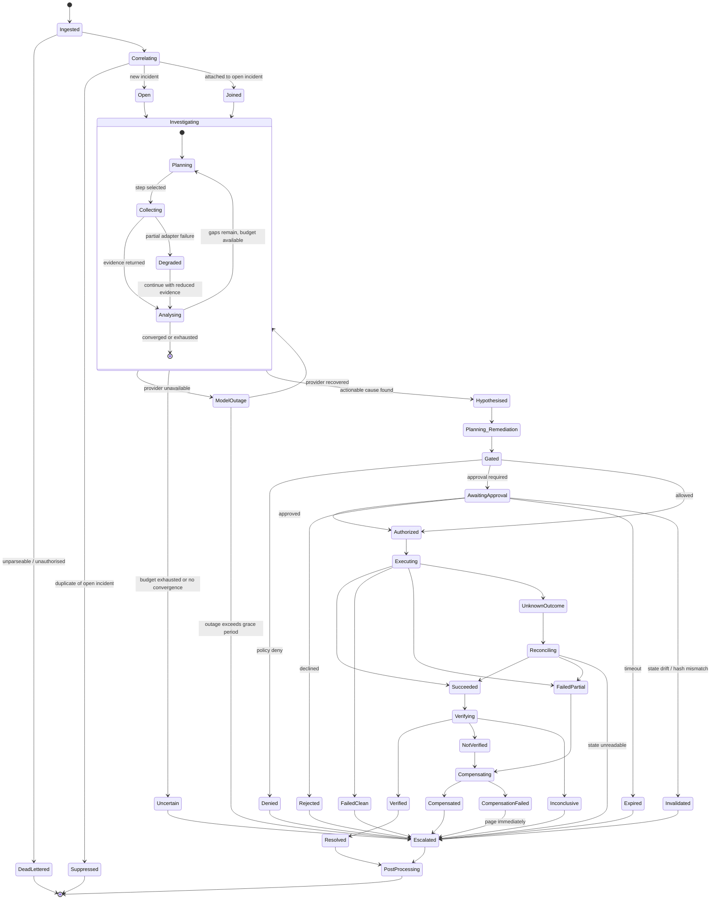

# Failure and Recovery Design

- **Status:** Authored — Architecture Package (V3 §23, durability model). **Proposed; not implemented.**
- **Master specification references:** Sections 5, 12, 16, 17
- **Related:** [`remediation-safety-policy.md`](./remediation-safety-policy.md) · [`../adr/0002-orchestration-langgraph-vs-temporal.md`](../adr/0002-orchestration-langgraph-vs-temporal.md)

Section 12 requires checkpointing, resume-after-failure, idempotent actions, retries with
backoff, timeouts, dead-letter states, duplicate-event handling, partial tool failure,
external API and model outage handling, and human-approval waiting states.

This document specifies **where each mechanism applies and why** — not "use retries".

---

## 1. The retry decision

The single most common durability defect in agent systems is retrying something that must
not be retried. Every operation in this system is classified before any retry policy is
written.

| Class | Definition | Retry? | Examples |
|---|---|---|---|
| **C1 Pure read** | No side effect; safely repeatable | **Yes** — aggressive | Metrics, logs, traces, K8s reads, knowledge search |
| **C2 Idempotent write** | Repeatable with the same key; same end state | **Yes** — bounded | Rollback to a named revision, scale to N, Jira update by key |
| **C3 Non-idempotent write** | Repetition changes the result | **No** — reconcile instead | Create-without-key, append operations |
| **C4 Unknown outcome** | Timed out; may or may not have applied | **Never blind-retry** — query actual state first | Any write that times out |
| **C5 Semantic failure** | The operation worked; the answer is unwelcome | **Never** | Empty result set, policy denial, approval rejection |
| **C6 Deterministic rejection** | The input is invalid | **Never** — repair or reject | Schema violation, unregistered tool |

### 1.1 The two rules that prevent most incidents

> **C5 is not a failure.** An empty log query is a *finding*. Retrying it wastes budget and
> can flip a correct "no evidence" conclusion into a spurious one. A policy denial retried
> is an attempt to get a different answer from a deterministic function.

> **C4 is the dangerous one.** Blind retry double-applies; assuming failure loses an applied
> change; assuming success skips verification. Only reconciliation — querying the target's
> actual state — determines the truth. Actions whose effect cannot be observed by query are
> ineligible for the autonomous catalogue.

### 1.2 Retry policy by operation

| Operation | Class | Attempts | Backoff | Notes |
|---|---|---|---|---|
| Telemetry read | C1 | 3 | Exponential + jitter, 1–8 s | Circuit-break per adapter |
| Knowledge search | C1 | 2 | Exponential | Degrade to lexical-only if the vector index is down |
| Model call (transient) | C1 | 3 | Exponential, 2–20 s | Then fail over to the secondary provider |
| Model call (schema-invalid) | C6 | 1 repair | None | Then terminate the node as a typed failure |
| Policy store read | C1 | 3 | 200 ms fixed | Then **fail closed** (deny) |
| Checkpoint write | C2 | 3 | Exponential | Then dead-letter the workflow |
| Idempotent write action | C2 | 2 | Exponential, 5–30 s | Only if the descriptor declares idempotent |
| Write action timeout | C4 | **0** | — | Enter `Reconciling` |
| Notification delivery | C2 | 5 | Exponential to 5 min | Never fails the incident |
| Alert ingestion | C2 | Broker-driven | — | Idempotent by fingerprint; then dead-letter |

---

## 2. Incident state machine

### 2.1 Terminal states

Section 5 requires every run terminate through success, uncertainty, timeout, failure or
human escalation. The mapping:

| Terminal state | §5 category | Meaning |
|---|---|---|
| `Resolved` | Success | Remediated and independently verified |
| `Uncertain` → `Escalated` | Uncertainty | Investigation completed without sufficient evidence — **a correct outcome** |
| `Escalated` (budget) | Timeout | A hard limit was reached |
| `Escalated` (failure) | Failure | An unrecoverable step |
| `Escalated` (policy/approval) | Human escalation | The system correctly refused to act alone |
| `DeadLettered` | Failure | Input never became an incident |

**Every non-terminal state has an outbound edge to a terminal state.** This is checked by a
state-machine conformance test, not by inspection.

---

## 3. Checkpointing and resume

### 3.1 Checkpoint points

Checkpointing at every node boundary would be expensive and mostly wasted; checkpointing too
rarely loses expensive work. Checkpoints are taken where the cost of recomputation or the
risk of duplication is highest:

| Point | Why |
|---|---|
| Incident opened | Nothing before this is durable |
| After each investigation step completes | Evidence gathering is the expensive part; never re-pay for it |
| Before any state-changing tool call | So a crash mid-call is recoverable to a known point |
| After each state-changing tool call | So the effect is recorded even if the process dies next |
| On entering `AwaitingApproval` | The wait may last hours and must survive deployment |
| After verification | So a resolved incident is not re-remediated |
| On terminal state | Finality |

### 3.2 Resume semantics

On orchestrator restart:

1. Reclaim workflows whose lease expired (lease + heartbeat prevents split-brain).
2. Load the last checkpoint.
3. **Reconcile before resuming**: for any action in `Executing` or `UnknownOutcome`, query
   the target's actual state before deciding what to do next.
4. Resume from the checkpointed step. `workflow_run_id` is preserved; `resumed_count`
   increments; a `workflow.resumed` event is recorded.

**Side effects are never replayed.** Every effect is guarded by its idempotency key, so a
resumed workflow that reaches an already-executed action gets the recorded result instead
of executing again (SI-8, INV-12).

### 3.3 Split-brain prevention

Two orchestrators believing they own the same incident would double-execute remediation —
the worst failure this system can have. Prevention:

- A workflow lease with a heartbeat; only the lease holder may advance the workflow.
- Lease expiry is longer than the maximum node timeout, so a slow node cannot lose its lease.
- Idempotency keys as the final backstop: even if leasing failed, the effect applies once.

---

## 4. Timeouts and budgets

Layered, each strictly shorter than its parent, so an inner timeout fires before an outer
one and produces a specific error rather than a generic one.

| Scope | Default | On expiry |
|---|---|---|
| Single tool call | 30 s read / per-descriptor write | Typed failure; retry per class |
| Model call | 60 s | Retry, then provider failover |
| Node execution | 120 s | Typed node failure; coordinator decides |
| Investigation step | 180 s | Step abandoned; planner continues with what it has |
| Approval wait | 30 min (R1) / 2 h (R2) | Expire → escalate |
| Incident wall-clock | 6 h | Terminate as timeout → escalate |

Budgets are enforced **before** each step, not after (see
[`ARCHITECTURE_OVERVIEW.md`](./ARCHITECTURE_OVERVIEW.md) §4), so exhaustion produces a
clean partial result:

| Budget | Default | On exhaustion |
|---|---|---|
| Investigation iterations | 12 | Terminate with current evidence |
| Tool calls per incident | 40 | Terminate |
| Tokens per incident | Tenant-configured | Terminate |
| Cost per incident | Tenant-configured | Terminate |
| Write actions per incident | 3 | Halt remediation; escalate |

---

## 5. Duplicate-event handling

| Duplicate | Detection | Response |
|---|---|---|
| Same alert redelivered | Unique on (source, fingerprint, started_at) | Absorb; no new incident |
| Alert for an already-open incident | Correlation window + fingerprint | Join; record `incident.joined` |
| Webhook replay | Signature + timestamp + nonce | Reject as replay |
| Duplicate approval submission | Unique on action_id | First wins; second returns the first result |
| Duplicate execution request | Idempotency key | Return recorded result; do not execute |
| Duplicate notification | De-duplication key | Suppress |

---

## 6. Partial tool failure

Section 12 requires partial tool failure be survivable. The principle: **an investigation
degrades; it does not abort.**

| Situation | Response |
|---|---|
| One telemetry domain unavailable | Mark that gap unclosable; continue with the others; record the limitation |
| Adapter degraded (slow, partial results) | Accept partial evidence, flag reduced quality, lower confidence |
| Knowledge base unavailable | Continue without retrieval; note that runbook evidence is absent |
| Multiple domains unavailable | If evidence coverage falls below a threshold, terminate as `Uncertain` — do not guess from a thin set |
| Kubernetes read unavailable | Investigation continues; **all remediation is blocked** — we will not act on a cluster we cannot observe |

The last row is the important one: degraded *observation* must block *action*, because
verification would also be impossible.

Every degradation is recorded on the incident and surfaced to the human, so a partial answer
is never presented as a complete one.

---

## 7. External and model outage

### 7.1 Model provider outage

| Stage | Response |
|---|---|
| Transient error | Retry 3× with backoff |
| Sustained error on primary | Fail over to the secondary provider; record the switch as a behaviour-affecting event |
| All providers unavailable | Enter `ModelOutage`: **pause**, checkpoint, notify. Do not fail the incident |
| Outage exceeds grace period (default 15 min) | Escalate to a human with all evidence gathered so far |

Pausing rather than failing matters because the evidence already gathered is valuable and
expensive; discarding it on a transient outage would be the wrong trade.

Provider failover is recorded because a different model is a different behaviour version —
evaluation comparisons must know which model produced a run (FR-EVL-09).

### 7.2 External system outage

| System | Response |
|---|---|
| Telemetry backend | Degrade per §6 |
| Kubernetes API | Investigation degrades; remediation blocked |
| Slack/Teams | Queue and retry; **never fails the incident**; approvals fall back to the dashboard |
| PagerDuty/Jira | Queue and retry; incident proceeds |
| Secret manager | **Fail closed** — no credential, no action |
| Policy store | **Fail closed** — deny |
| PostgreSQL | Workflow cannot checkpoint; pause and retry; dead-letter on sustained failure |

---

## 8. Dead-letter and error states

| Store | Contents | Handling |
|---|---|---|
| Alert dead-letter | Unparseable, unauthorised or unroutable alerts, with the rejection reason | Operator dashboard; replayable after a fix |
| Workflow dead-letter | Workflows that cannot checkpoint or have an inconsistent state | Manual inspection; resumable or terminable |
| Execution reconciliation queue | Actions in `UnknownOutcome` that could not be reconciled | **Paged immediately** — a possibly-applied change with unknown state |
| Notification dead-letter | Undeliverable messages after retries | Retried out-of-band; never blocks |

Nothing is ever silently dropped (FR-ING-05). Every dead-letter entry retains the reason,
the payload and the correlation identifiers.

---

## 9. FMEA — the failures that matter most

Ranked by severity × likelihood ÷ detectability. Detectability is scored 1 (obvious) to 5
(silent); a high score is what makes a moderate failure dangerous.

| # | Failure | Sev | Lik | Det | Mitigation | Residual |
|---|---|:-:|:-:|:-:|---|---|
| F1 | Double-applied remediation | 5 | 3 | 3 | Idempotency keys; reconcile-don't-retry; lease + heartbeat | Low |
| F2 | False verification of success | 5 | 3 | **5** | Independent verifier; frozen criteria; settling window; false-success is the headline metric | Medium — hardest to detect |
| F3 | Action on drifted state | 5 | 3 | 2 | Precondition re-validation at broker; hash binding | Low |
| F4 | Confident wrong hypothesis accepted by a human | 4 | 4 | **5** | Counter-evidence shown; confidence basis; calibration; deterministic approval rendering | Medium — human factors |
| F5 | Workflow lost on crash | 4 | 3 | 1 | Checkpointing; lease reclaim; dead-letter | Low |
| F6 | Split-brain double execution | 5 | 2 | 3 | Lease + heartbeat; idempotency backstop | Low |
| F7 | Budget exhaustion producing no output | 3 | 4 | 1 | Pre-step budget checks; always emit partial results | Low |
| F8 | Investigation loop without progress | 3 | 3 | 2 | Gap tracking; redundancy detection; hard iteration cap | Low |
| F9 | Silent evidence gap from a degraded adapter | 4 | 3 | **4** | Degradation recorded and surfaced; coverage threshold | Medium |
| F10 | Approval expiry unnoticed | 3 | 3 | 2 | Expiry is an explicit escalating outcome | Low |
| F11 | Compensation fails after partial application | 5 | 2 | 2 | Immediate page; reconciliation queue | Medium — needs a human |
| F12 | Model provider outage mid-incident | 3 | 4 | 1 | Failover; pause-and-resume; grace period | Low |

F2 and F4 share a property worth naming: **both are failures where the system produces a
confident, plausible, wrong answer, and nothing crashes.** They are the reason
false-success rate and unsupported-claim rate are headline evaluation metrics rather than
secondary ones — the test suite is the only detector these failures have.

---

## 10. Testing the failure model

| Mechanism | Test |
|---|---|
| Checkpoint and resume | Kill the orchestrator at each checkpoint; assert resume with no duplicated effect |
| Split-brain | Two workers, forced lease conflict; assert single execution |
| Idempotency | Duplicate and concurrent delivery per write tool |
| Unknown outcome | Inject timeout after the target applied the change; assert reconciliation, not retry |
| Partial tool failure | Disable each adapter in turn; assert degradation, not abort |
| Observation loss | Disable K8s reads; assert remediation is blocked |
| Model outage | Fail primary then all providers; assert failover, pause, then escalation |
| Approval durability | Restart during `AwaitingApproval`; assert the wait survives |
| Budget exhaustion | Force each budget to zero; assert clean partial output |
| Fail-closed | Kill policy store and secret manager; assert deny |
| Dead-letter | Malformed alerts; assert capture with reason and replayability |
| State machine | Exhaustive reachability: every state reaches a terminal state; no illegal transitions |
