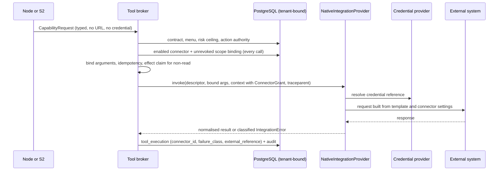

# External Integrations (Phase 10)

- **Status:** Implemented in Phase 10 and validated against **local deterministic HTTP
  servers only**. No live vendor deployment (Prometheus, Loki, Kubernetes, Slack, Teams,
  PagerDuty, Jira, Grafana) has been exercised, and no compatibility claim is made beyond
  the request/response contracts the tests encode.
- **Decisions:** [ADR-0026](../adr/0026-external-integrations-behind-the-broker.md),
  [ADR-0020](../adr/0020-provider-kind-label-and-execution-mode-composition.md),
  [ADR-0027](../adr/0027-loki-as-the-log-backend.md)
- **Related:** [`tool-registry.md`](./tool-registry.md) · [`bounded-remediation.md`](./bounded-remediation.md) · [`../security/THREAT_MODEL.md`](../security/THREAT_MODEL.md)

## 1. Capability map

Every adapter method implements exactly one registered tool. Nothing else in
`src/asic/integrations` can be reached.

| Tool | Capability | Effect class | Adapter | External operation |
|---|---|---|---|---|
| `metrics.query` | `read.metrics` | read | Prometheus | `GET /api/v1/query_range` with a reviewed PromQL template per metric |
| `logs.query` | `read.logs` | read | Loki | `GET /loki/api/v1/query_range` with a typed selector |
| `k8s.workload.read` | `read.k8s_workload` | read | Kubernetes | Deployments, ReplicaSets, HPAs, nodes, events (list) |
| `deploy.list` | `read.deploy` | read | Kubernetes | ReplicaSet revision history |
| `k8s.deployment.rollback` | `mutate.k8s_deployment` | infrastructure mutation | Kubernetes | JSON Patch replacing the pod template with a prior ReplicaSet's, guarded by a `resourceVersion` test |
| `k8s.hpa.adjust` | `mutate.k8s_scale` | infrastructure mutation | Kubernetes | Merge patch of `minReplicas`/`maxReplicas` |
| `k8s.node.cordon` / `uncordon` | `mutate.k8s_node` | infrastructure mutation | Kubernetes | Merge patch of `spec.unschedulable` |
| `slack.post` | `notify.slack_channel` | external record | Slack | `chat.postMessage` to the connector's channel |
| `teams.post` | `notify.teams_channel` | external record | Teams | Workflows webhook (URL is the secret) |
| `pagerduty.event` | `write.pagerduty_event` | external record | PagerDuty | Events API v2 trigger/resolve |
| `jira.issue.create` | `write.jira_issue` | external record | Jira Cloud | Label search, then create |
| `jira.issue.comment` | `write.jira_comment` | external record | Jira Cloud | Comment on the label-identified issue |
| `grafana.annotation.create` | `write.grafana_annotation` | external record | Grafana | `POST /api/annotations` on the configured dashboard |

Not implemented natively, by decision: `traces.query` (no trace backend ADR; refused in live
composition, never simulated) and `knowledge.search` (already native, Phase 6).
Grafana is used for annotations and deterministic deep links, not as a query engine.

## 2. Call path

## 3. Authority

- **Connector:** `integration_connector` per tenant, environment and kind (one enabled at a
  time). Endpoint and credential references only; the application role can read, never
  write. Settings are small flat scalars and are refused if a key or value looks secret.
- **Binding:** `connector_scope_binding(tenant, connector_id, source=kind, service,
  environment)`, enabled and unrevoked. Checked on every call before replay, so revocation
  refuses the next request, including a request that would have been deduplicated.
- **Scope in the request:** service and environment labels, namespaces and Kubernetes target
  labels come from the incident scope and service catalogue. Before any Kubernetes mutation
  the target must carry the configured service label; otherwise `scope_denied`, nothing sent.

## 4. Credentials

References (`asic/...`) are resolved at the execution boundary by `CredentialProvider`:

| Provider | Use | Missing secret |
|---|---|---|
| `EnvironmentCredentialProvider` | Production: `$ASIC_SECRETS_DIR/<reference>` file, else `ASIC_SECRET_<REFERENCE>` | `CredentialUnavailable` -> `configuration_error`, `failed_clean`, no request |
| `StaticCredentialProvider` | Tests only; refused in production and by live composition | same |

Secrets exist only as `SecretValue` (no `repr`, `str`, equality or pickling) and inside the
outbound header/body. Tests assert they never reach `tool_execution`, audit payloads or
errors. The Teams webhook URL is itself the secret; its path and query are never rendered.

## 5. Failure, retry and idempotency

| Situation | Classification | Outcome | Retried? |
|---|---|---|---|
| Connection refused / DNS / TLS | `transient_unavailable` / `configuration_error`, effect not applied | read: retried; write: `failed_clean` | reads only |
| Read timeout | `timeout` | `failed_clean` after attempts | yes |
| Write sent, then timeout or dropped connection | `unknown_outcome` | `unknown` | **never**; Kubernetes reconciled by read |
| 401 / 403 / 404 / 409 / 4xx | `unauthorized` / `forbidden` / `not_found` / `conflict` / `invalid_request` | `failed_clean` | no |
| 429 | `rate_limited`, `Retry-After` capped at 5 s | read retried | reads only |
| 5xx | `transient_unavailable`; write effect **not** assumed absent | read retried; write `unknown` | reads only |
| 2xx with unparseable/contradictory body | `malformed_response` | read `failed_clean`; write `unknown` | no |

Idempotency: every external record is keyed on a deterministic event id and protected by
the broker's durable effect claim. PagerDuty uses a derived `dedup_key`; Jira creates are
label-deduplicated; Kubernetes mutations are no-ops when the target already has the desired
state and use optimistic concurrency otherwise.

## 6. Modes

`asic.integrations.composition` builds `live` (native only, production credentials, https
only) or local-test (explicitly labelled test infrastructure, refused in production). The
simulator composition is unchanged. A broker refuses any mix of live integrations and
simulated or replay providers.

## 7. Notification service (S2)

`asic.notifications.service.NotificationService` renders records (reference, severity,
status, bounded title) and delivers through the broker using only capabilities on the
tenant's S2 menu. Jira issues are opened for opening/escalation events and commented for
others. Each destination yields a typed receipt; delivery failure never fails the incident.
`InvestigationService` announces escalated and resolved outcomes when a notifier is wired.

PagerDuty synchronisation is one-way: internal status drives trigger/resolve; PagerDuty
state never changes an incident. Inbound chat approvals are deferred - approval remains the
authenticated approval API.

## 8. OpenTelemetry boundary

Outbound requests carry a W3C `traceparent` built from the durable trace and span ids, so
external systems that honour trace context can be correlated with `trace_span` rows.
Exporters, dashboards and SLOs are Phase 12.

## 9. Verification with a live source

Remediation verification profiles are versioned. Profile `latency-p95-recovery-v2` approves
the native `prometheus` source; actions are judged by the exact profile version frozen on
them. Prometheus samples are normalised to six decimal places, matching the persisted
`Numeric(18,6)` precision so trusted lineage reproduces exactly.

## 10. Known limitations

- Local deterministic servers only; no vendor account, cluster or live Grafana was used.
- Jira Cloud REST v3 only; Teams via Workflows webhooks only.
- Kubernetes event filtering is by involved-object name prefix.
- No trace backend adapter; no Elasticsearch/OpenSearch (ADR-0027).
- No interactive (inbound) Slack/Teams approval.
