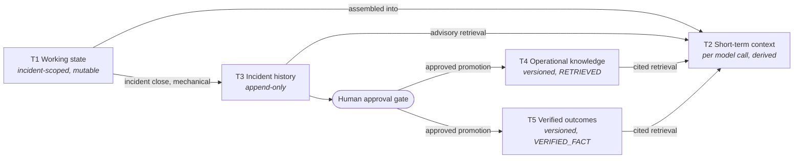
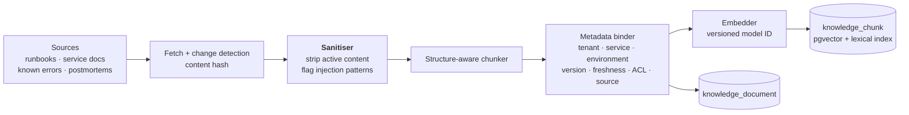
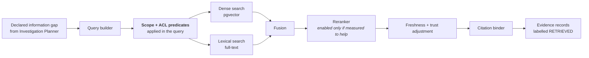

# Memory and RAG Architecture

- **Status:** Implemented — Phase 6 (`feat: establish governed operational rag and memory`). T1–T3 as designed
  in Phase 3–5; T4 (operational knowledge) and T5 (verified outcomes) implemented this
  phase. See §7 for what is deliberately deferred.
- **Master specification references:** Sections 8, 10, 15, 23(H)
- **Related:** [`tool-registry.md`](./tool-registry.md) §6 (provenance) · [`data-model-and-api.md`](./data-model-and-api.md) · [ADR-0004](../adr/0004-postgresql-pgvector-primary-datastore.md) · [ADR-0008](../adr/0008-rag-retrieval-strategy.md) · [ADR-0009](../adr/0009-memory-architecture-tiers.md)

---

## 1. Memory tiers

Section 8 requires five separated concerns. They are separated because they differ in
**lifetime, write authority and trust** — not merely for tidiness. Collapsing any two
creates a specific, nameable failure.

| Tier | Contents | Lifetime | Written by | Trust | Failure if merged with another tier |
|---|---|---|---|---|---|
| **T1 Working incident state** | Current hypotheses, open gaps, budget ledger, node scratch | Incident duration | Orchestrator, nodes | Internal | If merged with T3, a mid-investigation guess becomes permanent history |
| **T2 Short-term context** | The window assembled for a given model call | One model call | Context assembler | Derived | If merged with T1, prompt-shaping accidentally mutates incident state |
| **T3 Durable incident history** | Closed incidents, events, evidence, actions, outcomes | Retention policy (years) | Append-only, at incident close | `VERIFIED_FACT` where tool-derived | If merged with T4, unreviewed incident detail leaks into advice given to future incidents |
| **T4 Operational knowledge** | Runbooks, service docs, known errors, postmortems | Versioned; superseded not deleted | **Human-approved writes only** | `RETRIEVED` — untrusted | If merged with T5, an unverified suggestion is presented as a proven fix |
| **T5 Verified remediation outcomes** | Action → context → observed effect → verification verdict | Versioned | G12 proposal + human approval | `VERIFIED_FACT` with support count | If merged with T3, one incident becomes a general rule |

### 1.1 The rule that keeps the tiers honest

> **Nothing is promoted upward without an explicit, recorded, human-approved transition.**

T1 → T3 happens at incident close, mechanically, append-only. T3 → T5 and T3 → T4 require
a proposal and a human approval record. There is no automatic path from "this worked
once" to "this is what we do" (§10, SI-15).

**Implementation note:** the proposal/approval mechanism is `asic.memory.service.
MemoryGovernanceService` — a deterministic service called directly, not the `G12_MEMORY_
CURATOR` orchestration node. `G12_MEMORY_CURATOR` exists as a reserved `NodeId` value but
is not wired into any graph in this phase; nothing currently *proposes* a promotion
automatically. `propose()`/`decide()` are available for a future node, an operator tool, or
a human-facing workflow to call — Phase 6 builds the governance the promotion must satisfy,
not the trigger that initiates one.

### 1.2 History informs, never overrides

Section 8 is explicit: *"Historical incidents inform current investigation but never
override current evidence."* Enforced three ways:

1. Historical material enters T2 labelled `RETRIEVED`, never `VERIFIED_FACT`.
2. The Hypothesis Engine (G5) may cite history as *supporting context* but a hypothesis
   whose only support is historical is scored as unsupported by current evidence, and
   ranked accordingly.
3. When current evidence contradicts historical precedent, the contradiction is surfaced as
   counter-evidence rather than resolved silently in favour of either.

---

## 2. RAG pipeline

### 2.1 Ingestion

**Chunking is structure-aware, not fixed-width.** Operational documents have meaningful
structure — a runbook step, a known-error entry, a postmortem section — and splitting mid
procedure produces chunks that retrieve well and advise badly. A chunk that is half a
rollback procedure is worse than no chunk. Where structure is absent we fall back to
window-with-overlap, and record which strategy produced each chunk so retrieval evaluation
can compare them.

**The embedding model ID is stored per chunk.** Changing the embedding model is a versioned
behaviour change (§10, FR-EVL-09) requiring a re-index and a re-run of retrieval
evaluation — not a config edit.

**Implementation.** `asic.knowledge.canonical.canonicalize()` is the sanitiser (NFC
normalisation, control/format-character stripping, HTML-to-text with active content
dropped, injection-pattern scan as a recorded signal); `asic.knowledge.chunking.
chunk_document()` is the structure-aware chunker (heading/fence/table/list-aware, falling
back to bounded window-with-overlap, recording which strategy produced each chunk);
`asic.knowledge.embedding.EmbeddingService` wraps a swappable `EmbeddingProvider`, with
`DeterministicEmbeddingProvider` (hashed tokens plus a small versioned concept table) as
the test/evaluation provider — explicitly not a semantic model and making no quality claim
of its own; `asic.knowledge.ingestion.KnowledgeIngestionService` is the transactional
pipeline, serialising one source's version history under a per-source PostgreSQL advisory
lock so the supersede-then-insert sequence cannot race. One source type — an imported
document's title/body/format — is implemented; connector-specific fetch (git, wiki,
ticketing) is out of scope for this phase.

### 2.2 Metadata

| Field | Purpose |
|---|---|
| `tenant_id` | Isolation boundary; a query predicate, never a post-filter |
| `service_ids`, `environments` | Scoping per FR-KNW-02 |
| `acl_labels` | Access-control filtering per FR-KNW-03 |
| `document_version`, `superseded_by` | Versioning per FR-KNW-05 |
| `source_updated_at`, `ingested_at` | Freshness; staleness is computed, not assumed |
| `content_hash` | Change detection; avoids needless re-embedding |
| `chunk_strategy`, `embedding_model_id` | Reproducibility and evaluation comparability |
| `trust_class` | `official_runbook` ranks above `historical_postmortem` |

### 2.3 Retrieval

**Filter before search, never after.** Scope and ACL are query predicates, so out-of-scope
content never enters the candidate set. Post-filtering would let inaccessible content
influence scoring and ordering — an information leak even when the content itself is never
returned (NFR-SEC-03).

**Hybrid retrieval is the starting point; reranking is not.** Section 8 says hybrid
retrieval and reranking "where justified". Justification means measurement:

| Stage | v1 default | Promotion criterion |
|---|---|---|
| Dense (pgvector) | Enabled | Baseline |
| Lexical (Postgres FTS) | Enabled | Operational vocabulary is full of exact tokens — error codes, service names, metric names — where lexical beats dense |
| Fusion | Enabled, reciprocal rank fusion | Simple, no extra model, no extra latency |
| Cross-encoder rerank | **Disabled** | Enable only if it produces a measured improvement in retrieval evaluation that exceeds its latency and cost |
| Query expansion | **Disabled** | Same standard |

Shipping a reranker by default would be exactly the résumé-keyword adoption §20 forbids.
The retrieval evaluation set (§5 below) exists so this stays a measurement, not an opinion.

**Implementation.** `asic.knowledge.retrieval.KnowledgeRetriever.retrieve()` runs the whole
filter-then-search sequence as one SQL statement (`_RETRIEVAL_SQL`): a CTE classifies every
chunk's *disposition* — `unauthorized` / `inactive_source` / `revoked_version` /
`not_yet_effective` / `superseded` / `stale` / `embedding_model_mismatch` / `eligible` —
before lexical (`websearch_to_tsquery` + `ts_rank_cd`) or vector (exact cosine, pre-filtered)
search ever runs, so an out-of-scope chunk cannot influence ranking even indirectly. Fusion
is reciprocal rank fusion (`FusionPolicy`, `k=60`, versioned as part of the retrieval policy
identifier). No reranker or query-expansion code exists in the codebase — there is nothing
to enable, consistent with "disabled until measured to help."

### 2.3.1 Lifecycle authority

`ImportActor` records attribution only and grants no authority. Source revoke/delete and
version revoke require a separate `LifecyclePrincipal` whose current database role owns
`knowledge.source.lifecycle.manage` for the tenant. The service rechecks this permission at
mutation time; removal of the role assignment takes effect immediately. Both permitted and
denied attempts are audited. A future trusted connector may receive explicit lifecycle
authority only when Phase 10 defines that identity; a connector label or arbitrary system
actor does not grant it today.

### 2.4 Citations

Every retrieved chunk returns with `document_id`, `chunk_id`, `document_version`,
`source_uri`, `source_updated_at` and the retrieval score. A human can re-derive it; the
Postmortem Author's uncited claims are stripped against exactly these IDs (G11).

**Implementation.** A citation is the token `knowledge:<retrieval_id>/<chunk_id>@
<version_id>`, valid only if that exact chunk was returned by that exact retrieval —
resolution (`asic.knowledge.citations.resolve_citation()`) joins through the append-only
`knowledge_retrieval_result` table, not merely through the chunk table, so a token cannot
be minted for content that was never retrieved and a model cannot fabricate one that
resolves. `asic.knowledge.retrieval.replay_retrieval()` reconstructs exactly what a past
retrieval returned — including superseded content, as it stood then — while withholding
content whose source has since been revoked or deleted.

---

## 3. Provenance

The five labels, their authority and their rules, are defined normatively in
[`tool-registry.md`](./tool-registry.md) §6.1. Applied to memory:

| Content | Label | Why |
|---|---|---|
| Tool result from the broker | `VERIFIED_FACT` | Origin, query and timestamp are known |
| Knowledge base chunk | `RETRIEVED` | Human-authored text of unknown current accuracy |
| Historical incident detail | `RETRIEVED` | True of *that* incident, not of this one |
| Verified remediation outcome (T5) | `VERIFIED_FACT` with support count | Observed and verified, but support count still bounds generalisation |
| Any model generation | `MODEL_CLAIM` | Untrusted until grounded and schema-validated |
| Policy, registry, configuration | `SYSTEM` | Ours |
| Approval decision, operator input | `HUMAN` | Authenticated |

**Labels are applied at the boundary where origin is known** — the broker, the retriever,
the API — never by asking a model to label its own output. A node cannot promote a label.

---

## 4. Prompt-injection defenses

Retrieved content is the primary injection vector: runbooks and tickets are written by
humans, sometimes by humans outside the tenant, and can be edited by anyone with write
access to a wiki.

| Layer | Mechanism | What it stops |
|---|---|---|
| **Structural (primary)** | The policy gate accepts only a typed `ActionProposal` + `SYSTEM` policy. There is no field capable of carrying `RETRIEVED` content | An injected instruction reaching authorization at all |
| **Positional** | Untrusted content is placed in a delimited data region, never in an instruction position | Instruction confusion |
| **Capability** | The model chooses from a pre-resolved capability menu; it cannot name a new capability | "Grant yourself admin" having any referent |
| **Detection** | Injection-pattern scan at ingestion and at retrieval; flagged, recorded, surfaced | Provides signal and evidence; **not relied upon as the defence** |
| **Sanitisation** | Strip scripts, embedded markup, zero-width and bidirectional control characters | Obfuscated payloads |
| **Output validation** | Model output is schema-validated; cited evidence IDs are verified to exist | Fabricated citations, malformed actions |
| **Egress control** | Only the broker reaches external systems, with scoped credentials | Exfiltration via tool arguments |

The distinction that matters: detection is a **signal**, structure is the **defence**. A
system whose injection protection is a pattern list is one novel phrasing away from failure.
A system where retrieved text has no path to the authorization type is not.

**Implementation.** Retrieved content reaches a model prompt only through `asic.
orchestration.knowledge_context.knowledge_evidence_blocks()`, which renders each citation
as an `asic.domain.untrusted.UntrustedBlock` (provenance `RETRIEVED`, which cannot confer
authority — `UntrustedBlock.__post_init__` raises `ProvenanceViolation` for any block whose
provenance does confer it) and `PromptTemplate.render()` fences every block behind
`<<<UNTRUSTED_DATA ... UNTRUSTED_DATA>>>` markers, neutralising any marker-like text found
*inside* retrieved content first so a document cannot forge a fence close and inject a
second, attacker-labelled block. `tests/security/test_knowledge_prompt_injection.py`
exercises this through the real broker, the real `KnowledgeStoreProvider`, real manifest
verification and the real `HYPOTHESIS_PROMPT` template — not a sanitiser unit test — with a
document containing a fake `SYSTEM:` header, an "ignore all previous instructions" payload,
a forged citation and forged fence markers. Also load-bearing: a provider's retrieval
manifest is untrusted input in its own right — `knowledge_context.validate_manifest()`
re-checks tenant, correlation id, the broker's own idempotency key, and every result's
chunk/version/source/content-hash against the database before anything is recorded.

### 4.1 Threats we accept

Recorded honestly rather than claimed away:

- A runbook that is simply **wrong** (not malicious) can mislead a hypothesis. Mitigation:
  citation, freshness, trust class, and current evidence outranking retrieved text.
- Injected content can **waste budget** by steering investigation toward useless evidence.
  Bounded by hard limits (§5), detectable as a tool-call-efficiency regression.
- A **compromised knowledge source** can degrade advice quality broadly. Mitigation: source
  authentication, change detection, and human-approved promotion into T4.

---

## 5. Retrieval evaluation

Section 8 requires retrieval evaluation as a first-class concern, not a side effect of
end-to-end scoring. Detail in
[`../evaluation/EVALUATION_ARCHITECTURE.md`](../evaluation/EVALUATION_ARCHITECTURE.md).

| Metric | Definition | Why it matters here |
|---|---|---|
| Recall@k | Fraction of known-relevant chunks retrieved in top k | The dominant failure is *missing* the right runbook |
| Precision@k | Fraction of retrieved chunks that are relevant | Irrelevant chunks consume context budget and add injection surface |
| MRR / nDCG | Rank quality | Whether the reranker earns its cost |
| Citation validity | Cited chunk exists, is in scope, and supports the claim | Directly feeds unsupported-claim rate |
| Staleness rate | Retrieved chunks past their freshness threshold | Stale runbooks are the pain §3 names explicitly |
| Scope-violation rate | Out-of-scope or out-of-tenant chunk retrieved | **Must be zero.** A security metric, not a quality metric |
| Injection-detection rate | Flagged / planted, on the adversarial corpus | Signal quality |

The evaluation set pairs realistic incident information-gaps with expert-labelled relevant
chunks, and is versioned alongside the knowledge corpus so retrieval changes are compared
against a fixed target.

**Implementation and measured evidence.** `tests/knowledge/test_retrieval_evaluation.py`
is a twelve-document, eighteen-query golden corpus covering exact-lexical, semantic-
paraphrase, ambiguous, wrong-service, wrong-tenant, no-result, unauthorized, stale,
revoked, superseded/competing-version and injected-document cases, plus (P6-09) a
lexical-only holdout absent from the deterministic embedding's concept table, a
hard-negative distractor sharing vocabulary with a correct answer while describing a
different (non-)problem, and a semantic-paraphrase holdout built to avoid that concept
table entirely. Measured on the run that produced this document: recall@5 = 1.000,
precision@5 = 0.730, MRR = 0.933 over the ten gradeable queries (the ambiguous query, the
hard-negative distractor and the out-of-vocabulary holdout are each excluded from this
average and have their own dedicated test instead - the ambiguous query has no single
correct answer and is graded on citation soundness, the distractor is graded on whether
the true answer is still recalled at all under real competition, and the out-of-vocabulary
holdout is asserted to **miss**, honestly: the deterministic embedding is a hashed bag of
tokens and a fixed concept table, not a semantic model, and has no mechanism to recognise
a paraphrase built to avoid that table); unauthorized-rate and stale-rate were both
measured at zero across their probe sets, and are asserted as exact-zero security
properties rather than folded into the quality average. This is architecture validation on
a small corpus that now deliberately includes a hard negative, built with the
deterministic test embedding provider — it is not a claim about recall against any other
corpus, embedding model, or production-scale document set.

---

## 6. Context assembly (T2)

The short-term context for a model call is assembled deterministically, under a token
budget, in a fixed precedence order:

| Priority | Content | Label | Budget share |
|---|---|---|---|
| 1 | Task instruction and output schema | `SYSTEM` | Fixed |
| 2 | Incident scope: service, environment, window, symptoms | `SYSTEM` | Fixed |
| 3 | Current evidence set | `VERIFIED_FACT` | Largest share |
| 4 | Open gaps and prior hypotheses | Internal | Moderate |
| 5 | Retrieved knowledge | `RETRIEVED`, delimited | Capped |
| 6 | Verified past outcomes | `VERIFIED_FACT`, with support count | Capped |
| 7 | Historical incident summaries | `RETRIEVED`, advisory | Smallest, dropped first |

Three properties follow: assembly is **deterministic** (same state ⇒ same context, so
replay is meaningful); **current evidence outranks history** by construction of the budget;
and **untrusted content is capped and dropped first** under pressure, so budget exhaustion
degrades toward the trusted end of the spectrum rather than away from it.

---

## 7. Implementation status and deferred items

Built and tested this phase, against a real PostgreSQL database under the unprivileged
application role: `KnowledgeSource`/`KnowledgeDocument`/`KnowledgeChunk` versioning and
idempotent ingestion; structure-aware chunking; a swappable embedding provider with a
deterministic test implementation; hybrid (lexical + vector) retrieval with authorization
evaluated before ranking; stable, forgery-resistant citations; replay of historical
retrievals; the `MemoryCategory`/`MemoryKind` write-governance policy and
`MemoryGovernanceService` propose/decide flow; structural (not merely prompt-based)
resistance to memory poisoning and prompt injection; a retrieval evaluation harness with
measured numbers; observability spans and bounded-cardinality metrics for ingestion,
retrieval and memory decisions; and full RLS/append-only/immutability enforcement verified
under the application role, not the schema owner.

Deliberately not built in this phase (Phase 7+ scope per the implementation brief):

- No reranker or query-expansion stage — ADR-0008 keeps hybrid-only as Accepted; nothing
  measured has shown a need for either.
- No specialized investigation agents and no `G12_MEMORY_CURATOR` orchestration node —
  `MemoryGovernanceService.propose()` exists for a future caller; nothing calls it
  automatically yet.
- No connector-specific ingestion (git, wiki, ticketing fetch) — only the ingest-a-document
  API is implemented; a caller supplies title/body/format directly.
- No remediation planning, policy execution, approval implementation, executor or
  verification executor — Phase 6 is retrieval and memory *governance*, not action.
- No production integrations or frontend.
- The `knowledge.search` catalogue row seeded by migration `0005` still declares
  `provider_kind = simulator` — a pre-existing ADR-0018 defect (migrations must not read
  the live catalogue module, but `0005` does) recorded as deferred Phase 5 finding R-0x and
  deliberately not touched in this phase; the broker selects providers by capability
  match, not by this label, so behaviour is unaffected.
