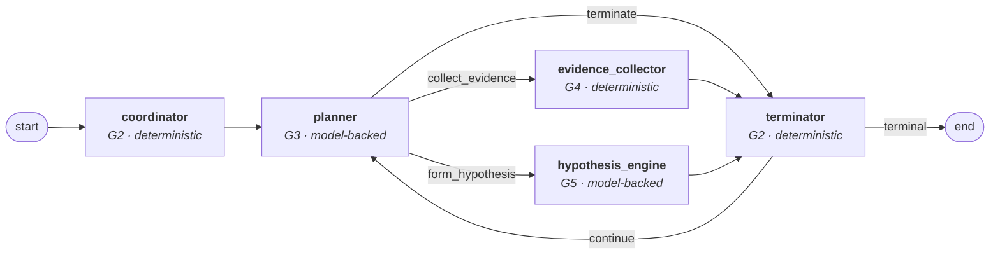

# Orchestration Kernel

- **Status:** **Implemented and tested** — Phase 4, extended by Phase 7 (bounded reflection).
- **Master specification references:** Sections 3, 4, 5, 7, 11, 12, 15, 17
- **Related:** [`agent-topology.md`](./agent-topology.md) · [`tool-registry.md`](./tool-registry.md) · [`failure-and-recovery.md`](./failure-and-recovery.md) · [`observability.md`](./observability.md) · [`bounded-reflection.md`](./bounded-reflection.md) · [ADR-0015](../adr/0015-domain-owned-checkpointing.md) · [ADR-0016](../adr/0016-deterministic-model-provider.md) · [ADR-0017](../adr/0017-read-only-capability-ceiling.md) · [ADR-0022](../adr/0022-bounded-reflection-without-a-new-node.md)

This document describes what Phase 4 built: a deterministic, typed, bounded, tenant-aware
execution substrate on which the investigation agents can safely operate. It is **read-only
and simulator-backed**. Nothing here mutates infrastructure, and nothing here can. Phase 7
extended the hypothesis engine with bounded reflection (section 6.2); the topology, the
tool boundary and the read-only ceiling are unchanged.

---

## 1. What exists, and what does not

| | |
|---|---|
| **Exists** | Typed graph state · five node contracts, enforced · a LangGraph graph with explicit routing · the tool registry, capability resolver and broker · deterministic simulators for six read domains · a versioned prompt set and a model port · budgets checked before every step · checkpointing and resume · execution traces and audit records · a deterministic terminator |
| **Does not exist** | Remediation planning, the policy gate, approval, execution, verification · RAG and governed memory · postmortems · external integrations · the HTTP surface · the frontend · the evaluation harness |
| **Not measured** | Latency, throughput, cost, reasoning quality. No performance figure appears in this document because none has been taken. |

The read-only ceiling is a decision, not an omission: a write capability with no policy gate
in front of it is a capability with nothing authorizing it. See
[ADR-0017](../adr/0017-read-only-capability-ceiling.md).

---

## 2. Graph topology



Five graph nodes implementing four of the twelve approved components. `G1` alert
correlation is the deterministic Phase 5 [ingestion service](./telemetry-ingestion.md);
`G6`–`G10` are the remediation path; `G11`–`G12` are post-incident.
The coordinator contributes two nodes — entry routing and termination — under separate
contracts, so the node that starts a run is not the node that can end it.

Two structural properties, asserted by tests rather than by inspection:

- **Every edge is explicit.** Both conditional edges are given a complete `path_map`, so a
  router returning an unmapped value fails at construction rather than falling through.
- **Every path terminates.** The one cycle passes through the planner, where the budget is
  checked before anything is spent. LangGraph's `recursion_limit` is set from the iteration
  budget as a second, independent bound — a backstop that should never be the thing that
  fires, capped so that a misconfigured budget still cannot produce an unbounded run.

---

## 3. State: four kinds, kept apart

| Kind | Where it lives | Who writes it |
|---|---|---|
| **Durable domain** | `incident`, `investigation_step`, `evidence`, `hypothesis`, `tool_execution` | Nodes, through the persistence layer. **The system of record.** |
| **Ephemeral graph** | `GraphState`, threaded between nodes | Nodes, within their contracts. Rebuilt from durable rows on resume. |
| **Execution trace** | `execution_trace`, `trace_span` | The trace recorder. Append-only. |
| **Audit** | `audit_record` | The broker and the coordinator. Append-only. |

`GraphState` carries **references and scalars, never payloads**. An evidence reference names
an id, a domain, a quality score and a 240-character headline; the log lines stay in
`evidence.content`. Three reasons, and the first is the important one:

1. a checkpoint containing copies of evidence is a **second source of truth**, and the two
   diverge the first time a resume lands on a partial write;
2. untrusted operational content in a checkpoint spreads customer log data into a store with
   a different retention policy;
3. accumulated model messages are the classic way an agent's context and cost grow without
   bound — so there is no `messages` key, and no field able to hold a prompt or a credential.

---

## 4. Node contracts

Every node declares the twelve attributes section 4 requires, and three of them are
**enforced** rather than published:

| Declared | Enforced how |
|---|---|
| `permitted_state_keys` | The kernel validates every returned update; a key outside the contract raises `ContractViolation` |
| `capabilities` | The broker refuses any request whose calling node does not declare the capability |
| `audit_events`, `span_kind` | Contract tests assert a node that stops emitting fails the build |

| Node | Model? | Capabilities | May terminate? |
|---|:-:|---|:-:|
| `coordinator` (G2) | No | none | No |
| `planner` (G3) | Yes | **none** | Proposes only |
| `evidence_collector` (G4) | No *(see §9)* | six `read.*` | No |
| `hypothesis_engine` (G5) | Yes | none | No |
| `terminator` (G2) | No | none | **Yes, solely** |

The planner declaring no capabilities is the design, not an oversight: it reasons about what
to ask and is structurally incapable of asking. Exactly one node can reach an external
system, and it reaches it through the broker.

---

## 5. The tool broker

```
node
  → request validation      does the calling node's contract declare this capability?
  → tenant context          does the bound tenant match the broker's scope?
  → capability resolution    registered, granted for this tenant and environment, on the menu?
  → risk boundary           within the deployment's ceiling? (re-checked, not trusted)
  → argument validation     typed; scope resolved from the incident, never supplied
  → idempotency             has this exact effect already been recorded?
  → adapter invocation      with a deadline, retried per operation class
  → result validation       typed; a malformed result is a failure, not a default
  → audit                   emitted on every path, including refusal
  → trace                   span with tool, version, scope, outcome, duration
```

Three properties are load-bearing, and each has tests written to break it:

**It fails closed.** Every stage's error path leads to a refusal. There is no default-allow
branch and no swallowed exception.

**A node cannot bypass it.** Nodes receive a broker, never a provider. An import-graph test
parses every node module's AST and fails if one imports a provider, a simulator or the
registry — so the property survives future edits rather than resting on convention.

**A failure is never a success.** A refused, failed or timed-out call returns a typed
failure naming the stage that produced it, with an empty payload. Nothing in the broker can
return a plausible-looking result in place of one that did not arrive.

### 5.1 Least privilege

The effective capability set is the intersection of five independent inputs — the bound
tenant, the incident's environment, the calling node's contract, `tenant_tool_grant`, and
the risk ceiling. Nothing in the resolver reads retrieved content or model output; its
inputs are a bound tenant, database rows and a node contract, all `SYSTEM` provenance.
There is no parameter through which a log line could reach it.

### 5.2 Scope is resolved, never supplied

`tenant_id`, `environment`, `service` and `namespace` are marked `scope_resolved` on every
descriptor. A caller supplying one is **rejected, not overwritten** — overwriting would hide
an attempt to widen scope instead of surfacing it. The service must already be one the
incident is about, so choosing between them narrows within an existing bound.

### 5.3 Idempotency and retry

A tool execution is keyed on the *effect* — tenant, tool, major version, and the scope
arguments the descriptor nominates — and is unique per tenant in the database. A repeated
request returns the recorded execution without reaching the adapter. Retry is classified per
operation (`failure-and-recovery.md` §1): a pure read is retried, an empty result never is
(it is a finding), and a malformed result never is (the adapter would produce the same shape
again, and a repaired result would be data we invented).

Timeouts are enforced by running the adapter call on a worker thread with a deadline, so the
deadline binds *for the caller* even if an adapter blocks. The abandoned thread may still
complete — which is precisely why a write timeout is an unknown outcome to be reconciled
rather than a failure to be retried. Every tool here is read-only, so an abandoned read has
no effect to reconcile.

---

## 6. Bounded autonomy

Budgets are checked **before** a step, never after. Checking afterwards means the step that
broke the limit already cost its tokens, its latency and its tool call; checking beforehand
means exhaustion produces a clean partial result with everything gathered so far intact.

| Dimension | Default | Enforced at |
|---|---:|---|
| Planning iterations | 12 | Planner, before the model call |
| Tool calls | 40 | Collector, before the broker call |
| Wall clock | 6 h | Observed at every node boundary and at every node entry; refuses the next step |
| Tokens | 200 000 | Charged after each model call, checked before the next |
| Cost (USD) | 5.00 | As above |

These are *configured* limits, not measured ones. No load test has been run and nothing
claims they are right for production traffic.

Wall clock is the one dimension that is **observed rather than accumulated**. Summing node
durations would undercount: it would miss the gaps between nodes and the time a suspended
run spent waiting. It is measured as *now minus the run's start*, taken from
`execution_trace.started_at`, so a resumed run keeps counting instead of receiving a fresh
allowance — an interruption cannot extend a deadline.

A refusal is recorded explicitly as `budget_refusal`, because the ledger alone cannot express
it: the refusal happens before the cost is paid, so a run stopped by a budget still looks
under-budget afterwards. Without that signal the terminator could not tell "we ran out of
allowance" from "we ran out of ideas".

### 6.1 Deterministic overrides of the planner

The model's choice is a *proposal*. Four deterministic rules can override it, and each
override is recorded with its reason:

| Situation | Response |
|---|---|
| Output will not parse | One repair attempt — a fresh request, not the same one resent — then a typed failure |
| Domain maps to a capability not on the menu | **Rejected, never repaired.** Repair would teach the loop that asking for ungranted capability is a negotiation |
| Domain already covered, same gap | Converted to hypothesis formation; a repeat spends budget without closing anything |
| Budget exhausted | Terminates, before the model is called |

### 6.2 Reflection

Implemented in Phase 7, and bounded the same way the planner is: the hypothesis engine's
model call is asked for an optional `reflection` decision alongside its hypotheses, and
`asic.orchestration.reflection.decide_reflection` validates the proposal before anything
acts on it - continue on a gap, seek counter-evidence, revise a hypothesis, or propose a
terminal outcome. No new graph node was added (ADR-0022): reflection reuses the hypothesis
engine's existing model call and the existing termination rule engine, rather than
duplicating either.

Full design in `docs/architecture/bounded-reflection.md`. In outline:

| Guard | Rejects | Falls back to |
|---|---|---|
| G1 | A target hypothesis id this run never persisted, or none given for a targeted action | Continue on an open gap, escalate, or terminate uncertain |
| G2 | A revision with no newly formed hypothesis to supersede onto, or a target already superseded | Same fallback ladder |
| G3 | `continue_with_gap` with no gap proposed and none open | Same fallback ladder |
| G4 | `terminate_success` when the evidence does not clear the same actionability bar R4 uses | Downgraded to `terminate_uncertain` |
| G5 | `escalate` with no hypothesis to escalate | Downgraded to `terminate_uncertain` |

Reflection's three terminal actions (`terminate_success`, `terminate_uncertain`, `escalate`)
are not a second way for a run to end: they are additional inputs to the same `decide()`
in section 7, so a reflection-driven stop is bound by exactly the same R1-R6 rule set a
planner-driven one is, and a run still ends in exactly one of the five categories in
section 7 - never a sixth.

---

## 7. Termination

Ordered, total, and deterministic. Every run leaves with exactly one verdict, naming the
rule that produced it.

| # | Rule | Reason | Incident status |
|---|---|---|---|
| R1 | Unrecoverable node failure | `unrecoverable_failure` | `failed` |
| R2 | Wall clock exhausted | `wall_clock_timeout` | `uncertain` |
| R3 | Any other budget exhausted or refused | `budget_exhausted` | `uncertain` |
| R4 | The planner or reflection asked to stop, **and** the evidence supports an actionable cause | `human_escalation` | `escalated` |
| R5 | The planner or reflection asked to stop without one | `insufficient_evidence` | `uncertain` |
| R6 | *(matches unconditionally)* — continue | — | — |

**`resolved` is not reachable, and that is correct.** This deployment gathers evidence and
forms hypotheses; it cannot remediate, so it cannot verify that anything was fixed. An
actionable cause is handed to a human — `escalated`, one of section 5's five categories.
Reporting resolution would claim an outcome the system did not produce.

R4 requires four conditions, all necessary: confidence at or above 0.55, at least two
supporting records, **zero** contradicting records, and at least half the attempted domains
answering. The model's stated confidence is only one of the four, and on its own the weakest.
`is_actionable()` is a standalone function precisely so reflection's `terminate_success` and
`escalate` proposals are held to the identical bar (section 6.2) rather than a second,
possibly looser one.

---

## 8. Distinguishing fact from claim

Three mechanisms, all code rather than prompt instructions.

**Provenance is assigned by the broker.** A node cannot label its own output a verified
fact. A telemetry result is `VERIFIED_FACT`; a knowledge-base document is `RETRIEVED` —
citable, never authoritative. The database refuses anything authority-bearing on an evidence
row.

**Citation integrity is enforced before ranking.** Every evidence id a hypothesis cites is
checked against the persisted set for that incident. A hypothesis citing an id that does not
exist is dropped entirely — not partially kept — so hallucinated citation is an impossible
state rather than a low score. The foreign key on `hypothesis_evidence` makes it impossible
a second time.

**Confidence has a deterministic ceiling.** The model states a number; the node computes a
maximum from the evidence actually available and stores the lower of the two, with both
numbers and the derivation in `confidence_basis` so calibration is measurable later.

| Evidence | Ceiling |
|---|---:|
| None supporting | 0.10 |
| Anything contradicting | 0.35 |
| One supporting record | ≤ 0.40 |
| Two or more, no contradiction | 0.45 + 0.1·min(n,4) + 0.2·quality, capped at 0.95 |

A record cited as both supporting and contradicting counts only as counter-evidence. That is
not tidying up an ambiguous output: counting it twice would inflate the support count, which
is an input to the ceiling — a way to buy confidence by citing the same record twice.

---

## 9. The model boundary

ADR-0005's thin internal interface: one method, taking a rendered prompt and returning text
plus the metadata a trace needs. A provider returns **text, not objects**, so parsing and
validation happen in the node where they can be tested — and one scenario deliberately
returns unparseable output to exercise that path.

**No provider SDK is wired in this phase** ([ADR-0016](../adr/0016-deterministic-model-provider.md)).
The only implementation replays scripted responses from a scenario. Reasoning quality is a
Phase 7 concern and cannot be evaluated before the Phase 11 harness exists; a live provider
now would make every test non-deterministic and every run cost money in exchange for nothing
this phase can measure. The seam is what this phase owes.

**The evidence collector is narrowed away from the model.** The approved topology gives G4
six model-assisted strategies; this implementation has six strategies and no model call.
Collection and normalisation are deterministic, so the first vertical slice has no model
between a tool result and the evidence record derived from it — which is exactly where a
fabricated observation would be hardest to detect. Recorded on the node contract as
`model_backed=False` with a test asserting the divergence from `NodeId.uses_model` is
deliberate.

### 9.1 Prompt handling

Prompts are versioned and referenced by content hash, never inlined into a trace. Untrusted
content reaches only a dedicated data slot, fenced and with marker-like text neutralised
first, so a payload cannot close the fence early and escape into the instruction position.
There is no code path that concatenates retrieved content into an instruction — which is
what makes the resistance structural rather than a request politely made of the model.

---

## 10. Durability

### 10.1 The guarantee, stated exactly

> **At-least-once node execution, with effect-level idempotency.**

Not exactly-once. A process can die after an adapter has answered and before the transaction
commits, and the resumed run will call that adapter again. What cannot happen is a duplicated
*effect*: the broker keys each execution on business identity and returns the recorded result
instead of invoking twice; a resumed run recomputes the same step sequence and the same keys.
Calling this exactly-once would be a claim the design does not support.

### 10.2 One transaction per node

Phase 5 closes the startup crash window: the initial checkpoint now commits in the same
transaction as run creation. A durable ingestion request can optionally be linked there,
carrying its correlation ID into the execution trace. Existing callers retain their entry
point and outcome contract. A duplicate linked request is reconciled by the dispatcher.

The kernel streams the graph and, at each node boundary, validates the update against the
node's contract, flushes its spans, writes a checkpoint and commits — all in the transaction
the node itself ran in. A crash therefore leaves the run *at a boundary* rather than halfway
through one, and a checkpoint can never describe work that was rolled back.

### 10.3 Resume reconciles

The resume path does not trust the checkpoint for anything the durable rows can answer.
Evidence, steps and hypotheses are re-read from their tables; the checkpoint supplies the
ephemeral remainder — phase, open gaps, last decision, budget ledger. Where they disagree
about how much was written, **the rows win** and the divergence is recorded on the
`workflow.resumed` event. A checkpoint failing its own SHA-256 digest is not resumed from at
all; the run is dead-lettered for inspection rather than resumed from a guess.

### 10.4 Leasing

A single conditional `UPDATE` claims the lease, so two orchestrators racing produce one
winner. Losing stops work immediately rather than retrying: two orchestrators advancing one
incident is the failure with the worst consequence this system can have. The lease outlives
the longest node timeout, so a slow node cannot lose a lease it is still using.

---

## 11. Timeouts: what is enforced, and what is only declared

The distinction matters more than the numbers. A timeout is **enforced** only if something
cancels or abandons the operation; a value recorded in a contract and honoured by convention
is **declarative**, and calling it enforcement would be the kind of claim this project is
supposed to avoid.

| Layer | Value | Status | What actually stops it |
|---|---|---|---|
| **Database statement** | 10 s | **Enforced — by the server** | PostgreSQL cancels the statement. `SET LOCAL statement_timeout` on every unit of work, so it is transaction-local and cannot leak onto a pooled connection |
| **Idle in transaction** | 180 s | **Enforced — by the server** | PostgreSQL terminates a session idle inside a transaction. Set above the longest node timeout, because a node legitimately holds its transaction open across a model call |
| **Tool invocation** | per descriptor, 20–30 s | **Enforced — by the caller** | The adapter runs on a worker thread and the broker abandons it at the deadline. Proved against an adapter that genuinely never returns |
| **Investigation wall clock** | 6 h | **Enforced — at step boundaries** | Observed at every node boundary and at every node entry; the next step is refused and the run terminates as `wall_clock_timeout` |
| **Node execution** | 10–120 s | **Declared, not enforced** | Nothing interrupts a node in flight. See §11.2 |

### 11.1 Why the layers are ordered as they are

Each bound is shorter than the one containing it, so the innermost fires first and the
failure names the thing that actually stalled. A statement timeout above the shortest node
timeout would surface a stuck query as a vague node failure; an idle-in-transaction timeout
below the longest node timeout would kill healthy work while a model was thinking. Both
relationships are asserted by tests rather than left to arithmetic in a comment.

### 11.2 Node execution is not preemptible, and why that is not fixed here

**The limitation, stated plainly.** `NodeContract.timeout_seconds` is recorded on every span
and used for layering, but the kernel does not interrupt a node that overruns it. A node
that blocked in pure Python — an infinite loop with no I/O — would not be stopped by the
orchestrator.

**Why not simply run nodes on a worker thread, as the broker does for adapters?** Because a
node is not an adapter call. A node holds an open transaction on a psycopg2 connection, and
a connection used concurrently from two threads is undefined behaviour. Abandoning a node
mid-transaction would leave the abandoned thread writing through a connection the kernel is
simultaneously rolling back — corrupting the very checkpoint that makes the run recoverable.
The cure would be worse than the disease.

**What bounds a slow node today.** Everything a node actually waits on is bounded: database
statements by the server, tool calls by the broker's deadline, and model calls by the
provider's own timeout when a real one is wired. The wall-clock budget then refuses the next
step. The unbounded case is a node spinning in Python with no I/O at all, which is a defect
in the node rather than a hazard the orchestrator can route around.

**What proper enforcement needs**, and why it is not in this phase: an async execution model
with cancellation, or a per-node connection that can be closed out of band so an abandoned
thread cannot reach the database. Either is an orchestration change, not a tuning change,
and the brief for this correction is explicit that a new execution engine is out of scope.
Recorded as a **Phase 15 obligation** alongside the concurrency work, since both concern the
same execution model. Introducing Temporal or another workflow engine to solve it is
explicitly not the answer (ADR-0002).

**How the claim is kept honest.** `tests/orchestration/test_timeouts.py` asserts that the
kernel does *not* run nodes on a worker pool. If node preemption is ever implemented, that
test fails and forces this section to be rewritten rather than quietly left wrong.

---

## 12. Observability

Every span is emitted twice from one description — an OpenTelemetry span for live tooling,
and a `trace_span` row that is durable, tenant-scoped and queryable. One trace serves
operations, replay and evaluation.

Span identifiers are **ours**, derived from the trace and an ordinal rather than randomly, so
a replay produces identical identifiers; the OTel span carries ours as an attribute so the
two views join. A resumed run continues the numbering, because it is the same trace.

Every node span carries: tenant, incident, run, node id and version, budget headroom at
entry, the decision and the alternatives weighed, and — where applicable — evidence
references, tool execution id, provider, model, prompt version and hash, tokens, cost,
confidence, failure and termination reason. **No prompt text, no tool payloads, no
credentials**: everything written passes through redaction at emission, because filtering on
read cannot un-write a secret.

No exporter is configured. Wiring one is deployment configuration and belongs to Phase 12;
with no provider configured the SDK's no-op meter absorbs the calls, which keeps the
instrumentation honest — it is emitted whether or not anyone is collecting.

---

## 13. Security invariants exercised

| Invariant | How it holds here | Adversarial test |
|---|---|---|
| SEC-I2 tenant isolation | Tenant comes from the bound session; RLS on all 31 tenant-scoped tables | A request naming another tenant is refused; a cross-tenant service is refused |
| SEC-I3 authorization before execution | The broker is the sole egress; nodes hold no provider | Import-graph test over every node module |
| SEC-I4 retrieved content cannot grant authority | The resolver reads no model output and no retrieved content | Injected capability grant, tenant switch and approval bypass all inert |
| SEC-I5 injection resistance is structural | The menu is resolved before the model is invoked | Hostile log line and poisoned runbook: recorded, flagged, no change in reach |
| SEC-I6 no secrets in traces | Redaction at emission; prompts by hash | Secret-shaped values asserted redacted; spans scanned |
| SEC-I7 auditability | Broker emits on allow and on refuse | Every execution reconciled against an audit record |
| SEC-I8 fail closed | Every stage's error path refuses | Unknown, ungranted, disabled and out-of-tier capabilities |
| SI-2 no action outside the catalogue | No argument kind can carry a command; field names checked | Descriptor construction refuses a `command` argument |
| SI-5 R3 not expressible | `ToolDescriptor` refuses tier R3 at construction | Catalogue asserted read-only at start-up and by the boundary validator |

---

## 14. Failure handling

| Failure | Response |
|---|---|
| Malformed node output | One repair attempt, then a typed failure; never coerced |
| Model provider outage | Recorded as a recoverable failure; the run terminates with what it has rather than hanging |
| Tool timeout | Typed failure; the domain is degraded, the investigation continues |
| Tool error (permanent) | Class C5 — not retried; the domain is degraded |
| Tool error (transient) | Class C1 — retried with backoff |
| Duplicate tool request | Recorded execution returned; the adapter is not reached |
| Malformed tool result | Class C6 — rejected, never retried, never coerced |
| Unavailable evidence source | Step marked `degraded` with its reason; coverage recorded |
| Checkpoint digest mismatch | Refused; the run is dead-lettered rather than resumed from a guess |
| Database failure | The unit of work rolls back; the run is dead-lettered |
| Budget exhaustion | Clean partial result, correct termination reason |
| Contradictory evidence | Confidence ceiling applied; not escalated as a cause |
| Insufficient evidence | `uncertain` — a correct outcome, not a failure |
| Unauthorized capability | Refused at the broker and audited |
| Missing tenant context | RLS denies everything; `require_tenant` raises rather than returning empty |

No silent fallback to fabricated data, and no `success` status after an exception.

---

## 15. What Phase 11 will consume

Each scenario declares a `ScenarioExpectation`: the expected termination reason and incident
status, the domains a competent investigation should consult, the expected root-cause class
where there is one, the domains expected to degrade, and whether injection should be flagged.
The end-to-end suite asserts runs against those expectations today; the evaluation harness
will score against the same declarations without redesigning the execution model.

The trace carries the frozen clock, the random seed and the fixture reference, so a run is
reproducible rather than merely re-runnable. **Nothing here computes a score, and no
improvement is claimed.**

---

## 16. Running the vertical slice

```bash
export ASIC_MIGRATION_DATABASE_URL=postgresql+psycopg2://asic_owner:<password>@localhost:55432/asic
export ASIC_DATABASE_URL=postgresql+psycopg2://<app_login>:<password>@localhost:55432/asic
python -m alembic upgrade head
python -m asic.orchestration.service --scenario SC-0001-checkout-latency-after-deploy
```

Seeding a demonstration tenant uses the administrative URL; the investigation itself runs as
the application role, under row-level security, exactly as it would in production. Creating a
tenant is an administrative operation and the application role has no `INSERT` on the global
catalogues — widening it to make a demo convenient would undo that.

---

## 17. Known limitations

Stated because they are real, not because they are comfortable.

| Limitation | Consequence | Where it is addressed |
|---|---|---|
| No real model provider | Reasoning quality is untested and unclaimed. Phase 7 added bounded reflection to the existing model-backed hypothesis call; it did not add a live provider (ADR-0016 still applies unchanged) | Phase 11, when a measurable evaluation harness exists |
| No real adapters | Behaviour against live telemetry is unproven | Phase 10 |
| Single-service evidence collection | A multi-service incident collects for the first service in scope. Phase 7 did not touch the evidence collector's domain strategies - it added reflection and hypothesis revision over evidence already gathered, not new collection strategies | Not yet scheduled; revisit if a later phase's evidence shows this matters |
| Concurrency under a shared pool untested | Lease correctness is tested; contention is not measured | Phase 15 |
| No performance measured | No latency, throughput or cost figure exists | Phase 15 |
| **Node execution is not preemptible** | A node that blocks in pure Python is bounded only by the timeouts *inside* it | §11.2, Phase 15 obligation |
| `0005` cannot be downgraded once a tool has run | Correct: `ON DELETE RESTRICT` protects execution history | Deprecate a catalogue entry rather than deleting it ([ADR-0018](../adr/0018-migrations-are-historical-contracts.md)) |
| Reflection shares the hypothesis engine's model call | It cannot ask a follow-up question the same call did not already answer; a revision or counter-evidence request is proposed in the same response that formed the hypothesis it concerns | ADR-0022's documented revisit trigger |
| A revision supersedes at most one hypothesis per step | `revise_hypothesis` names one target; superseding several requires several bounded-reflection steps, one per iteration | Not measured as a real constraint yet - no scenario has needed more than one |
