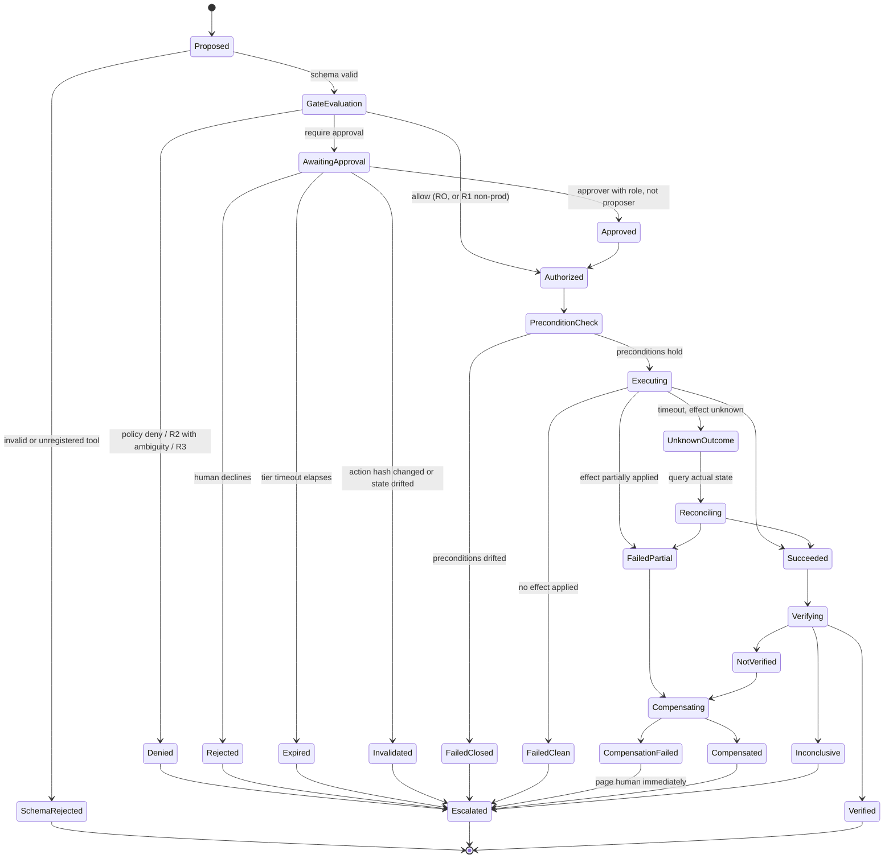

# Safety and Remediation Policy Model

- **Status:** Implemented for the Phase 8 simulator-backed boundary described in
  [`bounded-remediation.md`](./bounded-remediation.md). Production adapters and automated
  compensation remain deferred.
- **Master specification references:** Sections 6, 15, 23(J)
- **Related:** [`tool-registry.md`](./tool-registry.md) · [`agent-topology.md`](./agent-topology.md) · [`../security/THREAT_MODEL.md`](../security/THREAT_MODEL.md)

Section 6 requires that recommendation be separated from execution, that every action carry
twelve specific fields, that risk tiers govern autonomy, and that arbitrary model-generated
production commands never execute. This document specifies the model that delivers that.

---

## 1. Safety invariants

These hold at all times. Each is enforced structurally — by a type, a credential, or a
deterministic code path — never by an instruction in a prompt. Each has an adversarial test
(NFR-TST-03).

| # | Invariant | Enforcement | Violated if… |
|---|---|---|---|
| **SI-1** | The component that proposes an action is never the component that authorizes it | G6 and G7 are separate; G6 has no path to G9 | Any code path lets a proposal reach the broker without the gate |
| **SI-2** | No executable action exists outside the registered catalogue | Write tools have no free-form string argument | A `command`, `script`, `patch` or `manifest` field appears on any write tool |
| **SI-3** | Authority flows only from `SYSTEM` and `HUMAN` provenance | The gate's input type cannot carry `RETRIEVED` or `MODEL_CLAIM` content | Retrieved text or model prose reaches an authorization decision |
| **SI-4** | Investigation is incapable of mutation | Read paths hold physically read-only credentials | An investigation credential can write |
| **SI-5** | R3 (destructive/irreversible) actions are not expressible | Not registered as agent-invocable tools at all | An R3 capability appears in the registry |
| **SI-6** | An approval binds to exactly one action version | Approval carries `action_version_hash`; any parameter change invalidates it | An approved action executes with different parameters |
| **SI-7** | Preconditions are re-validated immediately before execution | Broker re-checks after approval, fails closed | An action executes against drifted state |
| **SI-8** | Every effect is idempotent under retry | Business-identifier idempotency keys; unknown outcomes reconcile by query | A retry double-applies an effect |
| **SI-9** | Verification is independent of execution | G10 never receives the executor's success claim | The verifier's verdict can be influenced by the executor |
| **SI-10** | The approved target is immutable | Append-only target binds incident, investigation, hypothesis, service, environment and resolved scope before G6 | Resume reconstructs a target from mutable alerts |
| **SI-11** | Planning authority expires at dispatch | Every write re-resolves current grant and tool enablement | A cached menu authorizes a revoked write |
| **SI-12** | Verification policy is deterministic | Tool-specific server profile plus independent baseline and fresh observation | Model-authored operator/threshold decides success |
| **SI-13** | Every authorization decision and execution is audited | Broker is sole egress and emits audit unconditionally | An action occurs with no audit record |
| **SI-14** | The system fails closed | Policy store, registry or identity unavailable ⇒ deny | Any failure path defaults to allow |
| **SI-15** | Durable memory is never written from a single incident automatically | G12 proposals require human approval | Knowledge changes without an approval record |

---

## 2. The action proposal

Section 6 enumerates twelve required fields. All twelve are mandatory; a proposal missing
any is rejected by schema validation before it reaches the gate.

| # | §6 field | Where it comes from | Why it is mandatory |
|---|---|---|---|
| 1 | Action ID | Generated; also the idempotency root | Correlates proposal, approval, execution, audit and verification |
| 2 | Reason | Planner, in natural language | Human comprehension at approval time |
| 3 | Evidence | Evidence IDs, validated to exist | An action with no evidence is a guess (SI-3) |
| 4 | Expected effect | Structured prediction of the observable change | The verifier compares against *this*, fixed in advance |
| 5 | Risk level | **Registry**, not the model | The model cannot downgrade its own risk |
| 6 | Permission scope | **Resolved** from incident context and service ownership | The model cannot widen scope (SI-2) |
| 7 | Preconditions | Registry descriptor | Re-validated at execution (SI-7) |
| 8 | Rollback / compensation | Registry descriptor | No rollback ⇒ cannot be R1 |
| 9 | Approval requirement | Gate, from tier + environment + tenant policy | Not a model judgement |
| 10 | Timeout | Registry descriptor | Bounds unknown-outcome windows |
| 11 | Verification profile | Planner selects an exact server-defined tool profile; **frozen at proposal time** | Prevents model-authored or post-hoc redefinition of success (FR-VRF-03) |
| 12 | Audit record | Emitted by broker automatically | Not optional, not the model's responsibility |

**Fields 5, 6, 7, 8, 9, 10 and the authoritative semantics of 11 are not authored by the
model.** They are resolved from the registry, deterministic verification catalogue and
incident context. The model authors only fields 2, 3 and 4 — reason, evidence and expected
effect — plus the choice of which registered action and verification-profile identifier to
propose with typed parameters. This split is what makes "the model cannot
escalate its own privileges" a structural property.

### 2.1 Action version hash

```
action_version_hash = H(action_id, tool_name, tool_version,
                        canonical(arguments), permission_scope,
                        preconditions, risk_tier)
```

The approval record stores this hash. The broker recomputes it immediately before
execution. Any divergence invalidates the approval and fails closed (SI-6). This closes the
"approve a small change, execute a large one" attack, including against a compromised
orchestrator process.

---

## 3. Risk tiers and autonomy

Tier definitions live in [`tool-registry.md`](./tool-registry.md) §3. The autonomy matrix:

| Tier | Non-production | Production | Ambiguous evidence | Multiple concurrent incidents |
|---|---|---|---|---|
| **RO** read-only | Autonomous | Autonomous | Autonomous | Autonomous |
| **R1** reversible low-risk | Autonomous | **Approval required** | **Approval required** | **Approval required** |
| **R2** high-risk | Approval required | Approval required | **Deny — escalate** | **Deny — escalate** |
| **R3** destructive | Not expressible | Not expressible | Not expressible | Not expressible |

### 3.1 Ambiguity is an escalation trigger, not a confidence discount

Section 6 requires that *ambiguous* actions stop for human approval. Ambiguity is defined
deterministically rather than left to model confidence:

An action proposal is **ambiguous** if any of:

- The supporting hypothesis has confidence below the tenant's threshold, **or**
- Two or more hypotheses within a configured margin propose *different* actions, **or**
- Counter-evidence exists that the hypothesis does not explain, **or**
- The evidence supporting it is older than the action's staleness window, **or**
- A concurrent open incident overlaps the same service or namespace.

The last is easy to miss and matters: acting on service A while an unrelated incident is
already mutating service A is how an automated remediation turns one outage into two.

---

## 4. Approval flow



### 4.1 Approval authority rules

| Rule | Reason |
|---|---|
| The approver must hold the role required for that tier, tenant **and** environment | Least privilege (NFR-SEC-04) |
| An actor cannot approve an action they proposed | Separation of duties — applies to humans too, not only to nodes |
| Chat-platform identity must resolve to an RBAC identity before it carries authority | A Slack handle is not an authorization (FR-CLB-03) |
| The approval request states the exact scope, blast radius and rollback | Informed consent; an approval prompt that hides blast radius is a dark pattern |
| Expiry is a real outcome that escalates | An unanswered approval must never silently execute or silently hang |
| R2 requires an approver distinct from the on-call engineer where staffing allows | Tenant-configurable; degrades to single-approver with the exception recorded |

### 4.2 What the approver sees

The approval request is generated deterministically from the proposal — not authored by a
model — to prevent a persuasive summary from misrepresenting a risky action:

```
ACTION      k8s.deployment.rollback  v1.2.0        RISK  R1 (reversible)
TARGET      prod-eu / checkout / checkout-api      SCOPE 1 Deployment, 12 pods
CHANGE      revision 847 -> 846
ROLLBACK    re-deploy revision 847  (tested: yes)
BECAUSE     error rate rose 0.2% -> 11.4% within 90s of revision 847
EVIDENCE    EV-3311 deploy event · EV-3314 error-rate series · EV-3319 pod logs
EXPECT      5xx rate returns below 0.5% within 5 minutes
VERIFY      rate(http_5xx[5m]) < 0.005 sustained 60s   [criteria frozen at proposal]
CAVEAT      1 hypothesis at 0.71 confidence; counter-evidence EV-3321 unexplained
EXPIRES     30 minutes
```

---

## 5. Execution safety

### 5.1 Idempotency

Keys are composed of business identifiers, never random UUIDs, so that two proposals for
the same effect collide rather than double-applying:

```
idempotency_key = H(tenant_id, tool_name, canonical(scope_arguments))
```

The broker records the key before dispatch. A second execution with the same key returns
the first result instead of executing (SI-8).

### 5.2 The unknown-outcome problem

The hardest real failure in remediation: the call timed out and we do not know whether the
target applied the change.

| Wrong response | Why it fails |
|---|---|
| Retry blindly | Double-applies when the first attempt succeeded |
| Assume failure | Leaves an applied change unrecorded and unverified |
| Assume success | Skips verification of a change that may never have happened |

**Our policy:** enter `UnknownOutcome`, then reconcile by querying the target's actual state
against the action's expected effect. Only reconciliation determines the true outcome.
Actions whose effect cannot be observed by query are ineligible for the autonomous
catalogue — if we cannot verify it, we do not automate it.

A **crash is an unknown outcome as well**, and the harder one, because the process that
knew what it had sent is gone. Two facts are therefore committed outside the executing
transaction and before anything is dispatched: the execution intent, and the broker's
effect claim. On recovery they answer the only question that matters — was an effect
attempted — and the answer decides the classification:

| Durable evidence | Classification |
|---|---|
| No claim | Nothing was sent; `FailedClean` is legitimate |
| Claim, no conclusive receipt | `UnknownOutcome` → reconcile → `Succeeded`, else `FailedPartial` and escalate |
| Receipt | The broker already classified it; recovery replays that classification |

The order matters as much as the evidence. Precondition drift is evaluated *after* this,
never before: a rolled-back deployment looks exactly like a drifted one, and an executor
that asks "has the world changed?" before "did I change it?" will record its own applied
effect as a clean failure.

### 5.3 Blast-radius limits

> **Phase 8 implementation limit:** concurrent remediation in the same tenant/environment
> is a deterministic policy signal, and typed argument bounds cap each registered action.
> The per-incident and per-service rolling counters below remain design targets for a later
> hardening phase; no current claim depends on them.

Enforced by the broker, independent of the gate:

| Limit | Default | Rationale |
|---|---|---|
| Concurrent write actions per tenant | 1 | Prevents compounding failures; serialises effects |
| Write actions per incident | 3 | An incident needing four remediations needs a human |
| Write actions per service per hour | 5 | Circuit-breaks a remediation loop |
| Total pods affected per action | 50 | Caps single-action blast radius |
| Consecutive verification failures before halt | 2 | Stops repeated ineffective remediation |

Exceeding any limit halts autonomous remediation for that scope and escalates. Limits are
tenant-configurable within registry-declared maxima and **cannot be changed at runtime by
any agent path**.

---

## 6. Verification

| Property | Specification |
|---|---|
| **Criteria source** | Frozen in the proposal before execution (field 11) |
| **Independence** | G10 receives criteria + telemetry; never the executor's claim (SI-9) |
| **Settling delay** | From the tool descriptor; verification cannot start early |
| **Observation window** | Must cover the settling period plus the criteria's own window |
| **Baseline** | Append-only independent measurement captured after policy/approval and before dispatch; maximum age is 300 seconds at dispatch |
| **Outcomes** | `verified` · `not_verified` · `inconclusive` — all three are legitimate |
| **Headline metric** | **False-success rate.** Declaring success while symptoms persist is the most damaging error the system can make |

G10 persists an independent baseline after policy and any approval, immediately before the
executor. The row binds the immutable target, action, versioned profile, approved source and
broker read execution. G9 revalidates the 300-second dispatch freshness bound after checking
preconditions. The model can select only an exact registered profile; operator, metric,
direction, threshold, freshness window and minimum evidence are server policy. In Phase 8,
`not_verified` returns the incident to investigation and `inconclusive`
escalates. Automated compensation is deferred because compensating on an unknown state can
itself cause harm; partial effects emit an audit/timeline signal for human handling.

A verified result also carries composite tenant/action foreign keys to that baseline and to
the independent post-action read execution. The broker persists a bounded metric/sample
summary on those append-only executions, allowing the trusted verifier to prove the values
used in its comparison came from the named reads. The same validator is reused before T5
memory proposal and again before promotion; non-empty legacy JSON or a copied `verified`
verdict confers no authority.

---

## 7. Failure-to-safety mapping

| Failure | Safe response | Never |
|---|---|---|
| Policy store unavailable | Deny (SI-14) | Default allow |
| Registry version skew | Reject proposal; require re-proposal | Execute against a guessed descriptor |
| Approval expired | Escalate | Execute on assumed consent |
| Precondition drift | Fail closed | Execute anyway |
| Execution timeout | Reconcile by query | Blind retry |
| Compensation failure | Page a human immediately | Retry silently |
| Verification inconclusive | Escalate | Assume success |
| Model outage during planning | Pause, then escalate on timeout | Proceed with a partial plan |
| Blast-radius limit hit | Halt autonomous remediation for that scope | Continue with an override |
| Concurrent incident on same scope | Require approval or deny | Act autonomously |

---

## 8. How this is tested

| Invariant | Test |
|---|---|
| SI-1, SI-2 | Static check: no write tool has a free-form argument; no code path from G6 to G9 |
| SI-3 | Injection corpus in runbooks, tickets, logs and alert annotations; assert no `allow` |
| SI-4 | Integration test: investigation credential attempts a write, must be rejected *by the target* |
| SI-5 | Registry lint: no R3 capability registered |
| SI-6 | Mutate parameters post-approval; assert invalidation |
| SI-7 | Change target state between approval and execution; assert fail-closed |
| SI-8 | Duplicate and concurrent delivery; assert single application |
| SI-9 | Feed the verifier a false success claim; assert the verdict is unchanged |
| SI-13 | Reconcile executions against audit records; target 100% |
| SI-14 | Chaos: kill the policy store mid-incident; assert deny |
| SI-15 | Attempt automated memory write; assert rejection without approval record |

Every one of these is a **release gate**, not a best-effort test. Per §18, AI behaviour
changes must pass the evaluation suite before release, and the safety suite is the part of
that suite with no tolerance for regression.
