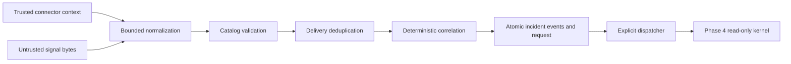

# Telemetry ingestion, correlation and incident lifecycle

**Status: implemented and validated in Phase 5; deterministic fixtures only.** Design decision:
[ADR-0019](../adr/0019-transactional-signal-ingestion.md).
The accepted [orchestration kernel](./orchestration-kernel.md),
[incident state machine](./failure-and-recovery.md), and
[tenant isolation](./tenancy-and-rls.md) remain the governing boundaries.

## Application boundary

`IngestionService.ingest(context, raw)` accepts bytes and a separately constructed
`ConnectorContext`. Trusted wiring supplies tenant, connector, source, service and
environment. Context is not an authentication implementation: HTTP, signatures, mTLS,
rate limiting and production connectors are Phase 9/10 work. Never construct context
from a submitted body. This phase has no webhook listener, background daemon, external
connection, model call for correlation, or infrastructure write.

The service commits accepted/rejected receipts before returning. A database or append
failure propagates and rolls back all effects. Callers must retry a failed transaction;
no error path acknowledges a failed commit. Ingestion never calls the investigation kernel.

## Canonical envelope and normalization

The envelope contains connector-owned identity, schema version 1, normalizer version,
source event ID, occurrence fingerprint, alert/change kind, source firing/resolved state,
canonical severity, title, category, labels, annotations, correlation IDs, metadata,
start/observation/resolution times, ingestion time, an internal correlation UUID,
`retrieved` provenance and a null raw-payload reference. The receipt separately records
delivery key, normalized-content digest, raw digest and processing result.

`Normalizer` is a narrow protocol. `SimulatorNormalizer` accepts the canonical fixture
format. `AlertmanagerFixtureNormalizer` maps a single simulated Alertmanager observation:
`startsAt`, `endsAt`, `observedAt`, `status`, labels and annotations; severity aliases
critical/error/warning/info become critical/high/medium/info. Its wrapper requires
`observedAt`; a start timestamp alone cannot order status updates. This is not a production
Alertmanager webhook integration or a claim of full upstream schema compatibility.
Grafana, OpenTelemetry-derived signals, Kubernetes events and deployment-provider formats
can implement this same protocol in Phase 10. No source-specific branches enter correlation.

All timestamps require offsets, normalize to UTC and must fall in the explicit operational
range `[2000-01-01, 2100-01-01)`. Policy `signal-validation/2` also requires
`observed_at <= ingestion_time + 5 minutes`, using the injected clock; the boundary is
inclusive. These bounds reject unsafe arithmetic and prevent future observations freezing
source state. Observation cannot precede start, and resolution must fall between start and
observation. Unknown severity/state/version fails. Top-level unknown metadata is retained
under `metadata.unknown`, never promoted to a configuration field. Duplicate JSON keys,
invalid UTF-8/JSON, non-finite numbers and NUL strings fail. Limits: 64 KiB body, 8 levels,
2,048 JSON nodes, 4,096-character source strings, 64 labels/annotations, 32 correlation
IDs, 128-character metadata keys and 2,048-character values in those string maps.

## Durable model

| Record | Meaning |
|---|---|
| `signal_receipt` | Append-only result per delivery identity; canonical observation, hashes, decision and reason |
| `alert` | Existing occurrence projection, with additional source state, observation time, digest and correlation category |
| `incident_event` | Durable source of incident history; meaningful effects use the existing append boundary |
| `investigation_dispatch` | One durable eligibility request per newly opened incident; opening event, correlation ID, attempts, safe error code and linked run |
| `incident_reopen_candidate` | Append-only human-review candidate for a firing update attached to a terminal incident |

`AlertStatus` keeps its Phase 3 processing meaning. A resolved source alert can still be
`correlated`. Resolution is in `source_state`/`resolved_at`, not a new incident state.
Historical alerts have nullable new fields and remain readable. New receipts and requests
have composite tenant foreign keys, FORCE RLS and application-role grants. Receipts deny
UPDATE/DELETE. Their parent foreign keys use RESTRICT so deleting a parent cannot silently
erase delivery history. Retention automation is deferred; raw bodies are not retained.
Normalized content is customer data and may contain sensitive operational text; it is not
exported into traces or metrics. Rejections that fail boundary validation retain only hashes
and safe reasons. Identity conflicts discovered after normalization may retain the bounded
normalized observation for diagnosis within the same tenant.

Persistence does not change provenance. The Phase 4 objective uses generated investigation
intent plus incident/catalogue identity. The planner and hypothesis renderer load bounded alert
title, labels, annotations, correlation identifiers and metadata only through `UntrustedBlock`.
No receipt envelope or incident display title is copied into trusted prompt context, capability
resolution, tenant binding or authorization.

## Identity, ordering and actual delivery guarantee

**At-least-once delivery with idempotent committed processing.** This does not claim
exactly-once delivery or invocation. PostgreSQL transactions and unique constraints protect
the durable effects, not a distributed sender's delivery behavior.

Delivery identity is tenant + connector + source + source event ID. Without an upstream
ID it uses a canonical content digest, excluding ingestion time, generated UUID and source
event ID. The digest includes bound identity. Reusing an event ID for different normalized
content is a durable `source_event_conflict` rejection. Exact duplicates return the original
receipt and identifiers without another incident effect. A different event ID with the same
observation is retained as `unchanged`, with suppression bookkeeping rather than reapplying it.

Malformed schema, identity spoofing, unsupported version/time and event-ID conflict are
permanent content outcomes and consume their delivery identity. Missing catalogue service or
environment and relevant-candidate overflow are `retryable`: their receipt uses a derived
attempt key, so the canonical delivery identity remains available. Repeating the unchanged
failed attempt returns its receipt. Once the catalogue/candidate condition changes, the same
source event can commit exactly one canonical result.

Occurrence identity remains tenant + source + fingerprint + start time. Same fingerprint
with a different start is a new occurrence; a changed observation with the same start is
an update. Scope/category changes to an occurrence fail rather than moving it between
services or incidents. Multiple historical matches fail closed for manual reconciliation.

Inspection found that the Phase 3 digest helper renders datetimes in the host's local
timezone. Phase 5 supplies the explicit UTC string to the same digest algorithm and also
looks up the natural occurrence tuple, preserving existing non-UTC keys without rewriting
them. No historical key or migration is changed. New workers therefore agree across host
timezones, while old occurrences remain addressable.

Source projections select the greatest tuple
`(observed_at, resolved_rank, severity_rank, content_digest)`. Resolution wins an
equal-time state tie; higher canonical severity wins a firing tie; equal-severity conflicts
have a stable digest tiebreaker.
Losing observations are retained as `stale`, with the winner recorded. A newer firing update
can reactivate the same occurrence; an older firing update cannot undo resolution.
Resolve-first observations are retained without an incident, and later stale firing
notifications do not manufacture one. Repeated resolution never resolves an incident.

These rules converge the source projection for the same observation set. Correlation is
an online algorithm: incident grouping, creation history and severity high-water marks
reflect the order of committed observations. Replaying historical decisions reproduces
them; reordering an entire stream is not promised to produce identical incident groups.

## Correlation policy and explanations

Policy `service-category-window/2` uses no score or LLM. A candidate must have the same
tenant, environment, service and category, be active, and have its fixed opening anchor
within 900 seconds of the new occurrence start. Arrival time does not define the window.
The opening event stores the anchor, so successive alerts cannot slide it indefinitely.

One candidate joins and no candidate creates. Multiple candidates select the smallest
absolute anchor-time delta, then the lexicographically smallest incident UUID. The receipt
and `correlation.decided` event store policy version, window, candidate IDs, factor booleans,
failure reasons, selection and outcome. Candidate SQL excludes other tenants, anchors
outside the window and incidents lacking ingestion anchors; these exclusions are recorded
as explicit scope rules. Rows that reach the bounded `considered` list satisfy those SQL
predicates. A row lock refreshes a selected incident before attachment; if it terminated
after candidate selection, the decision records `candidate_terminated` and opens a new
incident rather than attaching to the terminal one.

The database applies tenant, environment, service, category, active-state and occurrence-window
predicates before its 256-candidate bound. More than 256 relevant anchors commits a typed
`correlation_candidate_overflow` retryable receipt and selects nothing. Redelivery returns the
same attempt outcome until the active candidate set changes, then the canonical delivery can
commit once. Irrelevant services never consume this bound. Prior decisions are never
overwritten when policy code changes. Different services stay separate in v2. Declared
dependencies, shared traces, topology and failure domains are retained as data where
present but do not independently join incidents. This conservative rule is intentional.

## Incident effects and lifecycle

Creation records `incident.opened` with severity, state, environment, correlation anchor and
investigation-request flag. The source title remains on the alert/incident display projection
but never enters SYSTEM-provenance orchestration context. `alert.received` and `alert.normalised`
retain the source observation as untrusted data. `correlation.decided` explains attachment;
`incident.joined` identifies the alert and service. Source resolution is an
`alert.normalised` observation with `source_state=resolved`, avoiding a duplicate event
vocabulary. `alert.suppressed` records unchanged/stale observations.

Firing critical/high/medium/low-or-info map to SEV1/SEV2/SEV3/SEV4. Accepted updates can
increase incident severity, with `incident.severity_changed`; no automatic decrease.
Source resolution never changes incident status, cancels an investigation or claims repair.
An incident with no firing alerts still requires the investigation/human lifecycle.
Existing occurrence updates keep their attachment if the incident has terminated. Resolution
is retained without changing the terminal lifecycle. Firing updates leave terminal status and
severity stable and create one immutable human `incident_reopen_candidate`; they do not reopen
or dispatch. New occurrences cannot correlate to terminal incidents. Automated reopen, detach
and merge are deferred. The dispatcher enters the existing Phase 4 kernel;
all status evolution still uses `apply_transition()` and its event history.

## Investigation handoff and recovery

The opening transaction inserts a request. A trusted worker calls
`InvestigationDispatcher.dispatch(TenantContext(...), request_id, behaviour_version_id)`.
Behavior configuration comes from worker wiring, never the signal. Service scope is loaded
from the incident's attached alerts. The Tool Broker still resolves grants and enforces RO.

The kernel locks the request, validates incident/behavior/scope and atomically commits
the run link, execution trace, lifecycle transition and initial checkpoint. This closes
the inspected Phase 4 pre-checkpoint crash window without changing its graph or tool
contracts. Duplicate workers find the same linked run, including after it terminates.
A live lease returns `busy`; a suspended/expired run resumes through the existing kernel.
The unique active-run index remains a second protection against competing direct callers.

Dispatch against a terminal incident records permanent status `terminal` on its first attempt;
later calls return that outcome without increasing attempts. Other dispatch failure records
`trigger_failed` and propagates the exception. If creation never
committed, the unlinked request can be dispatched again. If it committed, retries reconcile
the link and lease. A failed kernel run is reported failed, never retried as a new run.
The worker entry point does not schedule itself: pending-request polling, backoff and
operator recovery are caller responsibilities; no perpetual retry process is hidden here.

## Concurrency and observability

Every ingestion transaction uses explicit tenant binding, READ COMMITTED and PostgreSQL's
two-int transaction advisory lock. The first key is the namespace hash for
`asic.ingestion.tenant.v1`; the second is the tenant hash. This serializes duplicates,
cross-fingerprint correlation and firing/resolution updates across connections/processes.
Hash collision can over-serialize tenants but cannot merge their data. A transaction-local
1,000 ms lock timeout bounds acquisition separately from the 10,000 ms statement timeout.
Incident projection/event writers use `FOR NO KEY UPDATE`, so Phase 4 child-row FK `KEY SHARE`
does not stall ingestion. Database errors roll back the receipt, projection, events and request.
In-memory locks are used only by test barriers, never for application correctness.

OTel spans cover receipt, normalization, validation, deduplication, correlation, incident
creation/update, persistence and investigation trigger. Root spans carry tenant, correlation,
receipt/incident IDs and a hashed source-event key; dispatch connects correlation to run ID.
Stage counters/duration histograms and lock acquisition count/wait histograms use bounded
stage, namespace and outcome labels, not tenant IDs
or payload values. Raw bodies, titles, labels, secrets and exception text are excluded.
Receipts/events retain durable pre-run decisions; the accepted execution trace/checkpoint
model records the investigation. OTel stage spans have no configured exporter in this phase.
Metrics are instrumentation points, not measured performance or Phase 12 dashboards.

## Validation and phase limits

`tests/ingestion` exercises the requested A–J paths directly: single creation (A), exact
duplicate (B), related join (C), unrelated split (D), tenant separation (E), change association
without causation (F), deterministic out-of-order/tie handling (G), source-only resolution (H),
concurrent creation (I), and deduplicated Phase 4 dispatch (J). It also covers real
application-role commits, production-sized candidate bounds, terminal candidates, real lock
contention, hostile persisted alert fields through both prompt renderers, explanations,
RLS, foreign keys, append failure rollback, trigger deduplication and pre-drive crash recovery.
Migration tests cover clean and accepted-head upgrades, drift, round trips, RLS and refusal
to downgrade when Phase 5 history exists. The phase validator rejects planted future-phase
imports and directories; normalization/correlation cannot import models or external clients.

No production scale, latency or availability has been measured. Production authentication,
transport integrations and rate limits remain later work. No operational RAG, retrieval,
memory, remediation, approval workflow, collaboration integration, frontend, Temporal,
MCP transport or new messaging/database infrastructure is implemented. Phase 6 has not begun.
