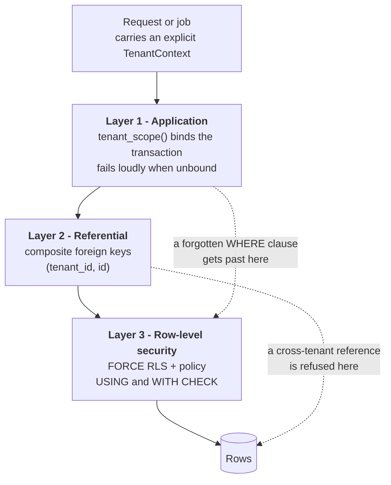

# Tenancy and Row-Level Security

- **Status:** **Implemented** in Phase 3 (`0003_tenant_isolation_rls`). Verified by `tests/db/test_tenant_isolation.py`.
- **Master specification references:** Sections 15, 20
- **Decision record:** [ADR-0011](../adr/0011-authentication-authorization-tenancy.md) · [ADR-0013](../adr/0013-composite-tenant-foreign-keys.md)
- **Related:** [`data-model-and-api.md`](./data-model-and-api.md) · [`../security/THREAT_MODEL.md`](../security/THREAT_MODEL.md)

The design question this document answers: **what protects tenant data when the
application has a bug?**

---

## 1. Why application-layer scoping is not enough

The conventional approach is a repository layer that adds `WHERE tenant_id = :tenant` to
every query. It works until one query is written without it, and then:

- The bug is invisible in testing, because a single-tenant test database has nothing to
  leak.
- The bug is invisible in code review, because the missing clause is an *absence*.
- The blast radius is total: one forgotten predicate exposes every tenant's rows.

That failure mode is why isolation here does not depend on the application getting every
query right. It depends on three independent layers, and the database is the one that
holds when the application is wrong.

---

## 2. The three layers



| Layer | Mechanism | Catches |
|---|---|---|
| **1. Application** | `tenant_scope()` binds the tenant for the transaction; `require_tenant()` raises rather than returning an empty set | Ordinary programming, and makes an unbound query diagnosable |
| **2. Referential** | Composite foreign keys `(tenant_id, child_id) → parent(tenant_id, id)` | A row pointing at another tenant's row, even when RLS is satisfied |
| **3. Row-level security** | `FORCE ROW LEVEL SECURITY` plus a `USING`/`WITH CHECK` policy on all 30 tenant-scoped tables | **Every query that forgot its tenant predicate** |

Layer 3 is the backstop, and it is the one that makes the guarantee real.

---

## 3. How the tenant context reaches the database

```sql
SELECT set_config('app.tenant_id', '<uuid>', true);
```

The third argument is the load-bearing detail: **`true` makes the setting local to the
current transaction.** It is discarded on commit or rollback.

A session-level `SET` would persist on the pooled connection and be inherited by whatever
request picked that connection up next — the classic multi-tenant leak, and one that only
appears under concurrency. `bind_tenant()` in `asic.db.session` is the only place this is
written.

The policy reads it back through a single function:

```sql
CREATE FUNCTION app.current_tenant_id() RETURNS uuid
LANGUAGE sql STABLE AS $$
    SELECT NULLIF(current_setting('app.tenant_id', true), '')::uuid
$$;
```

`STABLE`, not `IMMUTABLE`, because the setting can change between statements. It returns
`NULL` rather than raising when unset, which is what makes the policy **fail closed**.

---

## 4. The policy, and why both halves matter

```sql
ALTER TABLE incident ENABLE ROW LEVEL SECURITY;
ALTER TABLE incident FORCE  ROW LEVEL SECURITY;

CREATE POLICY tenant_isolation ON incident
    USING      (tenant_id = app.current_tenant_id())
    WITH CHECK (tenant_id = app.current_tenant_id());
```

| Clause | Governs | Without it |
|---|---|---|
| `USING` | `SELECT`, `UPDATE`, `DELETE` visibility | Any query reads every tenant |
| `WITH CHECK` | `INSERT`, `UPDATE` results | A session could **write rows for another tenant that it cannot read back** — a silent one-way injection |
| `FORCE` | Whether the table *owner* is subject | Owner-connected code and tests bypass the policy entirely |

### 4.1 Fail-closed behaviour

With no tenant bound, `app.current_tenant_id()` returns `NULL`, so `tenant_id = NULL`
evaluates to `NULL`, which is not `TRUE`, so **no row is visible and no row is writable**.

Forgetting to bind a tenant therefore produces an empty result set or a rejected write —
never a cross-tenant read. `tests/db/test_tenant_isolation.py::TestFailClosed` asserts
both directions.

---

## 5. The trap that FORCE does not close

> **A PostgreSQL superuser bypasses row-level security entirely, and `FORCE` does not
> change that.**

This matters more than it sounds. In most local setups — including the standard
PostgreSQL Docker image — the bootstrap owner is a superuser. An isolation test written
against that connection **passes while proving nothing**.

The first draft of this project's test suite made exactly that mistake. Every RLS
assertion passed against the owner connection; the behavioural tests were only meaningful
once they were moved to an unprivileged role. Inspecting `pg_class.relforcerowsecurity`
would not have caught it, because the flag was set correctly the whole time — the flag was
simply not being consulted for a superuser.

Two consequences, both now enforced:

1. **The application connects as `asic_app`**, created `NOLOGIN NOBYPASSRLS` and granted
   to a concrete login role per environment. It is not the owner and not a superuser.
2. **The test suite asserts its own role is unprivileged**
   (`TestApplicationRolePrivileges::test_the_test_role_is_not_privileged`), so the guard
   cannot silently rot back into a vacuous pass.

---

## 6. Composite foreign keys

RLS controls which rows a *session* can see. It does not stop a row from *referencing*
another tenant's row, because the reference is checked by the foreign key, not the policy.

Every tenant-scoped table therefore carries `UNIQUE (tenant_id, id)`, and references
between tenant-scoped tables carry the tenant through:

```sql
FOREIGN KEY (tenant_id, incident_id) REFERENCES incident (tenant_id, id)
```

A child row cannot point at a parent belonging to another tenant, because the tenant is
part of the key being matched. `TestCompositeForeignKeys` demonstrates this: it inserts a
row whose own `tenant_id` satisfies RLS but whose `environment_id` belongs to a different
tenant, and the database refuses it.

`test_references_between_tenant_scoped_tables_carry_the_tenant` asserts no
single-column reference between tenant-scoped tables exists, so this cannot be forgotten
on a new table.

---

## 7. Which tables are not protected, and why

Six tables are deliberately global, and the classification is asserted by
`test_global_tables_are_deliberately_unprotected`:

| Table | Why it is global |
|---|---|
| `tenant` | Defines the boundary; it cannot sit inside it |
| `role`, `permission`, `role_permission` | Platform-owned authorization catalogue. A tenant able to define its own permission semantics could widen its own authority |
| `tool_definition` | Platform-owned capability catalogue, reviewed like code. A tenant able to register a tool or set its risk tier could grant itself capability |
| `behaviour_version` | Immutable global record of what produced a run |

The application role holds **no `INSERT`, `UPDATE` or `DELETE`** on any of them — asserted
by `test_global_catalogues_are_read_only_to_the_application`. Tenants receive capability
through `tenant_tool_grant`, which *is* tenant-scoped and RLS-protected.

---

## 8. Consequences elsewhere

Tenancy has to survive every boundary the request crosses, and two of those have no
database to fall back on.

### 8.1 Caches

A cache is a second store with **no row-level security**. A key that omits the tenant is a
cross-tenant read, and the database backstop does not apply. Every key goes through:

```python
TenantContext.cache_key("incident", incident_id)   # -> "t:<tenant>:incident:<id>"
```

### 8.2 Background jobs

A worker starts with no tenant context. `TenantContext.job_envelope()` wraps a payload so
the worker can rebind, and refuses a payload carrying its own `tenant_id` key — otherwise
a job could nominate the tenant it runs as.

With no context bound the worker sees nothing, which fails loudly in tests rather than
silently in production.

### 8.3 Events and messages

Every `incident_event` carries `tenant_id`, and the idempotency index is
`(tenant_id, idempotency_key)` — so an identical key in two tenants is two distinct events,
asserted by `test_keys_do_not_collide_across_tenants`.

### 8.4 Cross-tenant audit access

A platform security auditor legitimately needs to read across tenants. That is **not**
granted here: `asic_auditor` is created `NOBYPASSRLS`, so it is subject to the same
policies. An environment that requires cross-tenant audit reads grants `BYPASSRLS`
explicitly and records why. Making that an explicit, auditable act was preferred to
shipping a role that can already see everything.

---

## 9. What is verified, and what is not

**Verified by tests** (`tests/db/test_tenant_isolation.py`, 24 tests, all passing):

| Property | Test |
|---|---|
| All 30 tenant-scoped tables have RLS enabled *and* forced | `test_every_tenant_scoped_table_has_rls_enabled_and_forced` |
| All 30 have an isolation policy with both `USING` and `WITH CHECK` | `test_policies_constrain_writes_as_well_as_reads` |
| Unbound reads return nothing; unbound writes are refused | `TestFailClosed` |
| Reads, updates and deletes cannot reach another tenant's rows | `TestCrossTenantReads`, `TestCrossTenantWrites` |
| Aggregates do not leak counts | `test_aggregates_do_not_leak_counts_across_tenants` |
| A cross-tenant *reference* is refused | `TestCompositeForeignKeys` |
| The test role is genuinely unprivileged | `test_the_test_role_is_not_privileged` |
| Global catalogues are read-only to the application | `test_global_catalogues_are_read_only_to_the_application` |

**Not yet verified, and honestly out of scope for Phase 3:**

- Concurrency: no test yet runs two tenants' work simultaneously on a shared pool to prove
  the transaction-local setting holds under contention. Planned for Phase 15.
- Connection pooling in a real server: the current tests use one connection per test.
- `pg_hba`/TLS configuration, which is deployment concern (Phase 14).
- Performance of RLS predicates at scale (Phase 15).
