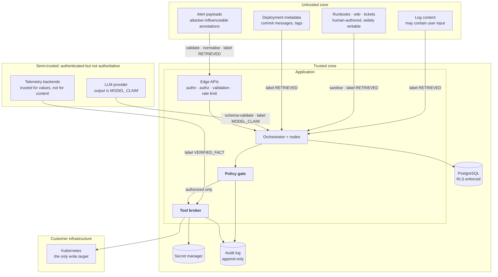

# Security and Threat Model

- **Status:** Authored — Architecture Package (V3 §23 L). **Proposed; not implemented.**
- **Master specification references:** Sections 6, 7, 15, 16, 23(L)
- **Related:** [`../architecture/remediation-safety-policy.md`](../architecture/remediation-safety-policy.md) · [`../architecture/tool-registry.md`](../architecture/tool-registry.md) · [`REPOSITORY_SECURITY_CHECKLIST.md`](./REPOSITORY_SECURITY_CHECKLIST.md)

> **Security is designed in Phase 2, not Phase 13.** The master specification's roadmap
> places "Security, RBAC, tenant isolation and supply-chain controls" at phase 13, but §20
> requires security be kept *alongside* feature development, and several invariants here are
> not retrofittable — tenant isolation, the authorization chokepoint and provenance typing
> all constrain the first line of schema and node code. Phase 13 hardens and audits what
> Phase 2 designed and Phases 3–8 build. This deviation is justified in
> [`../architecture/PROJECT_INITIATION_AND_ARCHITECTURE_PACKAGE.md`](../architecture/PROJECT_INITIATION_AND_ARCHITECTURE_PACKAGE.md) §O.

---

## 1. Why this system is a hard security target

Three properties make it unusually sensitive, and they compound:

1. **It holds production credentials for customer infrastructure.** Compromise is not data
   loss; it is the ability to act on a customer's cluster.
2. **It ingests attacker-influenceable text and feeds it to a model.** Log lines, alert
   annotations, ticket bodies and wiki runbooks can all be written by someone who is not the
   customer, and all reach a reasoning path.
3. **It is designed to take autonomous action.** The gap between "a model was confused" and
   "production changed" is exactly the safety architecture.

The design assumption throughout: **treat the model as potentially adversarial.** Not
because it is, but because a design that survives an adversarial model also survives a
confused one, a prompt-injected one, and a future model swap.

---

## 2. Security invariants required from day one

These must exist in the first executable slice, not be added later. Each is enforced
structurally and has an adversarial test.

| # | Invariant | Enforcement mechanism | Not retrofittable because |
|---|---|---|---|
| **SEC-I1** | **Least privilege** — every credential is the narrowest that works | Per-action credential resolution, short-lived, scope-bound | Broad credentials get depended upon; narrowing later breaks callers |
| **SEC-I2** | **Tenant isolation** — no request reads or writes another tenant's data | `tenant_id` on every table, PostgreSQL row-level security, tenant in every query predicate | Every table, index, query and cache key changes |
| **SEC-I3** | **Authorization before execution** — the deterministic gate is the only path to any effect | Single egress broker; gate cannot be bypassed | Multiple egress paths spread authorization everywhere |
| **SEC-I4** | **Retrieved content cannot grant authority** | Provenance typing; gate input type cannot carry `RETRIEVED`/`MODEL_CLAIM` | Requires the type system and prompt structure from the start |
| **SEC-I5** | **Prompt-injection resistance is structural** | Capability menu, typed proposals, delimited untrusted regions | A prompt-based defence cannot be upgraded into a structural one |
| **SEC-I6** | **Secrets never enter prompts, traces, logs or the database** | Redaction at emission; secret manager; broker-held credentials | Leaked secrets in historical traces cannot be un-leaked |
| **SEC-I7** | **Auditability** — every authorization decision and effect is recorded immutably | Append-only audit at the sole egress point | Gaps in history cannot be reconstructed |
| **SEC-I8** | **Fail closed** — unavailability of policy, registry or identity denies | Explicit deny paths, no default-allow branch | Default-allow gets embedded in call sites |
| **SEC-I9** | **Separation of duties** — proposer ≠ authorizer ≠ approver | G6 / G7 / G8 separation; humans cannot self-approve | Structural, in the node graph |
| **SEC-I10** | **Read/write credential separation** — investigation cannot mutate | Physically distinct credentials and service accounts | Shared credentials become load-bearing |

---

## 3. Assets and trust boundaries

### 3.1 Assets, ranked

| Asset | Impact if compromised |
|---|---|
| **Infrastructure credentials** (K8s service accounts, API tokens) | **Critical** — direct action on customer production |
| **The policy and registry configuration** | **Critical** — controls what is possible at all |
| Audit log integrity | Critical — the record of what happened |
| Tenant telemetry and incident data | High — operational intelligence, possibly PII in logs |
| Operational knowledge base | High — poisoning misleads all future incidents |
| LLM provider credentials | Medium–High — cost abuse, data exfiltration |
| Approval records | High — the compliance artifact |
| Evaluation baselines | Medium — corrupting them hides regressions |

### 3.2 Trust boundaries

**The critical boundary is `GATE → BROKER`.** Everything upstream of it — including all
model output and all retrieved content — is untrusted for authorization purposes. Nothing
crosses it except a typed, validated, policy-approved action.

---

## 4. Untrusted input model

The brief requires explicit modelling of each untrusted source. For each: how it arrives,
what an attacker could attempt, and what actually stops it.

| Source | Arrives via | Attack attempt | Structural defence |
|---|---|---|---|
| **Logs** | `logs.query` results | Inject instructions in a log line an attacker can cause the app to emit (e.g. via a username field) | Labelled `RETRIEVED`; delimited in prompts; cannot reach the gate; result size capped |
| **Runbooks** | Knowledge retrieval | Edit a wiki page to instruct privilege escalation or a harmful action | Sanitised at ingestion; `RETRIEVED`; capability menu is pre-resolved; unregistered actions rejected |
| **Tickets** (Jira) | Knowledge retrieval / context | Inject in a ticket body or comment | Same as runbooks |
| **Alerts** | Ingestion API | Inject in annotations/labels; forge an alert to trigger action; flood to exhaust budget | Schema validation; authenticated ingestion; per-tenant rate limits; annotations `RETRIEVED`; correlation is deterministic-first |
| **Deployment metadata** | `deploy.read` | Inject in a commit message or release note | `RETRIEVED`; used as evidence, never as instruction |
| **Model output** | LLM provider | Fabricate evidence IDs; propose unregistered tools; widen scope via arguments | Schema validation; evidence IDs verified to exist; unregistered tools rejected without repair; scope resolved from context, not from arguments |
| **Telemetry values** | Metrics/traces adapters | Poison metrics to steer a hypothesis | Trusted for *values* only; corroboration across domains; human approval before production action |
| **Approval replies** (Slack) | Collaboration adapter | Spoof an approval message | Phase 10 builds **outbound collaboration only**: no inbound chat path exists, so a chat message cannot reach approval at all. Approval remains the authenticated approval API; a future inbound path must resolve an RBAC identity and bind to `action_version_hash` |
| **External API responses** (Phase 10) | Prometheus, Loki, Kubernetes, Slack, Teams, PagerDuty, Jira, Grafana adapters | Return oversized, redirecting, contradictory or instruction-bearing payloads; echo tokens in errors | Size-capped responses, no redirects, strict parsing with `malformed_response` on doubt, vendor error bodies never persisted, log/event text bounded to single-line display text and returned as data |
| **Incident titles in outbound records** (Phase 10) | S2 notification templates | Ping a channel (`<!channel>`), forge a link, inject newlines into a message or observation | Bounded display text with every control character removed; Slack mrkdwn and Markdown escaped per destination; destination never an argument |

### 4.1 The point worth restating

For every row above, the defence is that the content **has no path to authorization**, not
that we detect the malicious phrasing. Detection is recorded (`injection_flags_total`) as
signal and evidence. If detection were the defence, the system would be one novel phrasing
away from failure.

---

## 5. Authentication, authorization and tenancy

### 5.1 Authentication

| Surface | Method |
|---|---|
| Ingestion API | mTLS or signed webhooks with per-source keys; replay-protected |
| Incident / Approval / Evaluation APIs | OAuth2 + JWT via the org IdP; short-lived tokens |
| Admin API | OAuth2 + JWT, **step-up authentication required** |
| Chat platforms | Platform signature verification, **then** identity resolution to an internal principal |
| Service-to-service | mTLS with workload identity |
| Outbound to customer infra | Per-tenant, per-capability credentials from the secret manager |

### 5.2 RBAC

| Role | May | May not |
|---|---|---|
| `viewer` | Read incidents, evidence, timelines in their tenant | Approve; change configuration |
| `responder` | Above + trigger investigation, escalate, annotate | Approve production remediation |
| `sre_approver` | Above + approve R1 in production | Approve R2; change policy |
| `senior_approver` | Above + approve R2 | Change policy or registry |
| `platform_admin` | Manage registry, policy, tool scopes, tenants | Approve actions they proposed |
| `security_auditor` | Read all audit records, policy, configuration | Any mutation |
| `system_operator` | Run evaluation, replay, manage behaviour versions | Approve production remediation |

Authority is **per tenant, per environment, per risk tier**. `sre_approver` in staging is
not `sre_approver` in production. Separation of duties applies to humans as it does to
nodes (SEC-I9).

### 5.3 Tenant isolation

Defence in depth, because a single mechanism will eventually have a bug:

| Layer | Mechanism |
|---|---|
| Database | Row-level security policies keyed on a session tenant claim; `tenant_id` on every table |
| Application | Repository layer requires a tenant context; a query built without one fails at the type level |
| Retrieval | `tenant_id` as a search predicate applied **before** ranking |
| Credentials | Per-tenant credentials in the secret manager; no shared infrastructure credential |
| Cache | `tenant_id` in every cache key |
| Telemetry | `tenant_id` as a span/log dimension; cross-tenant queries are an authorization decision |
| Tests | Property tests attempt cross-tenant access at every layer |

Relying on application-layer scoping alone means one forgotten `WHERE` clause is a breach.
RLS makes the database the backstop.

---

## 6. Threat enumeration

STRIDE-derived, ordered by severity. Likelihood is qualitative and pre-mitigation.

| ID | Threat | Category | Sev | Likelihood | Mitigation | Residual |
|---|---|---|---|---|---|---|
| T01 | Prompt injection in retrieved content causes an unauthorized action | Elevation | **Critical** | High | SEC-I3, I4, I5; capability menu; typed proposals; gate cannot read untrusted content | Wasted budget; misdirected investigation |
| T02 | Model proposes an action outside its permission scope | Elevation | **Critical** | Medium | Scope resolved from context not arguments; registry-owned tiers; layer-4 credential scoping | Low |
| T03 | Compromised orchestrator executes arbitrary actions | Elevation | **Critical** | Low | R3 not expressible; blast-radius limits; approval for production; short-lived scoped credentials; audit | Bounded to registered R1/R2 with approval |
| T04 | Cross-tenant data access | Disclosure | **Critical** | Medium | RLS + app scoping + pre-search filtering + per-tenant credentials | Low |
| T05 | Secret leakage via prompts, traces or logs | Disclosure | **Critical** | Medium | Redaction at emission; secrets never in prompts; broker-held credentials; CI secret scanning | Low |
| T06 | Knowledge-base poisoning misleads many incidents | Tampering | High | Medium | Source authentication; change detection; human-approved promotion; current evidence outranks retrieved | Degraded advice quality |
| T07 | Forged or replayed alerts trigger unwanted work | Spoofing | High | Medium | Authenticated ingestion; replay protection; deterministic correlation; rate limits | Budget consumption |
| T08 | Spoofed approval via chat | Spoofing | High | Medium | Platform signature verification; RBAC identity resolution; action hash binding | Low |
| T09 | Approval bypass by mutating parameters post-approval | Tampering | High | Low | `action_version_hash` recomputed at execution (SI-6) | Low |
| T10 | Double-application of a remediation | Tampering | High | Medium | Business-identifier idempotency; reconcile-don't-retry on unknown outcome | Low |
| T11 | Audit tampering or gaps | Repudiation | High | Low | Append-only store; broker as sole egress; periodic reconciliation | Low |
| T12 | Budget/cost exhaustion via alert flooding | DoS | Medium | High | Per-tenant rate limits and budgets; correlation before investigation; circuit breakers | Delayed processing |
| T13 | Model provider outage or degradation | DoS | Medium | High | Multi-provider abstraction with fallback; degrade to deterministic paths; pause-and-resume | Reduced capability |
| T14 | Supply-chain compromise in dependencies or images | Tampering | High | Medium | Pinned dependencies, lockfiles, SBOM, SAST, container and dependency scanning, signed images | Residual zero-day |
| T15 | Malicious or careless MCP/tool provider (future) | Elevation | High | Low | Human review before registry mapping; providers cannot self-declare risk tier; credentials stay with broker | Bounded by tier and scope |
| T16 | Evaluation baseline tampering hides regressions | Tampering | Medium | Low | Baselines versioned in Git; runs immutable; CI-signed | Low |
| T17 | PII in incident data beyond retention | Compliance | Medium | Medium | Retention policy per class; redaction at ingestion; deletion workflows | Depends on customer log hygiene |
| T18 | Insider platform-admin abuse | Elevation | High | Low | Separation of duties; admin actions audited; step-up auth; no self-approval | Requires organisational control |
| T19 | Connector redirection: rewrite an endpoint to exfiltrate authenticated requests (Phase 10) | Disclosure | High | Low | `integration_connector` read-only to the application role; https only; no userinfo/query in endpoints; host allowlists for SaaS endpoints; no redirects followed | Administrator-level configuration compromise |
| T20 | Stale or cross-tenant connector authority (Phase 10) | Elevation | High | Medium | Connector and scope binding resolved from tenant-bound rows on every call, before idempotent replay; revocation refuses the next call | Low |
| T21 | Duplicate or phantom external records after an unknown outcome (Phase 10) | Tampering | Medium | Medium | Durable effect claim per deterministic event id; unknown outcomes never retried; `failed_clean` only when an adapter proves no effect | A lost message after a genuinely unknown outcome is reported, not re-sent |
| T22 | Simulator or fixture data answering for a live system (Phase 10) | Tampering | High | Low | Live composition is native-only with production credentials; the broker refuses mixed providers; no provider fall-through on failure | Low |

---

## 7. Secret management

| Rule | Detail |
|---|---|
| Storage | External secret manager (cloud KMS-backed or Vault). Never in the repository, environment files, or the database |
| Scope | Per tenant, per capability. No global infrastructure credential exists |
| Lifetime | Short-lived, resolved per action, revoked on incident close where the backend supports it |
| Access | Only the credential resolver inside the broker. Nodes never receive credentials |
| In prompts | Never. Prompt assembly has no access to the resolver |
| In telemetry | Redacted at emission (SEC-I6) |
| Rotation | Scheduled; **mandatory and immediate on any suspected exposure** |
| CI | Repository secret scanning; `scripts/check_repo_hygiene.py` pre-commit; gitleaks in CI from Phase 14 |
| Implemented (Phase 10) | Connector rows hold `asic/...` references only (check constraint). `EnvironmentCredentialProvider` resolves mounted secret files or environment variables per call and fails closed; resolved secrets exist only as a non-renderable `SecretValue` inside the outbound request. Kubernetes read and write references must differ. External secret-manager integration (Vault/KMS) remains a deployment concern for Phase 14 |

---

## 8. Encryption, validation, rate limiting, retention

| Control | Specification |
|---|---|
| In transit | TLS 1.3 externally; mTLS between internal services |
| At rest | Full-disk/volume encryption plus column-level encryption for connector credentials and sensitive incident fields |
| Input validation | Schema validation at every boundary; size caps on alert payloads, tool results and retrieved content; canonicalisation before hashing or comparison |
| Rate limiting | Per tenant and per source on ingestion; per user on APIs; per tool on egress; global cost circuit breaker |
| Retention | Incident data and audit per policy below; PII redacted at ingestion where detectable |

| Data class | Default retention | Rationale |
|---|---|---|
| Audit records | 7 years | Compliance |
| Incident records and evidence | 2 years | Operational history and replay value |
| Execution traces | 90 days hot, 1 year cold | Evaluation and debugging |
| Retrieved content copies | Incident lifetime + 30 days | Minimise duplicated customer data |
| Model prompts/completions | 30 days | Debugging only; not a system of record |
| Evaluation runs and baselines | Indefinite | Regression comparison across versions |

---

## 9. Supply chain

| Control | Phase |
|---|---|
| Pinned dependencies with lockfiles; reproducible builds | 2 (repository conventions) |
| Dependency vulnerability scanning in CI | 14 (enforced), advisory earlier |
| SAST | 14 (enforced), advisory earlier |
| Container image scanning; minimal base images; non-root | 14 |
| SBOM generation and image signing | 14 |
| Pre-commit secret scanning | **Active now** (Phase 0) |
| Third-party tool/MCP provider review | Before any provider is registered |

---

## 10. Residual risks

Stated honestly; none is fully eliminated by design:

| Risk | Why it remains | Compensating control |
|---|---|---|
| A correct-looking but wrong hypothesis misleads a human approver | Human approval assumes the human can evaluate the evidence | Counter-evidence shown; confidence basis stated; blast radius and rollback shown deterministically |
| A stale but non-malicious runbook degrades advice | We cannot verify external document correctness | Freshness metadata; trust class; current evidence outranks retrieved text |
| Injected content wastes investigation budget | Budget is consumed before content is judged useless | Hard limits; efficiency metrics detect it |
| Customer logs contain PII we cannot fully detect | PII detection is imperfect | Retention limits; redaction; documented customer responsibility |
| Insider with `platform_admin` weakens policy | Any system with administrators has this | Audit, step-up auth, separation of duties, change review |
| Zero-day in a pinned dependency | Unavoidable | Scanning cadence, rapid patch process, minimal dependency surface |

---

## 11. Security testing

| Area | Test | Gate |
|---|---|---|
| Prompt injection | Adversarial corpus A1–A4 across all untrusted sources | Release |
| Tool abuse | A5–A7: unregistered tools, scope widening, fabricated evidence | Release |
| Approval integrity | A8: post-approval mutation | Release |
| Idempotency | A9: duplicate and concurrent delivery | Release |
| Fail-closed | A10: policy store outage | Release |
| Verifier independence | A11: false success claim | Release |
| Tenant isolation | A12 + property tests at every layer | Release |
| Credential separation | Investigation credential attempts a write; must be denied *by the target* | Release |
| AuthN/AuthZ | Role matrix tests; privilege-escalation attempts; self-approval | Release |
| Rate limiting and DoS | Flood tests per tenant | Phase 15 |
| Dependency and container | Scanning | CI, every build |

Every invariant in §2 maps to at least one test above, and all are **zero-tolerance release
gates** — a regression blocks release regardless of improvements elsewhere.
